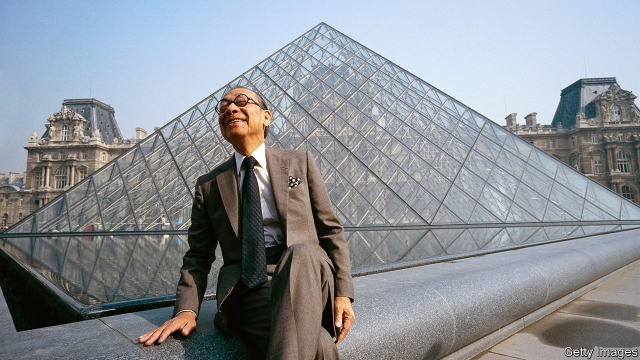

###### His light materials

# Obituary: I.M.Pei died on May 16th 

##### The architect most famous for the Louvre pyramid was 102 

 

> May 30th 2019 

WHEN IN 1984 I.M.Pei, then the most sought-after architect in America, presented his plans for a 70-foot glass pyramid in the 18th-century courtyard of the Louvre, the general reaction was outrage. This was an atrocity; it was “an annex to Disneyland”. Because Mr Pei was Chinese-American, a foreigner twice over, he clearly had no understanding of the Louvre, or Paris, or France. 

These remarks did not annoy him. As a man of courtesy and cultivation, with quick enthusiasms and wide, wide smiles, he took them in his stride. But he was surprised. He had been asked to design a new entrance for the museum and, instead of adding on some utilitarian concrete block, had created a great welcoming space: put a swirling staircase underground and capped it with a glow of transparency and light that did not touch, let alone hurt, the old ornamented façades. In short, he had taken his usual care. 

He had also expressed, once again, his two great passions in architecture. The first, as befitted a true modernist trained at MIT and Harvard, was for simple geometric forms, triangle, circle and square. On these he based all his buildings, which included the East Building of the National Gallery in Washington, the Kennedy Library in Boston, the Museum of Art at Cornell, the Bank of China Tower in Hong Kong and the Museum of Islamic Art in Dubai. Slopes, as in rhomboids and trapezoids, delighted him; pyramids pleased him for their perfect stability. And when he dreamed of one in the Louvre—for he always did the dreaming, while associates did the drawing—it fitted exactly, to his mind, with the love of geometry and rationality that he saw everywhere in Paris. 

His other firm conviction was that architecture had to mirror life. So for the Mesa Laboratory at the National Centre for Atmospheric Research (NCAR) in Boulder, Colorado he hiked among the sandstone hills, finding inspiration for his sculptural, reddish, thick-walled towers in Native-American cliff-dwellings. His City Hall in Dallas, a boldly cantilevered wedge of glass and steel facing the commercial district, reflected the vaunting Texan pride he found there. He built the Kennedy Library to evoke the man, and its towering empty spaceframe, flooded with light and hung with an American flag, summed up both limitless optimism and the country’s loss. For the Rock and Roll Hall of Fame in Cleveland, a tower with a pyramid protruding and a wedge driven through it, he prepared his mind by venturing, for the first time, to rock concerts. For his Doha commission he studied Islam and explored the Islamic world, discovering his dome-and-cube ideal in the oldest mosque in Cairo. And when considering the Louvre he impishly took a cue from Napoleon’s fascination with the pyramids on the Nile. 

Regard for tradition and context did not ward off the doubters, but it helped. So did his punctiliousness about finish and materials. Everything had to be built well: built to last, and to be beautiful. His trademark lattices of glass were devised to admit as much light as possible, sometimes by angling the thousands of crystalline facets, sometimes by connecting them with rods so thin they were more like a spiderweb. Stone, too, was chosen to pick up the changing colours of daylight: creamy limestone, as at Doha, or the pale pink Tennessee marble he used for the East Building. But everyday concrete could also be refined to his purposes by matching its colour consistently to local earth, bush-hammering the NCAR slabs so that they resembled weathered rocks, and avoiding visible joins. One of his designs for William Zeckendorf, the flamboyant New York property developer who employed him in the 1950s, was the Kips Bay Plaza housing project, two square grids in pre-cast concrete which were meant to revitalise a blighted neighbourhood. He softened them with arched and recessed windows until they looked like honeycombs. Architecture could heal, too. 

Once Jackie Kennedy had daringly picked him to build her husband’s library in 1964, he became such a feature of America’s cultural scene, owlishly sipping his favourite red Bordeaux, that it was easy to forget that only the rise of the communists in China had kept him in America at all. He had come to study in 1934, lured mostly by the films of Bing Crosby and Betty Grable, and had fun. But he was keen to go back until it became too risky for a banker’s son to do so. He therefore took American citizenship, but did not cut the roots. His wife was Chinese; his children had Chinese names. And his imagination had been shaped less by Le Corbusier or Walter Gropius, though he met and admired both men, than by his family’s ancient gardens at Suzhou in Jiangsu. There, as a child, he would wander winding paths through fantastic rocks towards pavilions, unconsciously absorbing sightlines and approaches, light and shadow, as well as the framing of views. He did not forget. 

In 1974 he managed to return; later he built, for the government, a hotel complex at Fragrant Hill outside Beijing. He seized on this as a chance to wean the Chinese away from their drab eastern European blocks and back to the domestic traditions they had lost. But their break with the past had been too definite; they now wanted to copy the West, and did not care for the old motifs he combined with his geometry and glass. He did better with the Bank of China Tower for the bank his father had run, where his shaft of 70 slim, dark storeys, criss-crossed with white lines, was based on the angular growth of bamboo. Visiting shrines in the mountains once in childhood, he thought he heard the bamboo growing. 

Those mountains, like the gardens, led him to seek tranquillity in the buildings he designed. They sometimes seemed too exciting for that: sweeping stairways, soaring glass, razor-sharp angles, scintillating slopes. But at their heart lay those perfect forms, triangle, circle and square. Water often lay nearby, offering both transparency and reflection. A pyramid with water round it, as at the Louvre, was the very essence of serenity: harmony of structure and spirit. It might take time to make its case; architecture was a slow art. But as it moved from newness to permanence, he felt beamingly sure that Parisians would agree with him. 

