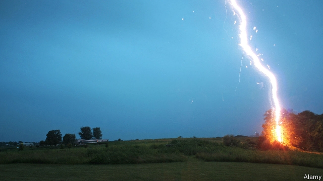

###### Astronomy and evolution

# Human beings may owe their existence to nearby supernovas 

##### Cosmic rays from them would have changed the world’s vegetation 

 

> May 30th 2019 

IF A SUPERNOVA went off near Earth, that would be bad. From a distance of less than, say, 25 light-years, the resulting bombardment of fast-moving atomic nuclei, known as cosmic rays, would destroy the layer of atmospheric ozone that stops most of the sun’s harmful ultraviolet light reaching Earth’s surface. In combination, these two kinds of radiation, cosmic and ultraviolet, would then kill many forms of life. 

If a supernova went off not quite so close by, though, that might be interesting. It would have effects, but more subtle ones. Indeed, a paper published in the latest edition of the Journal of Geology, by Brian Thomas of Washburn University, in Kansas, and Adrian Melott of the University of Kansas, suggests that a series of such stellar explosions may have nudged humanity’s forebears down from their trees and up onto their hind legs. 

The chain of events Dr Thomas and Dr Melott propose starts with the observation that between 14 and 20 supernovas have gone off in Earth’s vicinity over the past 8m years. These explosions, of young, massive stars, are believed to have happened in the Tucana-Horologium stellar group, currently about 130 light-years from Earth. 

One reason for believing these supernovas occurred is that the shock waves from them swept away nearby interstellar gas and the magnetic field which threads through that gas. This has left the sun embedded in what is known as the Local Bubble, a peanut-shaped void 300 light-years long in which the vacuum of space is even emptier than normal, and which is bounded by a wall of somewhat denser gas and stronger magnetic fields. 

Once the Local Bubble was established, any cosmic rays created by a supernova within it would have kept bouncing off this magnetic wall and back into the bubble. They would thus have strafed every object within it, including Earth, for tens, or even hundreds of thousands of years after the explosion that created them. 

Some of these rays were the nuclei of a radioactive isotope of iron that is created almost exclusively in supernovas. These unstable nuclei, together with their decay products, have been found in the ocean floor on Earth and in rock samples brought from the Moon—another reason to believe the supernovas happened. Those isotopes found on Earth can be dated from the sediment they are in. The strongest signal is from 2.5m years ago, indicating that this explosion was the closest. 

A geological feature that coincides with the period when Local Bubble supernovas were going off is an increase in traces of charcoal in oceanic sediment. That is evidence of wildfires on land. This increase starts about 7m years ago and in turn coincides with a period when much of Earth’s vegetation shifted from forests to grasslands. The fires recorded by the oceanic charcoal could explain this vegetational shift, because grass is more resilient to fire than trees are. What explains the fires, though, remains mysterious. 

Dr Thomas and Dr Melott propose that the culprit is cosmic rays from the local supernovas. The main arsonist of wildfires is lightning. The hammering of atmospheric molecules these rays handed out, they suggest, caused more lightning. The rays would knock such molecules apart, liberating electrons from their atoms. These liberated electrons would in turn knock loose other electrons, creating cascades that would make the air electrically conductive. This would encourage lightning strikes. 

Observations made recently on a mountain in Armenia, of electron cascades caused by normal cosmic rays, showed that many of these did indeed end in a lightning flash, so the idea is plausible. Encouraged by this, Dr Thomas and Dr Melott calculated the effect that the cosmic rays of the explosion of 2.5m years ago would have had on the number of cascades. They conclude that the cascade rate would have increased 50-fold. 

The replacement of forests by grassland is thought by some anthropologists to have encouraged the evolution of humanity’s ancestors away from tree-climbing and towards the bipedalism. It was this change in locomotion that freed human hands to get up to all the mischief which distinguishes people from other species. Human beings, in all their manipulative glory, are thus, if the chain of events Dr Thomas and Dr Melott are suggesting is correct, the children of dying stars. 

