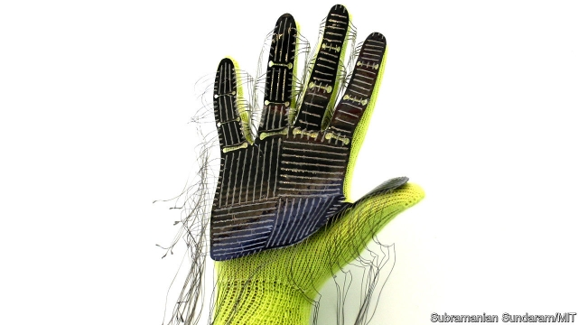

###### Robotics

# Improving robots’ grasp requires a new way to measure it in humans 

##### A special glove should do the trick 

 

> May 30th 2019 

HUMAN BEINGS can pick up and manipulate objects and tools with hardly a thought. This seemingly simple task, however, requires the precise, co-ordinated movement of individual fingers and thumbs, each applying the correct amount of pressure, at exactly the right places, to the object handled. 

That people can do this successfully is thanks to special nerve endings, called mechanoreceptors, found in their skin. These provide instant tactile feedback to the brain of the shape, feel and weight of whatever is being grasped. With time and experience, people learn to vary their grip instinctively when lifting a golf ball, for example, as opposed to an egg. 

Replicating that dexterity in robots is hard. A machine usually picks things up by, first, identifying the object via a camera and appropriate software, and then using a preprogrammed grasping strategy appropriate to what it thinks it has seen. This approach has improved greatly in recent years, thanks to advances in machine learning and vision. Further improvement will, however, be best served by a more precise understanding of the mechanics of how people themselves manipulate objects. A new “smart” glove, from computer scientists at the Massachusetts Institute of Technology, promises to do just that. 

Writing in this week’s Nature, Subramanian Sundaram and his team describe a way to measure, quickly and easily, the forces a human hand exerts as it grasps and manipulates things. Their invention is a sensory sleeve that fits over a knitted glove. Attached to the sleeve’s palm, and running up the fingers and thumb of the glove, are pieces of a film that generates electricity in response to pressure. This film has electrically conducting threads running through it to form a set of grids (see picture). Each of the 548 places on the grids where two threads overlap acts as a localised pressure sensor—the equivalent of a mechanoreceptor in the skin of a hand. The signals from the threads are fed to a computer for storage and interpretation. 

In their experiment, Dr Sundaram and his colleagues asked people to put on one of these gloves and use their now-gloved hand to pick up and manipulate 26 everyday objects—a mug, a pair of scissors, a spoon, a pen and so on—one at a time for a few minutes each. The system then recorded the signals from the threads seven times a second as every object was held and moved in its turn. 

The trick was to take these recordings and train a machine-learning program, called a neural network, to interpret them. Since many of the best neural networks available are designed to learn and interpret images, Dr Sundaram decided to present the team’s data to the network visually, by making each of the seven-a-second samples into an image in which the colour of the grid points represented the pressure applied there in shades of grey from low (white) to high (black). Once the network had been trained on these images it could then identify any of the 26 test objects from new pressure maps recorded by the glove. 

Measuring in this way just how a human hand exerts force will, as originally intended, be useful in programming robots to mimic people more closely when they pick objects up. But Dr Sundaram’s experiments also provide insights into how the different parts of the hand work together when grasping things—how often, for example, the first finger is used at the same time as the thumb or the second finger. Those data, he reckons, could assist designers of prosthetic limbs in the perfection of their devices. 

Dr Sundaram’s invention is clever, then. But one of the cleverest things of all about it is that it is also cheap, for the glove costs only around $10 to make. This, he hopes, will encourage others to create their own versions. Building comprehensive tactile maps of how people employ their hands to manipulate the world will require huge sets of data—ideally derived from many thousands of individuals handling thousands or millions of objects. To gather data on that scale requires cheap tools. 

Dr Sundaram cites as an analogy the example of computer vision. This, he says, has improved quickly in recent years because almost everyone has easy access to a standardised, cheap digital recording device, the camera, the outputs of which are easy to share, label and process by computers. The analogy is not perfect. People like taking and sharing photographs, so the supply is endless and free. They will have, by contrast, to be encouraged, and perhaps paid, to handle things while wearing special gloves, however inexpensive. But the success of so-called citizen science projects, which require the mass participation of interested amateurs, suggests the task would not be impossible. So if, in the future, someone asks you to put on a new pair of gloves and handle a strange object, don’t take it the wrong way. 

