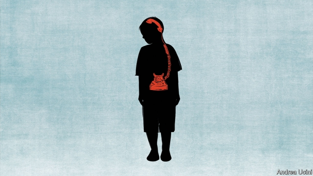

###### Autism-spectrum disorder

# More evidence that autism is linked to gut bacteria 

##### Understanding that link may be crucial to treatment 

 

> May 30th 2019 

PARADIGM SHIFT is an overused term. Properly, it refers to a radical change of perspective on a topic, such as the move from the physics of Newton to the physics of Einstein, or the introduction of plate tectonics into geology. Such things are rare. Something which history may come to regard as a true paradigm shift does, however, seem to be going on at the moment in medicine. This is a recognition that the zillions of apparently non-pathogenic bacteria on and in human bodies, hitherto largely ignored, are actually important for people’s health. They may even help to explain the development of some mysterious conditions. 

One such condition is autism—these days often called autism-spectrum disorder (ASD). ASD is characterised by repetitive, stereotypical and often restricted behaviour such as head-nodding, and by the difficulties those with it have in reading the emotions of, and communicating with, other people. These symptoms are noticeable in children from the age of two onwards. Currently, in America, about one child in 59 is diagnosed with ASD. 

What causes ASD has baffled psychiatrists and neurologists since the syndrome was first described, in the mid-20th century, by Hans Asperger and Leo Kanner. But the evidence is pointing towards the bacteria of the gut. That suggestion has been reinforced by two recently published studies—one on human beings and one on laboratory rodents. 

The human study, the latest results of which came out a few weeks ago in Scientific Reports, is being conducted by Rosa Krajmalnik-Brown of Arizona State University and her associates. It was prompted by earlier work in which Dr Krajmalnik-Brown and James Adams, a colleague at Arizona State, sequenced the DNA of gut bacteria from 20 autistic children to discover which species were present. They found that the children in their sample were missing hundreds of the thousand-plus bacterial species that colonise a “neurotypical” person’s intestine. One notable absence was Prevotella. This bug, which makes its living by fermenting otherwise-indigestible carbohydrate polymers in dietary fibre, is abundant in the alimentary canals of farmers and hunter-gatherers in places like Africa, rare in western Europeans and Americans, and nearly nonexistent in children with ASD. 

Their discovery led Dr Krajmalnik-Brown and Dr Adams to the idea that restoring the missing bacteria might alleviate autism’s symptoms. Two years ago they tested a process called microbiota transfer therapy (MTT) on 18 autistic children aged between seven and 16. Of their participants 15 were regarded, according to the Childhood Autism Rating Scale, as having “severe” autism. 

MTT is a prolonged version of a process already used to treat infection by a bug called Clostridium difficile, which causes life-threatening diarrhoea. It involves transplanting carefully prepared doses of faecal bacteria from a healthy individual to a patient. The researchers gave the children, first, an oral antibiotic, a bowel cleanse and an oral antacid (to ensure that microbes administered by mouth would survive their passage through the stomach). They followed this up with either an oral or a rectal dose of gut bacteria, and then, for seven to eight weeks, a daily antacid-assisted oral dose. 

Ten weeks after treatment started the children’s Prevotella levels had multiplied 712-fold. In addition, those of another species, Bifidobacterium, had quadrupled. Bifidobacterium is what is known as a “probiotic” organism—something that acts as a keystone species in the alimentary ecosystem, keeping the mixture of gut bacteria healthy. Now, two years later, although levels of Prevotella have fallen back somewhat, they are still 84 times higher than they were before the experiment started. Levels of Bifidobacterium, meanwhile, have gone up still further—being five times higher than they had been at the beginning of the study. This, says Dr Krajmalnik-Brown, suggests the children’s guts have become healthy environments that can recruit beneficial microbes by themselves. 

Crucially, these changes in gut bacteria have translated into behavioural changes. Even 18 weeks after treatment started the children had begun showing reduced symptoms of autism. After two years, only three of them still rated as severe, while eight fell below the diagnostic cut-off point for ASD altogether. These eight thus now count as neurotypical. 

Exactly how gut bacteria might contribute to autism is a puzzle. But light has been shed on the matter by the second study, published this week in Cell by a team led by Sarkis Mazmanian of the California Institute of Technology. Dr Mazmanian and a group of colleagues that also included Dr Krajmalnik-Brown performed a type of MTT on mice. They collected bacteria from the faeces of both neurotypical and autistic people (who ranged in their symptoms from mild to severe) and transplanted these into hundreds of mice. They then interbred the recipient mice and studied the offspring of these crosses—animals that had picked up the transplanted bacteria from their mothers at birth. 

They were looking for the rodent equivalent of ASD. And they found it. Most of the young mice harbouring gut bacteria from autistic human donors showed features of autism themselves. These included repetitive behaviours, reduced social and vocal communication with other mice, and restricted movement. In contrast, none of the mice colonised with bacteria from neurotypical people ended up autistic. Dr Mazmanian and his team discovered, moreover, that the intensity of a human donor’s autism was transferred to the recipient mice. If an individual’s symptoms were severe then so, too, were those of mice that hosted his gut bacteria. 

Dr Mazmanian’s study also dealt with the question of mechanism. One long-held suspicion is that a molecule called gamma-aminobutyric acid (GABA) is involved. GABA is a neurotransmitter, meaning that it carries signals between nerve cells. In particular, it counters the action of another neurotransmitter, glutamate, that excites nervous activity in the brain. Studies have shown that levels of GABA are lower than normal in the brains of autistic children (though, inexplicably, not in autistic adults). Some researchers suspect that this deficiency takes the brakes off glutamate’s excitatory activity, thus stimulating things like repetitive behaviour. 

Dr Mazmanian and his colleagues produced evidence supporting this idea. They collected faeces, blood and brain tissue from the rodents in the experiment. When they analysed these they found that the “autistic” animals were deficient in taurine and 5-aminovaleric acid, two substances that stimulate GABA’s activity. 

They, too, drew potentially therapeutic conclusions from their results, and tested those conclusions by giving the missing substances to female mice carrying autism-inducing bacteria in the weeks before those females become pregnant. The resulting offspring, though still showing some symptoms of autism, scored 30% better on the rating scale than did the offspring of untreated females. 

Meanwhile, the success of the study in Arizona has prompted America’s Food and Drug Administration (FDA) to look into the matter. A firm called Finch Therapeutics Group, based in Massachusetts, hopes to commercialise the use of MTT as a treatment for autism and the FDA has now granted this effort “fast track” status, which should speed up the review process. Dr Krajmalnik-Brown and Dr Adams are now recruiting volunteers for a large-scale trial of MTT for adults with autism, to see if they, too, can benefit. The paradigm, it seems, really is shifting. 

