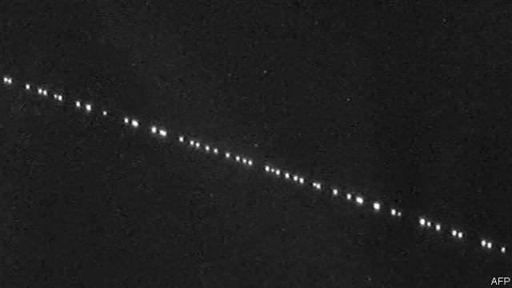

###### Satellites versus astronomers

# The unexpected brightness of new satellites could ruin the night sky 

##### The number of visible man-made objects may triple 

 

> May 30th 2019 

'TWAS QUITE a show: a train of illuminated dots moving across the sky, many of them as bright as Polaris, the north star. These were not new astronomical objects, however. Rather, they were the first tranche of satellites for Starlink, a project intended to provide internet access across the globe. These were launched into orbit on May 24th by SpaceX, an American rocketry firm. 

Seeing satellites from the ground with the naked eye is nothing new. But astronomers (professional and amateur) were surprised, and unhappy, at just how many and how bright the Starlink satellites appeared to be. Quite a few of them took to Twitter to raise the alarm and post pictures and videos of the blazing birds. Their worry was that these satellites and their successors could change the night sky for ever. If the initial 60 members of the Starlink network were already causing noticeable light pollution, they reasoned, how bad would it get once the full constellation of 12,000 had been launched? 

For those who enjoy watching the night sky for pleasure it would surely be sad, for it would more than triple the number of man-made objects in the firmament and thus further degrade the natural beauty of the heavens—a beauty already diminished in many places by light pollution from the ground. For those involved in investigating the universe scientifically, though, it may be more than merely sad. In some cases it could be job-threatening. 

Preliminary analysis shows, for example, that almost every image from the Large Synoptic Survey Telescope in Chile, currently nearing completion and intended to photograph the entire available sky every few nights when it is operational, could contain a satellite trail. These can be edited out, but each correction destroys valuable data. It is possible that some experiments, such as regularly timed observations of the variation in behaviour of astronomical objects, will no longer be feasible. 

Optical astronomers thus have cause to be nervous about Starlink. For radio astronomers its impact may be even more serious. The satellites’ mode of operation necessarily requires them to send radio signals back to Earth, all of which will be stronger than any signal arriving from deep space. This can be accommodated to a certain extent by knowing which frequencies the satellites are broadcasting on, and adjusting accordingly. But exactly how badly radio observatories are affected will depend on how well the satellites manage to confine their broadcasts within those frequencies, which remains to be seen. 

Elon Musk, SpaceX’s boss, initially dismissed astronomers’ concerns, tweeting at the weekend that there were “already 4,900 satellites in orbit, which people notice ~0% of the time. Starlink won’t be seen by anyone unless looking very carefully & will have ~0% impact on advancements in astronomy.” In later exchanges, though, he struck a more understanding tone. Starlink would avoid the frequencies associated with radio astronomy, he said, and if the satellites’ orientations needed to be tweaked to minimise solar reflection during critical astronomical experiments, that could easily be done. Moreover, as the initial Starlink satellites moved into their operational configuration after the weekend, their brightness dropped—though they still occasionally flared as they crossed the sky, probably because of reflections from their large solar panels. 

Mr Musk also seemed, in his tweets, to suggest that the aims of Starlink outweighed the harms. “Potentially helping billions of economically disadvantaged people is the greater good. That said, we’ll make sure Starlink has no material effect on discoveries in astronomy. We care a great deal about science.” His assertion has merit. The problem, as Mark McCaughrean, senior adviser for science and exploration at the European Space Agency, observes, is that there has been little public discussion of the matter. From his point of view the night sky is a public commons that risks appropriation in the name of private interest. Whether that appropriation serves the greater good should at least be a matter of debate. 

For now, astronomers plan to carry out further simulations of the potential impacts of Starlink and other communication-satellite networks planned by companies such as OneWeb. But even when that work is complete, it is unclear what they can actually do to make SpaceX and its competitors listen to their concerns, for there is no legislation to regulate the impact of satellites on the night sky. 

America’s Federal Communications Commission does concern itself with how satellites use the available radio spectrum and with what happens to them after they have done their job. But that is it. With the coming mega-constellations of communications satellites, it is perhaps time for this to change, and for governments (not only America’s) to involve themselves more deeply in the uses of heaven. 

Awards: Two of The Economist’s journalists carried off laurels at this year’s Association of British Science Writers awards ceremony, held in London on May 28th. Catherine Brahic was pronounced one of two Science Journalists of the Year. Hal Hodson won the prize for Feature of the Year, for “The network within, the network without”, about a boy who is missing part of his brain. 

