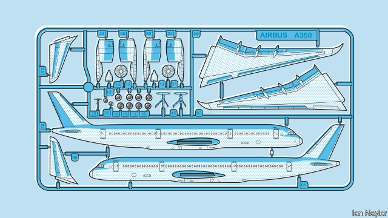
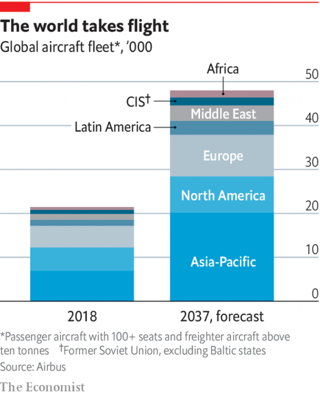

###### Manufacturing

# Aircraft construction is being transformed 

##### Boeing and Airbus need to speed up production to meet demand 

 

> May 30th 2019 

THE A350 is a twin-engined airliner that is the top of the range of Airbus’s offerings, rolling out of the company’s factory in Toulouse, France, at the rate of ten a month. Each of the finished planes sits at the apex of a system of supply chains which fans out across the world, bringing 3.5m components together into a single product. An A350’s airframe is composed of seven sections. Three are assembled into the fuselage, two being made at another site in France and the third in Germany. The two wings are made in Britain, then transferred to Germany to be finished. The tail fin and the horizontal-stabiliser assembly are made in Spain. 

All of these pieces are flown to Toulouse in special transport aircraft called Belugas—after the whale, which they resemble, rather than the sturgeon, which they do not. They are made, mostly, of carbon-fibre-reinforced plastics (CFRPs). These are composite materials that cannot be riveted in the way metal is because of the damage this causes to the fibres. They are therefore held together by lock-bolts inserted through 10,000 specially drilled holes in the flanges where the sections overlap. 

Connecting the sections involves fitting them together, drilling the holes (a process less damaging than riveting), unfitting them, cleaning the holes and surrounding areas of debris, applying a sealant to the flanges, fitting the pieces back together again and then inserting the lock-bolts. At this point the myriad cables which keep a modern aircraft flying, and which have been pre-fitted into the airframe sections, are linked up. 

Before their final bonding, however, the fuselage sections have had what are known as “monuments” installed. These are bits of equipment—galleys, crews’ quarters and so on—that would be too big to carry through the cabin doors later. Afterwards, the rest of the fitting-out is done, the plane is painted in the customer’s livery and the crucial finishing touches, a pair of engines, one under each wing, are added. The whole process takes about a month. 

Airbus and its American counterpart Boeing dominate civil aviation and have done so for decades. Airbus was formed in 2000, though it acquired its current name only in 2014, having previously been known as EADS. Boeing took over McDonnell Douglas, its last American rival in the civil-aviation business, in 1997. 

That domination has been enhanced yet further by Airbus’s recent absorption of part of the business of Bombardier, a Canadian company, and Boeing’s purchase of a large chunk of Embraer, a Brazilian one. These two were the last firms in the West with even a nominal claim to be independent makers of airliners. A Chinese rival, COMAC, may eventually muscle in. And, in the wreckage that was once the Soviet Union, the United Aircraft Corporation, a merger of Soviet-era firms, clings to life. But, to all intents and purposes, making airliners is at the moment a duopoly. 

The cockeyed nature of Airbus’s supply chain, spread across much of western Europe, might be seen as a consequence of the firm’s multinational antecedence and a desire not to put noses out of joint by politically awkward closures of peripheral plants. But Boeing is no better. The supply chain for its 787 Dreamliner, a competitor of the A350, is even more convoluted than for the A350s, as a result of a decision early in the plane’s history to outsource manufacturing of airframe sections to other firms. Despite such self-indulgences, however, competition between the two firms is fierce. The jurisdictions in which they operate are each acutely aware of any knavish tricks by the authorities in the other intended to support the home team, and are willing to challenge such arrangements in the World Trade Organisation. All this helps drive technological improvements. 

In the case of airframes, the biggest technological shift going on is an invisible one, from metal alloys to composite materials—mostly CFRPs. The A350’s airframe is 53% composite. The resulting lighter weight, Airbus claims, makes it 25% more efficient, in terms of fuel consumption, than predecessor planes. That is a huge saving for the world’s airlines. According to the International Air Transport Association, an industry body, fuel accounts for almost a quarter of airlines’ operating expenses—$180bn in 2018. 

Boeing, naturally, matches these claims with claims of its own. The Dreamliner is 50% composite—and again around 20% more efficient than its predecessors. Composites bring advantages beyond lightness. Unlike metals, they do not corrode. Nor do they crack from metal fatigue. They therefore need less maintenance. They do bring problems, though. One is that damage to them is less obvious than to metal, because they do not bend or dent. This is one reason why Airbus fits hundreds of sensors, ranging from voltage meters to strain gauges, all over its A350s. These can warn of problems invisible to the eye. Another disadvantage of composites is that they are not as malleable as metals. Bit by bit, however, that disadvantage is disappearing. 

Parts made of composites are constructed by a process called laying up. This builds a component from ribbons or small sheets of carbon-fibre fabric applied to a forming mould together with a resin that hardens when the whole thing is baked in an autoclave. Originally, laying up was done by hand. Then automatic tape-laying machines made things faster and more reliable. These days, matters have improved still further. Giant looms are used to weave carbon-fibre ribbons into huge sheets. These looms can vary the tension in warp and weft in a way that does the job of the forming mould, creating sheets that reflect from the start the shape of the component of which they will become part. This makes laying up much easier, speeding up production even more. 

In civil aviation, that speeding up of production is going to be crucial. Airbus, in a forecast published in 2017, predicted that air traffic will grow at 4.4% a year over the next two decades, requiring some 36,600 new passenger and 830 cargo aircraft at a total value of $5.8trn (see chart). Boeing’s forecasts are, if anything, more bullish: a 4.7% annual growth in traffic, more than 41,000 new aircraft and a total value of $6.1trn. 

 

To meet such demand, both firms will need to up their game, and they are doing so. Oliver Wyman, a consultancy, said in a report last year that it expected production of Airbus’s A320 and Boeing’s 737 each to jump from around 40 a month in 2015 to 60 a month this year. Those figures may need to be adjusted a bit after the recent 737 accidents, but the trend is clear. 

Techniques like using looms to improve the manufacture of parts contribute to this growth. But grander plans are afoot. According to Grazia Vittadini, Airbus’s chief technology officer, the key to the future is connectivity. 

It would be easy to dismiss that as a buzzword invented by the marketing department if it were not for all those sensors aboard every A350. The 30 gigabytes of data they transmit every day—and similar, if not quite so abundant, quantities of data from other types of Airbus aircraft—are the basis of a system called Skywise that allows both the firm and its customers to track what is going on across entire fleets of aircraft. 

Eventually this will lead to every plane having an electronic twin on the ground. This system is already established for jet engines. Manufacturers create a computer model of each engine they make, and then update it during or after every flight, using data collected by sensors on board the real thing. That way, the electronic simulacrum can keep an eye on its physical counterpart, flagging up potential problems and predicting better than an arbitrary maintenance schedule when parts need replacing. What works for engines can easily be extended to entire aircraft—and even to a time before an individual plane is born, tracking its components as they are put together. This way, the process of assembly can be monitored, integrated and speeded up. 

Further off into the future, plans for new generations of aircraft are already being laid. There is talk, for example, of CFRPs having a serious makeover. The resins currently used to bind the sheets and tapes of fibre together are what are known as thermosetting plastics. Once baked, these hold their shape for ever. Most of the materials that a layman would think of on hearing the word “plastic”, though, are different from this. They are thermoplastics, and can be softened by heating and then remoulded an indefinite number of times. They behave, in other words, like metals. And, like metals, they can be riveted—a process easier than assembling things using lock-bolts. They can also be recycled, which saves money and burnishes a firm’s green credentials. 

Looking even further ahead than that, Airbus is now experimenting with spider silk, produced on an industrial scale by genetically modified micro-organisms, for making aircraft components. Such silk is stronger, tougher and lighter than almost any man-made material. Work on it is still at an experimental stage. But Airbus is collaborating with AMSilk, a German biotechnology firm, to develop silk-reinforced polymers that might one day become substitutes for CFRPs. 

As to the design of airframes themselves, cautious improvement rather than radical change is the order of the day. No one has forgotten the lesson of the Sonic Cruiser. Though the design for that unbuilt aircraft retained a cylindrical fuselage for passengers to sit in, it had delta wings aft and a pair of canards at the front for stability. It would, as the name suggests, have cruised at Mach 0.98, just below the speed of sound. 

It bombed. No one wanted it, mainly because its fuel consumption would have been too high (most passengers seem to prefer cheap tickets to speedy arrival). There was also a problem with its awkward shape, which would have made it difficult to fit into the existing infrastructure of global airports. 

That does not mean that the design of airframes—and wings, in particular—cannot be improved. In January, for example, Boeing announced it was working on a proposal that will change the look of aircraft quite a lot if it is implemented. The Transonic Truss-Braced Wing, as the firm calls it, will have a pair of wings fixed above the fuselage, each supported by a brace that is fixed below the fuselage. This arrangement allows the main wings to be both thin (saving weight overall) and long (which reduces drag). The upshot is the eternal desideratum of better fuel economy. 

Airbus, meanwhile, is working on BLADE (Breakthrough Laminar Aircraft Demonstrator in Europe), an experimental wing design that is being test-flown this year. BLADE is an attempt to create a wing that has no irregularities to disrupt the smooth flow of air over its surface. This, too, is intended to reduce drag. BLADE wings have no joints, and therefore no rivets or fasteners, and have smooth, glossy surfaces. They may also be fitted with flaps that deflect insects during take-off and landing. 

The delta-wing dream will, nevertheless, not quite go away. In theory, the optimum shape for an aircraft that relies on fixed wings to provide its lift is such a delta, with wings and body blended together so that the whole structure provides lift. Designs for such vehicles pop up from time to time, and might make effective freighters. Whether passengers would like them, though, is moot. Most seats would be a long way from a window, and evacuation in an emergency might be hard. 

