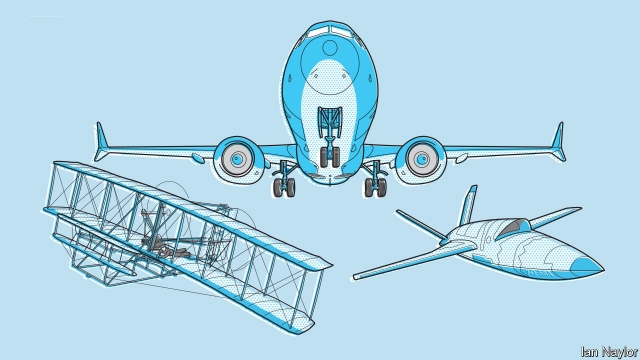
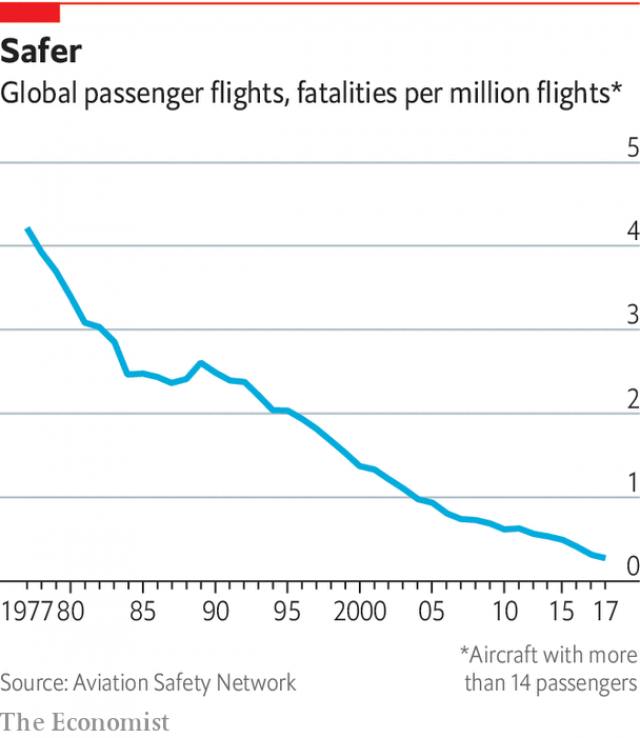

###### Aviation

# Despite setbacks, aviation is changing fast 

##### It must continue to balance conservatism and innovation, writes Geoffrey Carr 

 

> May 30th 2019 

ON MARCH 10TH a Boeing 737 MAX, the latest version of that firm’s bestselling narrow-bodied airliner, fell from the sky in Ethiopia. All 157 souls on board were lost. This followed the crash off the coast of Java, less than five months earlier, of another 737 MAX. The death toll then was 189. The immediate cause in both cases seems to have been a faulty sensor feeding false data to an avionic flight-management system that had, in turn, had new software which pilots had not been briefed about. The flight-management system insisted on overriding the actions of the pilots, who did not know how to respond. This precipitated a stall rather than, as intended, preventing one. 

These two tragedies illuminate the tension between conservatism and innovation that lies at the heart of civil-aviation technology. As a character in “The Leopard”, a novel about the revolutionary events of Italy’s unification in the 19th century, declares: “If we want things to remain as they are, everything needs to change.” Attempts by the industry to follow that advice seem to have been what ultimately caused these crashes. 

The 737 goes back many years. It was conceived in the 1960s, when engines were smaller and passengers generally embarked and disembarked using staircases wheeled in for the purpose rather than airbridges connected directly to a terminal building. Small engines allowed, and staircases encouraged, a design that kept the fuselage close to the ground. 

By the time the 737 MAX was being planned, this had changed. Modern turbofan engines with wide air intakes required, and airbridges permitted, alterations to the airframe that also altered its handling characteristics (its trim, to use the jargon). To keep things as they were, and avoid pilots having to recertify to fly the new version, its avionic software was tweaked to make the new plane’s trim feel, to a pilot, like the old plane’s. That would have been fine as long as the sensors feeding information to those avionics worked properly and the pilots themselves knew what was going on. But they did not. 

The case of the 737 MAX is an extreme example of conservatism at work in aircraft design. But retaining the familiar is a recurring theme. A Boeing 707, the plane that ushered in mass intercontinental air transport in the 1950s, appears to the untutored eye much like the current offerings of Boeing and Airbus, the world’s principal makers of airliners. Both old and new are portholed tubes that have two swept-back wings sticking out of their sides about halfway along. They have three stabiliser fins—two horizontal and one vertical—at the stern. Pods containing their engines hang on pylons from their wings. 

Attempts to change this arrangement have been proposed—most notably Boeing’s delta-winged Sonic Cruiser in the early 2000s. But apart from Concorde, a supersonic aircraft in which the delta-winged arrangement was imposed by the laws of physics, such changes have never got anywhere. Engineers know how to keep it safe, and the world’s airports have grown in synergy with it. Beneath this conservative geometry, however, airliner technology has improved enormously and is still improving. Better materials are making planes lighter and more comfortable to fly in. Better engines are making them quieter and cheaper to run. And better avionics are, despite exceptions of the sort seen so recently, making them safer (see chart). 

 

Those better avionics also point inexorably in one direction: to a day when most aircraft will no longer require a pilot. Airlines and their passengers and regulators may take a while to come to terms with this, so it is likely that pilots will sit in cockpits long after they are needed for anything other than the reassurance of the paying public. But armed forces are embracing a pilotless future. Surveillance and missile-carrying drones have been around for a couple of decades. The 2020s will see robot military helicopters introduced and pilotless fighter jets starting to emerge, even though these jets will, at least to begin with, be parts of squadrons that have a human leader in control. Cargo aircraft—military probably and civilian possibly—will be robotised as well. 

New technology is also extending the concept of civil aviation. The idea of supersonic transport (SST) for civilians is back on the cards, 16 years after Concorde’s last flight. Three firms in America, in particular, have plausible designs for SSTs, appropriate commercial partnerships, and, they hope, sufficient money to get prototypes flying over the next few years. And another old fantasy, flying cars, seems likely to become real in the next few years, as firms both new and old rush to build electrically propelled one- and two-seater aircraft of novel design. Some will act as remotely controlled taxis. Some will be the SUVs of the sky—piloted by their owners over city traffic jams and winding country roads alike. 

In these two areas, SSTs and flying cars, change is happening that is reminiscent of the glory days of aeronautics—the half-century after 1903, the year that the Wright brothers made the first widely recognised, heavier-than-air powered flight, at Kitty Hawk, North Carolina. Flying cars especially, if they can be proved safe and manageable by air-traffic-control systems, may change transport networks almost as much as their ground-based brethren did a century ago, by being able to avoid the congestion that the multiplication of those brethren has brought. 

Conventional civil aviation is also growing fast. The number of jet airliners flying may double by 2040 as people, particularly those in Asia who do not fly now, get richer. That will bring environmental problems, for aviation is the least tractable of industries to decarbonisation in order to reduce greenhouse-gas emissions. Aviation fuel packs more energy per kilogram than batteries do. And, so far, attempts to make such fuel synthetically, rather than from petroleum, have foundered on cost. The embrace of, or resistance to, the growth of aviation may depend on whether that, too, can change. 

