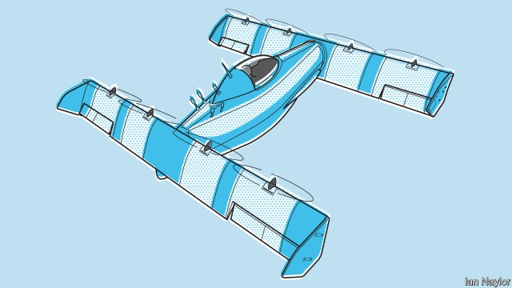

###### Urban air mobility

# Flying cars are almost here, but they don’t look like cars 

##### The first ones available are most likely to run as taxis 

 

> May 30th 2019 

BLACKFLY IS ONE of the strangest flying machines yet built. Its body resembles a small whale—though, when flying, the whale is facing backwards. Attached to its nose and tail are two wings, angled to the horizontal. Each wing sports four propellers. Seen from below when airborne, the thing resembles a slightly flattened letter H (pictured). Its inventor, Marcus Leng, and its sponsor, Larry Page, co-founder of Google, hope it will spawn a transport revolution. 

People have talked of flying cars for years, with little to show for it. In part that is because they took the idea of being car-like too literally. In part it was because the technology was not yet available to build them. Blackfly in no physical way resembles a car. It is a single-seater, and wheelless (its convex belly means that it can land on most surfaces, rocking its way to stability after landing so that it needs no undercarriage). Yet it is aimed at the car-owning classes. It has a car-like cruising speed of 100kph (62mph), and a range of between 40 and 60 kilometres. More than 95% of domestic car journeys undertaken in America are shorter than 50km, and a majority involve only the driver. 

As to technology, Blackfly has a carbon-fibre airframe, electric motors for propulsion, lithium-ion batteries to provide the power, and smart software to stop the pilot accidentally killing himself or anyone else. Moreover, Blackfly has been designed so that it qualifies, in America, as an ultralight. That means the person flying it is required to have neither licence nor training (though the firm will, in practice, insist on customers undertaking an induction course before they take delivery). 

Urban air mobility is the buzz phrase behind Blackfly. And the firm is not alone. A bunch of companies, many of them, like Opener, founded specifically for the purpose, have come up recently with a plethora of designs for single or two-seat personal air transport. That is catnip to technophiles like Mr Page. 

Like Blackfly, most of the new designs derive their motive power from arrays of electrically driven propellers, an arrangement pioneered by the small, “multicopter” drones that took to the air a decade or so ago. Some firms have simply scaled drones up. One such is eHang, a Chinese outfit that was already in the drone-manufacturing business before the idea of urban air mobility took off. eHang’s two-seater, the 216, was unveiled on April 4th at a show in Vienna. It has a cabin that sprouts eight struts, each fitted with two propellers. Unlike Blackfly, which is piloted by its occupant, the 216 will be, at least to start with, a robot, for eHang’s initial plan is to run the craft as taxis rather than private vehicles. 

Another firm building a scaled-up drone is Volocopter, a German startup. The two-seat cabin of its eponymous vehicle is attached below an 18-propeller structure that resembles a spider’s web built of curved strands of silk. This, like eHang’s craft, will offer a preprogrammed point-to-point service for avoiding traffic jams. A second German company, Lilium, has another approach. Its prototype, which has rear-mounted wings, a pair of canards and is propelled by electrically powered ducted fans rather than propellers, made its maiden flight in May. 

Back in Silicon Valley Kitty Hawk, yet another firm part-owned by Mr Page, has also added wings to provide extra lift. Its two-seater, Cora, has 12 small lifting propellers and a single, large, rear-mounted one to drive the thing forward when in flight. And Airbus’s special-projects unit, A3, also based in Silicon Valley, has come up with Vahana, a craft that has four rotatable propeller-laden wings. These point upwards for take-off and landing, and forwards for level flight. Even Boeing has belatedly joined the party, having unveiled its own, so far nameless, offering in January. 

Unlike everything else discussed in this report—even the return of supersonic passenger aircraft—urban air mobility has the potential to change the way society works. It is not exactly a disruptive technology, at least not yet. Planes, trains and automobiles will continue to run more or less as now. But if flying cars really take off, as it were, it would be a transformative technology, for local transport networks would surely change quite a lot. 

As with supersonic passenger planes, the private firms involved in this field have a tendency to make optimistic claims. But some really are getting close to commercial operation. In April eHang received permission from the Chinese government to begin test flights, such as island-hopping, with passengers. Volocopter will be conducting trials of its craft in Singapore later this year, also with a view to starting an air-taxi service. And Opener plans to start making Blackfly commercially by the end of the year. One city to keep a particular eye on is São Paulo, in Brazil, where the authorities already permit taxi journeys by helicopter to avoid the crowded streets below. Success there would be a model for other large cities, particularly ones in middle-income countries that also have inadequate roads. 

Integrating such taxis into air-traffic-control systems should not be too hard. One model of the future is that, as has been suggested for ground cars, increased automation will mean people just call for a flying car when they need one, and it will fly in to pick them up, flight plan filed and ready. Moreover, there are fewer obstacles and surprises in the sky than on the ground, so pilotless flying cars may be easier to build than driverless road cars. If firms like Opener have their way, though, private pilots will buy them for the sheer joy of being in control. That will require new air-traffic-control systems, perhaps ones in which craft talk directly to one another, rather than being centrally managed. 

Back in the more mainstream part of aviation, too, the future looks bright. Fleets are growing as more people in more parts of the world can afford to travel. To pluck another analogy from the unification of Italy, it was said then that “railways will serve to sew up the Italian boot.” The growth of air transport is doing something similar to the planet. Despite recent tragedies, flying is getting safer. It is also getting cheaper and, at least on a per passenger-kilometre basis, greener. The Hegelian synthesis of technological conservatism and innovation that governs the field is, both literally and metaphorically, delivering. 

