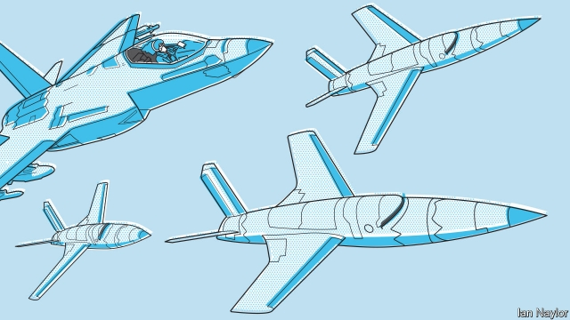

###### Avionics

# Pilotless planes are on the way 

##### The armed forces are keen, the flying public less so 

 

> May 30th 2019 

LAST YEAR Boeing’s Pilot Outlook report estimated that civil aviation will require 790,000 new commercial pilots over the next two decades. Of those, 261,000 will be needed in Asia and 206,000 in North America. One approach to this problem is to open more flight schools. An alternative is to need fewer pilots. And that requires better technology. 

The first autopilot was invented surprisingly early in the history of aviation, in 1912, less than a decade after the Wright brothers’ original flight. It used a gyroscope and altimeter to operate a plane’s control surfaces to keep it flying straight and level. Since then, autopilots have evolved into flight-management systems that can run almost every part of an aeroplane’s journey except taxiing and take-off, and even those are starting to come under automatic control. As recent events have shown, flight-management systems are still not good enough to be trusted completely when lives are at stake. But in a world where automated drones such as America’s Global Hawk reconnaissance vehicle routinely fly military missions, and self-driving vehicles are talked of as if they were just around the corner, the question of how large a civilian flight crew needs to be is clearly open for debate. 

It is also a pertinent question for the armed forces. In particular, pilotless aircraft can be sent on missions too dangerous for people, and possibly ones that piloted craft would be incapable of performing. This could change how future wars are fought. 

Both Airbus and Boeing are preparing for at least a single-pilot commercial-aviation world. Such a world will require not only reliable flight-management systems, but also a redesign of the cockpit for one-person operation. Both firms are now testing simulators of such cockpits. Airlines are keen. A report published last year by UBS, a bank, suggested that moving to single-pilot operation could save the world’s civil-aviation companies $15bn a year. Going fully pilotless would increase that figure to $35bn. 

Moving to single-pilot operation would require an aircraft’s flight-management system to be good enough to take over in a medical emergency that incapacitated a lone aircrew, flying the plane to a nearby airport and landing it safely. For all practical purposes that is true already. It is only during take-off that the human touch is still widely regarded as necessary. Pilots’ unions say they are worried about the ability of a single pilot to handle an emergency brought about by a problem with the aircraft itself, such as an engine failure. But how necessary it is to have two crew members to deal with such exceptional circumstances is moot. 

Even so, automated flight systems are an area where the innate conservatism of aviation technology manifests itself. For example, flight-control software for civil aviation cannot easily take advantage of the “deep learning” capabilities of artificial intelligence. Regulators are loth to license anything they cannot understand. But the whole point of deep learning is that it reprograms itself in unpredictable ways in response to circumstances. That would be of huge benefit, for it would permit the autopilots of individual planes to learn from each other’s experiences. 

In civil aviation, then, passenger aircraft are likely to remain twin-crewed machines for some time. But that may not be true of freighters. There would be no customer resistance here either to single-pilot operation or even to full dronification, as soon as that is possible. And if pilotless freighters proved safe, in a world in which self-driving cars had also become commonplace, passengers’ attitudes might change. 

In America’s armed forces the next set of aircraft likely to drop the pilot is helicopters. Much of the work is being conducted under the aegis of the Defence Advanced Research Projects Agency, or DARPA, a research arm of America’s defence department. As part of its ALIAS (Aircrew Labour In-Cockpit Automation System) project the Sikorsky Aircraft Corporation, which is the helicopter division of Lockheed Martin, has refitted one of the firm’s S76-B commercial models to be able almost to pilot itself. 

As Chris Van Buiten, vice-president of innovations at Sikorsky, observes, flying a helicopter is far harder than flying a plane. Helicopters are aerodynamically unstable, so simply keeping them straight and level is a challenge. But the whole point of a helicopter is that it does not just fly straight and level. It can dodge around to avoid obstacles, meaning it can hug the ground—all of which adds to the mental effort of controlling it. And it is often deployed in weather that would make a fixed-wing pilot think twice. 

MATRIX, as the company dubs its experimental helicopter co-pilot, has a central processor that receives signals from a range of sensors, and combines these with data from the Global Positioning System and a map of the local terrain stored in its memory banks. The processor then sends appropriate signals to actuators located in various places around the craft’s airframe, to control its mechanical systems. The mission-instructions themselves come from MATRIX’s human commander, via a tablet computer, but Mr Van Buiten hopes that voice-recognition systems will soon become reliable enough for those instructions to be spoken. 

One of the advantages of MATRIX is that it can respond much faster than a human pilot. This is valuable in normal circumstances. In an emergency, it may be crucial. It can, for example, react to an engine failure, assess a score of options for a forced landing, and recognise which is safest, all within a hundredth of a second. A human pilot would need a couple of seconds just to work out what was going on. 

The next step on its journey, which should happen in the autumn, is to test the system on Sikorsky’s Black Hawk helicopter. Here it really will, on many occasions, be in sole charge. Field commanders will, as Mr Van Buiten puts it, have the option of two, one or no human pilots on board. 

The ideas behind ALIAS are not confined to helicopters. Until 2017 DARPA followed a twin-track approach—the other track being to sponsor Aurora Flight Sciences, a subsidiary of Boeing, to make a system that would physically replace the co-pilot in the cockpit of a fixed-wing aeroplane. Aurora came up with a pair of devices to do the job. One was a specially designed manipulator that operates the aircraft’s control yoke and pedals. The other was an adaptation of a commercially available robotic arm that pulled appropriate levers and flipped relevant switches. The system also had vision. Rather than being wired to an aircraft’s sensors, it read the instrument display directly and then reacted. 

The advantages of this arrangement are obvious. With appropriate programming it would permit the dronification of any existing aircraft. Aurora tested it on two types of fixed-wing plane and also a UH-1 Iroquois helicopter. It was even put through its paces at the controls of a Boeing 737—though those controls were installed in a flight simulator rather than a real aircraft. 

What has happened to all this hard work is a mystery. Although DARPA has stopped paying for Aurora’s part of ALIAS the firm will not comment on how it is pursuing the matter. The project, now branded Robotic Copilot and described as a “concept development programme”, is still on its website, however. And the idea of something that could take the controls of an existing plane with little modification seems an attractive one in the civilian world as well as the military one. 

As to future pilotless aircraft, significant benefits come from designing people out from the beginning. Such craft require neither cockpits nor life-support systems. Moreover, freed from the need to sustain a human pilot, they could accelerate faster and manoeuvre more nimbly than is possible for a crewed plane. 

That manoeuvrability and acceleration would be particularly advantageous for a fighter jet. And, although autonomous robot fighters are not here yet, something close to that will soon be flying. The idea is to have strike aircraft fly in small squadrons, with a single human acting as squadron leader. 

Lockheed Martin tested this idea in 2017 by converting an F-16, an ageing fighter jet, to act as a drone under the command of a piloted lead aircraft. These tests, conducted at Edwards Air Force Base in California, were deemed successful, and one possible version of the future would be to fit out and deploy the American air force’s fleet of increasingly obsolete F-16s in this way, while a human master of ceremonies sat in a more modern craft—presumably an F-35—conducting the escorts’ actions. Another version of the future sees the robot craft involved in these formations, known as “loyal wingmen”, as being purpose-built. Boeing, indeed, seems to have appropriated and capitalised the term Loyal Wingman to describe its Airpower Teaming System, which was unveiled on February 26th. 

Boeing’s offering will be 12 metres long, about three-quarters the length of an F-35. Prototypes should fly next year. Intriguingly, the announcement was made, and the prototypes will be built, in Australia—for the Airpower Teaming System is being developed in collaboration with Australia’s air force and is intended from the beginning to be available to America’s closest allies, Australia apparently being top of the list. 

Boeing’s loyal wingmen are not the only ones in development. Kratos, a Californian firm that builds drones used by pilots for target practice, is also working on them. Its first test craft, the UTAP-22 MAKO, based on a target drone, has been flying since 2015. A more advanced vehicle, the XQ58a Valkyrie, took to the air on March 5th, making a successful test flight at Yuma in Arizona. Details of Valkyrie are scarce, but pictures of it suggest the extensive use of stealth technology by its designers. 

In the field of military drones, America has only one open rival at the moment: Israel. Its state-run arms firm, Israel Aerospace Industries, produces a reconnaissance drone called Heron. Europe, by contrast, is playing catch-up, and China has said little. 

Europe’s competitor to America’s drones, the snappily titled European Medium Altitude Long Endurance Remotely Piloted Aircraft System, is being put together by Airbus, in collaboration with Dassault Aviation of France and Leonardo of Italy. It should be ready for deployment by 2025. There are no European plans, though, for loyal wingmen. China’s military-drone programme is the purview of the Shenyang Aircraft Corporation, a subsidiary of the Aviation Industry Corporation of China, a state-owned company that is based in Liaoning province. This firm has developed a series of experimental drones with names like Wind Blade, Cloud Shadow and Sharp Sword. As far as is known, however, China has no production-model military drones. 

America, meanwhile, is looking beyond the vision of loyal wingmen. Both DARPA and the American air force seem to be trying to scale down the size of unmanned aircraft, in favour of numbers. DARPA calls its programme Gremlins. And it is at the heart of the air force’s Small Unmanned Systems Flight Plan, published in 2016. 

Gremlins will be drones about four metres long, with a wingspan of 3.5 metres, that are dropped, mid-air, from transport aircraft and then picked up again, mid-air, by that mother ship or a similar one, if they survive their mission. DARPA’s contract for the Gremlins programme is held by Dynetics, a firm based in Alabama, and the first test of the craft, pushing some of them out of the back of a C-130, is scheduled for later this year. What they lack in size, Gremlins will make up for in quantity—the idea being to overwhelm enemy defences as a swarm of wasps overwhelms a picnic. If it works, that will create a whole new form of aerial warfare. 

