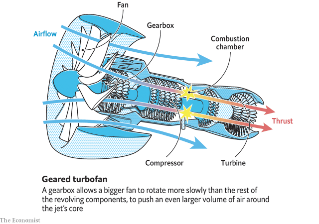

###### Propulsion systems

# Smaller planes could soon use electric propulsion 

##### Turbofans for larger craft are improving rapidly, too 

> May 30th 2019 

 

JET AIRLINERS are not, in fact, jet airliners. Though the first of the breed, the de Havilland Comet, really was powered only by sleek turbojets that fitted elegantly into its wings, it did not take engineers long to work out that a turbojet works best not by itself but as part of a bigger whole. 

A turbojet takes in air through a revolving compressor, mixes the compressed air with fuel, burns the mixture in a combustion chamber and ejects the exhaust out of the back to provide thrust, having first run it through a turbine which, via a shaft running along the engine’s axis, turns the compressor. Modern engines, however, also use the jet’s revolving shaft to spin either a propeller, creating a turboprop, or a ducted set of blades, creating a turbofan (see diagram). Both of these arrangements—and particularly turbofans—move more air, and thus create more thrust, than the turbojet within is capable of generating by itself. For long-haul flight, therefore, turbofans are preferred. 

As with making large aircraft themselves, the business of building turbofans is confined to a few big firms. According to Market Research Future, a consultancy, General Electric (GE) and United Technologies (trading under the Pratt & Whitney brand) in America, Rolls-Royce in Britain, and CFM International (a collaboration between GE and Safran, of France) account collectively for almost 93% of the turbofan market. And each is intent on upping what is known as the bypass ratio of its engines. 

A turbofan’s bypass ratio is the amount of fan-driven air it expels from the rear divided by the amount of exhaust from the combustion chamber. The bigger the bypass ratio, the more efficient the engine. More efficiency means lower costs. It also means less environmental impact. 

The GE9X, as fitted to Boeing’s new 777-9X, which was rolled out on March 13th, shortly after the second of the 737 MAX crashes, is currently the world’s largest turbofan. It has a bypass ratio of 10:1. The latest iteration of Rolls-Royce’s Trent, the 7000, will also have a 10:1 ratio. And CFM, which specialises in engines for narrowbodied jets, and thus avoids treading on GE’s toes in the widebodied-jet market, has an engine called LEAP with a bypass ratio of 11:1. The daddy of the field at the moment, though, is Pratt & Whitney’s PW1000G (branded “PurePower”). Its best-performing version has a bypass ratio of more than 12:1. 

Pratt & Whitney’s lead is the result of a gamble. Turbofans are complicated beasts, put together from about 25,000 component parts. The company’s engineers decided to make them more complicated still, by adding a gearbox. This reduces the speed at which the fan blades spin, relative to the shaft. The shaft needs to spin rapidly because it also drives the compressor, but that high rate of revolution puts a strain on the fan blades. Reducing this strain allows the blades to be longer, meaning the engine can have a wider air intake that is able to gulp in more air and thus to achieve a bigger bypass ratio. 

Gearing is not, though, the only way to make engines more efficient. Better materials also help. As with airframes, replacing metal alloys with composites saves weight, which saves fuel. And composites also offer a way to deal with an engine’s intense heat. 

Two composite materials are particularly pertinent to aircraft engines: for fan blades, carbon-fibre-reinforced plastics similar to those used in airframes; and for components that need to be heat-resistant, ceramic-matrix composites, in which both fibres and matrix are made of a material such as silicon carbide. At the moment, GE leads the way in the use of these materials in engines. It has been making carbon-fibre blades for its turbofans since the 1990s. In the case of LEAP this halves the number of blades required, compared with its predecessor, the CFM56, from 36 to 18. GE also makes extensive use of additive manufacturing, commonly known as 3D printing, which permits the manufacture of shapes—including weight-saving voids—that conventional manufacturing can manage only with difficulty, if at all. 

Rolls-Royce, meanwhile, is planning to go the whole hog, using a gearbox, carbon-fibre blades and a range of ceramic-matrix composites in what it calls its “ultrafan” technology, which it hopes will permit bypass ratios above 15. Ultrafan will also make use of additive manufacturing. And, naturally, every component in an ultrafan engine will have its digital twin in Rolls-Royce’s computers, keeping track of what is happening to it and flagging up any maintenance-related issues. 

In the end, though, all these improvements to turbofans lead simply to better turbofans. The propulsion systems of large passenger aircraft seem unlikely to change radically from this arrangement in the foreseeable future. But that is not the case for small passenger aircraft. There is now a real possibility that many of these will be converted to electric propulsion. 

The aircraft in question are those driven by propellers. Replacing piston engines, or even turboprops, with electric motors would have several advantages. One is that such motors are easier and cheaper to maintain. Another is that they are quieter, which would make planes using them popular at urban airports with a lot of neighbours. A third is that, depending on how the electricity is generated, electric propulsion sometimes offers a saving in greenhouse-gas emissions. 

As is also true of electric road vehicles, the terminology of electric aircraft has become confused. An electric motor is an electric motor regardless of where the electricity comes from. There is a tendency, however, to refer to motors supplied only by batteries as “pure” electric systems, whereas those that employ both batteries and an on-board generator are known as hybrids. 

In an aerial context, where weight is everything, a large or long-distance electrically propelled aircraft will, for the moment, have to be a hybrid. Existing batteries cannot store enough juice per kilogram to allow otherwise—though, as Grazia Vittadini of Airbus observes, lithium-ion batteries are improving by one or two per cent a year. And, like compound interest, such incremental change adds up. 

For small, short-haul planes, however, today’s batteries will suffice. One airline running such services has already announced that it is going down the electric route. On March 26th Harbour Air, a firm in British Columbia, Canada, made public a deal with magniX, an aspiring manufacturer of electric motors for aircraft. Harbour Air will, if all goes according to plan, fit its fleet of around 40 seaplanes with magniX’s motors, using lithium-ion batteries as the power pack. The first in line for conversion is a six-seater, but the largest plane in the fleet has three times that capacity. 

Harbour Air may not be alone for long. Ampaire, a firm in Hawthorne, California, hopes, later this year, to do something similar in collaboration with Mokulele Airlines, a Hawaiian company. Mokulele’s planes, unlike Harbour’s, touch down on runways. 

Fitting existing airframes with electric engines is clearly the quickest way of getting electricity-driven aviation airborne. But it may not, in the longer run, be the best. Most of the firms that plan to launch electrically powered regional aircraft are starting from scratch, using airframes made from carbon-fibre-reinforced plastics as well as specially designed motors. 

The most advanced of these startups is Eviation, an Israeli firm. Its proposal, called Alice, is a pure-battery system intended to carry nine people 1,000km. Alice has three engines, supplied either by magniX or by Siemens, a German engineering firm, at the customer’s choice. These are mounted, one on each wing tip (where they also serve to reduce drag) and one at the stern, with the propellers facing backwards to push the plane through the air. A prototype, built in north-west France, awaits certification. Eviation hopes to fly it thence to the country’s capital and show it off at the Paris air show in June. 

Several other firms, mostly American, are following in Eviation’s wake with proposals to build aircraft of similar range and capacity. Most of their designs, however, differ in one important respect from Eviation’s. They use ducted fans rather than propellers. These are more efficient at producing thrust, and also quieter. 

Ampaire, for example, has a proposal it calls “Tailwind” that would be pushed along by a single such fan at the stern. Zunum Aero, in Seattle, proposes two ducted fans mounted on the sides of the fuselage, near the rear. And Wright Electric, a firm in Los Angeles, backed by Larry Page, a co-founder of Google and now boss of Google’s parent company, Alphabet, has teamed up with easyJet, a British airline, with the aspiration of producing a nine-seater with enough range to be able to fly from London to Amsterdam. 

Just how far electrification can be pushed is unclear. Airbus seems to think it could be quite a long way. It has teamed up with Rolls-Royce and Siemens to electrify an example of a 100-seater regional aircraft called the BAe146. This project is intriguing, not least because the plane is not even a propeller aircraft to start with. It is powered by turbofans. 

The consortium is proceeding cautiously, and will replace only one of the 146’s four engines on the test runs planned for next year. If those go well, a second will be swapped, too. It is hard to imagine an electric version of a plane like a 146 being purely battery-powered. But even a hybrid version of a plane that large would demonstrate that electric engines could have a big future in aviation. 

