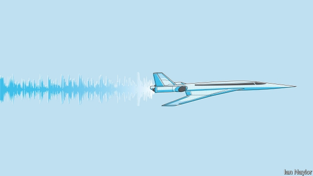

###### Faster than sound

# Supersonic aeroplanes could make a comeback 

##### Three American companies are developing them 

 

> May 30th 2019 

 ON OCTOBER 24TH 2003 Concorde made its last commercial flight. It carried a full load of passengers, 100 of them, from New York to London. And it did so in three and a half hours. It was able to make the journey so rapidly because its top speed was Mach 2.04—just over twice the velocity of sound. 

In its day, Concorde was a superb piece of engineering. But it was also a vanity project, cooked up in the early 1960s by the British and French governments. Issues like profit were ignored. However superb the engineering, with the technology then available the profitable operation of such a plane was impossible. 

Technology moves on, though, and several truly commercial undertakings think the time is now ripe for something similar. Most of the running is being made by three American firms, Aerion, Boom and Spike. Aerion’s offering, the AS2, is a 12-seater intended to fly at Mach 1.4. Overture, the aircraft planned by Boom, will get to Mach 2.2. It will carry 55-75 passengers. Spike’s proposal, the S-512, lies between these extremes. It is intended to carry 18 passengers at Mach 1.6. All three firms think that improvements in materials, engine design and the understanding of aerodynamics mean their proposed craft can be operated profitably and without too much discomfort, in the form of sonic booms, to those on the ground below. 

In February Aerion signed a development deal with Boeing. It also has an arrangement with GE to develop a supersonic engine called Affinity, capable of operating efficiently both subsonically and supersonically. The plan is to attach these, three at a time, to an airframe built by Spirit AeroSystems, a large manufacturer of airframe components. And all this will come to pass, Aerion claims, by 2023—the current target for the AS2 to take off. 

Boom has yet to announce a propulsion system for Overture. But it, too, has development money, having received a tranche of $41m in venture funding in 2017 and a further $100m this January. And it will soon have a prototype, a one-third-scale aircraft that it calls Baby Boom. This is powered by three of General Electric’s J85-15 engines—the military versions of the CJ610, an established workhorse of business jets. All being well, Baby Boom will take to the air early next year and fly at Mach 2.2. 

Like Boom, Spike has yet to pick an engine, though it plans to do so by the end of the year. It also plans a subsonic demonstration flight in June, and a supersonic demonstration next year. Whether supersonic commercial aviation really will work this time should thus be clear by the mid 2020s. A few visionaries are, however, looking beyond the merely supersonic. They want to go hypersonic—beyond Mach 5. That would make it possible to fly to an airport’s antipodes in less than four hours. 

At this speed the physics get scary. Air entering a hypersonic jet engine would be travelling at more than 1.7km per second. Slowing this air down sufficiently for it to be manageable would convert its kinetic energy into heat so intense that it would melt most of the materials of which such an engine might be made. 

All this explains why existing hypersonic vehicles—namely satellite-launchers—are rocket-propelled. A rocket carries its own oxidant and so does not need to breathe air. The only alternative that has been tested experimentally is called a supersonic-combustion ramjet. This does not require the incoming air to be slowed down to the same extent as a turbofan. But it has to be accelerated to Mach 5 to start operating, usually by a rocket. 

A small British company called Reaction Engines does, however, have an alternative on offer. Skylon, as it calls its design, would be powered by engines able to switch between air and liquid oxygen. They are known as Synergetic Air Breathing Rocket Engines (SABRES) and would be fuelled by liquid hydrogen, which has a temperature of less than 20 degrees above absolute zero. The trick, when a SABRE is in air-breathing mode, would be to use this coldness to absorb heat generated by the inrushing air before it could cause damage. A heat-exchanger intended to do this was tested successfully in April. 

At best, the chances of a tiny team working in the metaphorical equivalent of a garden shed cracking the problem of air-breathing hypersonic flight are slim. But perhaps they are not zero. The fundamental design looks sound, and there has, over the years, been enough interest from outsiders such as Boeing, Rolls-Royce and BAE to keep the dream alive. 

If Skylon does eventually fly, its first use is likely to be as an unmanned space plane carrying objects into orbit. But one day, perhaps, it or a successor will—for those rich enough—make popping over to Sydney for a weekend break seem just the thing. 

