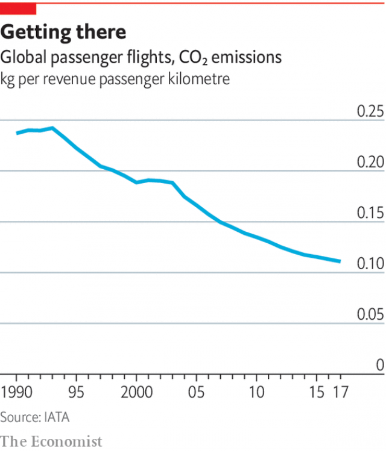

###### Aviation and the environment

# Using aviation biofuel continues to be difficult 

##### Emissions from flying are comparatively low, but growing 

 

> May 30th 2019 

COMPARED WITH electricity generation (44%), road transport (17%) and even cement-making (4%), aviation, at about 2%, is not a huge source of man-made greenhouse-gas emissions. But it is a source, and it is growing fast. The International Civil Aviation Organisation, an arm of the UN, forecasts that such emissions could rise between three- and seven-fold by 2050 if nothing substantial is done. More efficient engines (see chart) and the introduction of a certain amount of electrification will help, but will only cut into this growth rate, not reverse it. To do that would require the fuel itself to be made “carbon-neutral”. 

That is not the same as carbon-free. The chemistry of what went into an aircraft’s fuel tank would change little, if at all. Rather, the idea would be to borrow the carbon in the fuel from the air, in the form of carbon dioxide. Then, add energy and hydrogen and remove the oxygen to turn it into appropriate hydrocarbons, and release the energy added in the same way that the energy in conventional fuel is released—by burning the fuel in a turbojet that then turns a turbofan or a propeller. As long as the added energy was not itself derived from fossil fuels, this would not add to the natural stock of atmospheric CO2. 

Though plans exist to build machines which would suck the carbon for this process directly out of the air, doing so on an industrial scale would be a heroic endeavour. Such carbon-capturing machines already exist in nature, though. They are called plants. 

Chemically, there are at least half a dozen ways of turning plant matter into aviation fuel. Two stand out. One is called HEFA (Hydroprocessed Esters and Fatty Acids). The other is the Fischer-Tropsch process. 

 

The raw material for HEFA is plant oils. One of the attractions of this is that the oils in question can be cast-offs, like used cooking oil, that would otherwise be thrown away. At small scale, HEFA can therefore rely on recycled waste products as its raw material. Plant oils and their derivatives (the esters and fatty acids in the process’s name) are similar to the hydrocarbon molecules in petroleum-based aircraft fuel, but need to be stripped of their oxygen atoms to become identical. HEFA does that by getting them to react with hydrogen, in the presence of a catalyst. The oxygen atoms are carried away either in water molecules or in molecules of carbon monoxide or carbon dioxide, depending on the details of the process. 

Just how green HEFA is depends on the source of the hydrogen. Ideally, it would come from the electrolysis of water, the electricity involved having, in its turn, been generated by some fossil-fuel-free method such as solar, wind or nuclear power. Unfortunately, the main source of industrial hydrogen at the moment is steam reformation, a two-stage operation in which methane and steam react together to make hydrogen and carbon dioxide. 

The Fischer-Tropsch process is a well-established set of chemical reactions (it was invented in 1925) that have, in the past, been used to convert both coal and natural gas into liquid fuels. It takes carbon-rich material from whatever source and reacts it with steam in a manner identical to the first stage of steam reformation. This produces a mixture of hydrogen and carbon monoxide known as syngas, which can be further reacted, using appropriate catalysts, to produce hydrocarbon molecules of the desired size. To make aviation fuel, for example, those molecules should have between eight and 16 carbon atoms in them. 

Both of these approaches work chemically. But they also have carbon footprints of their own, and therefore reduce global warming by different amounts. According to a report published in 2017 by Imperial College, London, preparing and burning aviation fuel made by HEFA from used cooking oil yields a 69% saving of carbon-dioxide emissions compared with those created by refining and burning aviation fuel made from petroleum. Used cooking oil is, however, in finite supply. Start with fresh oil, as would be needed if a significant fraction of aviation fuel were to be made this way, and the saving drops to 20-54%. For the Fischer-Tropsch process, using fast-growing grasses known as energy crops, the saving is 85-90%, rising to 95% if leftover wood from forestry is the feedstock. 

On the face of things, then, the Fischer-Tropsch route looks the better one. It may also be the cheaper. For HEFA, the price of the vegetable oil alone, unless it is waste, already exceeds the cost of petroleum-based aviation fuel. And waste oil is a drop in the ocean of the raw materials that would be required for biofuels to make a dent in CO2 emissions. Energy crops are a lot cheaper than that. The Fischer-Tropsch process does, however, require enormous capital investment in the necessary plant. In this regard HEFA is cheaper. 

Unfortunately, if they are to meet a significant fraction of the demand for aviation fuel, both of these methods will require a lot of land to grow their raw materials. But this could change. In particular, there are hopes that the new field of synthetic biology will come up with ways of generating esters and fatty acids in fast-growing micro-organisms—or even arrange for those micro-organisms to synthesise the relevant hydrocarbons directly. That would reboot everyone’s calculations, and have ramifications far beyond the field of aviation. For the moment, though, the outlook for bio-aviation fuel is glum. 

