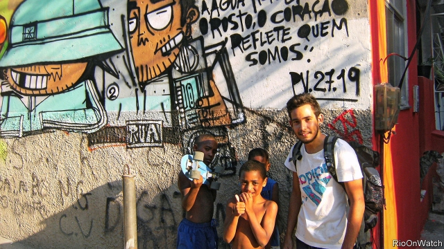
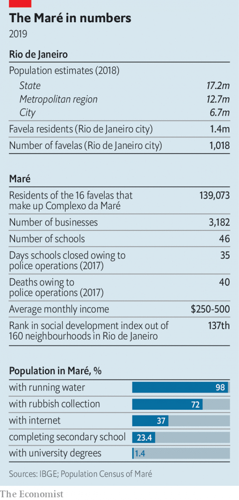

###### Mapping the Maré

# A new census shows how a Brazilian favela really works 

##### But it can’t halt the violence in Rio de Janeiro 

 

> May 30th 2019 

As YOU WALK down Rua Teixeira Ribeiro, a commercial avenue in the Complexo da Maré, Rio de Janeiro’s biggest favela, you barely notice the open-air drug markets guarded by teens with AK-47s. There are also pet stores with exotic fish, restaurants with better service than most Copacabana bistros and a hipster barbershop with mood lighting and retro décor. And now, for the first time, they have been counted. An unofficial census conducted by more than 100 local people over a period of six years found that the Maré includes 660 bars, 307 beauty salons, 138 supermarkets, 69 computer stores, 21 ice-cream shops and 8 dental offices. In total, 3,182 licit businesses employ 9,371 people. 

The census was organised by two NGOs, Redes da Maré and Observatório de Favelas. Later this month they will publish a 112-page book of their findings. The idea is to put a part of the city that until recently was mostly uncharted onto the map. Despite being home to some 140,000 people, roughly the same as the more famous Copacabana, this informal settlement was a blank spot on Google and city maps. Such invisibility “makes it easier for the government and society to treat favela residents like they don’t exist”, says Everton Pereira da Silva, one of the census-takers. His grandfather moved to the favela in the 1960s from Brazil’s north-east and worked on its electricity grid; now he is working on its informational grid. 

The national government conducts a census, too; the most recent was in 2010. But its universal survey had only a couple of dozen questions. The unofficial census, led by Dalcio Marinho, a geographer, and Eliana Sousa Silva, the founder of Redes, had many more and reached 93% of Maré residents. Some results were expected. Some 26% of Maré residents were born in Brazil’s north-east, 62% identify as black or mixed-race and 60% root for the football team Flamengo. But others have spurred the government to tackle problems it had long overlooked—for example, proof that the Maré has lots of children skipping classes has helped convince the city to build 25 new schools. 

The data created by the mapping have been shared with Google, and now the Maré’s streets and businesses are visible online and recorded by the city government. In 2016 more than 530 street names entered the official register, the largest collection in history. Their residents gained postcodes, which enabled them to sign up for bank accounts and receive letters. 

 

The results illuminate how the favela’s economy works. Around 13% of businesses close each year but owners often start new ventures. The Maré has no physical bank, so startup capital usually comes from savings earned from jobs in the formal economy; only 15% of favela entrepreneurs have any debt. Businesses that are obsolete elsewhere thrive. Getúlio Tolentino, who runs a DVD-rental shop for some 6,000 clients, benefits from the fact that newly ubiquitous Wi-Fi is still too slow for streaming. (He also has a side business, selling sex toys and providing “erotic lessons”.) 

Similar mapping projects are now taking place in more than 200 of Rio’s 1,018 informal settlements, home to 23% of the city’s population. The hope is that they can bring about similar changes. But although counting encourages the government to pay attention, it cannot restore order. On May 6th police helicopters started shooting over the Maré just as children left schools. In the first four months of this year, cops in the state gunned down 558 people. A city councilwoman, Marielle Franco, the first person elected to office from the Maré, was murdered last year. 

At the Museu da Maré, a humble institution housed in an old ship-building factory, exhibits show how life has improved. There are pula-pulas, barrels once used to haul water from the nearby Guanabara Bay. Nowadays 98% of residents have running water. Each year more attend university. “We thought the violence would disappear once we got electricity, water and trash collection, but we were wrong,” says Lourenço Cezar da Silva, the museum’s director. 

