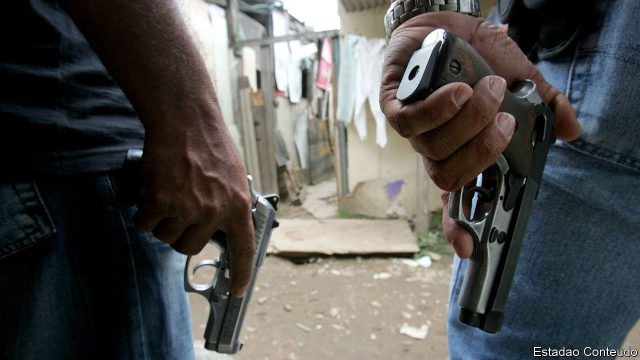
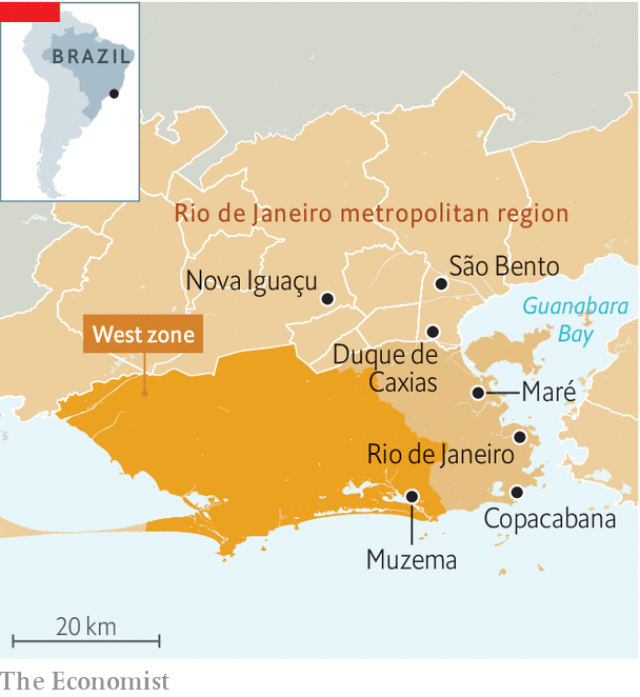

###### Shadow state

# Mafias run by rogue police officers are terrorising Rio 

##### President Jair Bolsonaro is turning a blind eye 

 

> May 30th 2019 

LATE LAST year mysterious trucks started dumping industrial waste at a precolonial archaeological site in Duque de Caxias, an industrial city of 900,000 people some 24km (15 miles) north of Rio de Janeiro. Environmental activists thought they knew who was behind it. Over the past decade, their battle to protect local nature reserves and the poor people who live near them has become a battle against criminal groups known as militias. 

Prosecutors say that from the mid-1990s these groups, often made up of rogue police officers, started snatching swampy federal land. They filled it with dirt and sold the lots to families, mostly poor migrants from other states. In São Bento, a neighbourhood in the city, a hill overlooks thousands of identical tin-roofed shacks. “The militias control all of it,” says an activist. For a fee, they provide transport, water, cooking gas, cable television and internet. But they also flaunt heavy weapons, run extortion rackets and threaten to kill anyone who opposes them. 

According to an investigation last year by G1, a Brazilian news site, militias control 348 square kilometres of land—roughly a quarter of the Rio de Janeiro metropolitan region. That territory is home to 2m people. Unlike drug-traffickers, who also control plenty of neighbourhoods in Rio, militias have close connections to the state. “They’re untouchable by the law because they themselves are the law,” says José Cláudio Souza Alves, of the Federal Rural University of Rio de Janeiro. As a congressman, Jair Bolsonaro, Brazil’s populist president, defended militias, though he is more careful now. “Where the militia is paid, there is no violence,” he claimed last year. 

 

Violence and politics have long been intertwined in Rio de Janeiro. In the 1950s a federal deputy from Duque de Caxias prowled around with a German machinegun. A film in 1986 romanticised his life, but historians pin several dozen violent crimes on him, including at least one murder. Brazil’s military dictatorship, which fell in 1985, used police death squads to kill political opponents (some of whom were urban guerrillas) and other unwanted people. 

Militias evolved out of citizen-led vigilante groups that emerged in the 1990s to tackle drug gangs, says Mr Alves. Today they are de facto mafias. They thrive in the power vacuum of Rio’s peripheries, offering what Mr Alves calls “false security”. They are popular with politicians thanks to their talent for getting out the vote. Police officers among their members help them to thwart investigations. Their political ties help them to filch public money. 

In 2007 Marcelo Freixo, then a state congressman from the left-wing Socialism and Liberty Party (PSOL), proposed a parliamentary commission to investigate militias. But it was not until 2008, after militiamen kidnapped and tortured two journalists and their driver, that politicians agreed to the inquiry. After months of testimony, the commission released a 282-page report that accused 226 people of having militia connections, including police and army officers and city and state politicians. Most were eventually jailed. 

Those who avoided prison and worse—25 of those named in the report have since been murdered—shifted their strategy to become less brazen and more enterprising, often outsourcing violence. Duque de Caxias is among Brazil’s richest municipalities thanks to its oil refinery, chemical industry and position on the highway. That makes it an attractive market for what Gabriel Ferrando of the state police’s organised-crime unit (DRACO) calls the militias’ “power project”. They have “an absurd capacity to adapt”, he says. 

By contrast, the authorities are weak. A federal judge was murdered in another part of Greater Rio in 2011. A police delegation sent in February to investigate land-grabbing in Duque de Caxias concluded that officers could not do their work without risking their lives. According to Julio José Araujo Junior, a federal prosecutor, “our goal, frankly, is not to resolve the situation but to keep it from getting worse.” 

To prosecutors’ consternation, the mayor’s office has sought to issue titles for irregularly occupied federal land. “It’s precisely this stamp of approval that the militias seek,” says Mr Araujo. Locals say that after several low-lying areas in São Bento were declared uninhabitable and 300 families were promised apartments in a government housing project, militia members distributed the flats among families from another area, and then extorted money. 

In 2016, when he was a federal congressman, the mayor of Duque de Caxias, Washington Reis, was fined by the supreme court for cutting down trees in a nature reserve in order to build an illegal housing development. He appears in Facebook photos with Chiquinho Grandão, a city councilman accused by prosecutors in 2010 of leading an extermination squad responsible for some 50 murders. Both deny militia connections. Mr Grandão laments the waste-dumping and land-grabbing in São Bento, but blames it on the mayor’s office. He says he has “never heard about militias” there. The mayor’s office argues that giving out titles deters illegal construction. 

Militias in Duque de Caxias have also been accused of stealing sand (for building work) and petrol from government pipelines. On April 26th a leak from an illegal tap left a nine-year-old girl with third-degree burns; she died in hospital. Militias in some places hold auctions where drug gangs bid for the right to sell their wares on militia turf. In Nova Iguaçu, a city that borders Duque de Caxias, militiamen recently started extorting money from taxi drivers. The drivers were already paying off drug dealers and corrupt cops. “So who do you report it to?” one driver asks. 

The government’s plans may end up strengthening militias. Sérgio Moro, the justice minister, has introduced a bill that would shield from prosecution police who kill criminals because of “excusable fear, surprise or intense emotion”. Mr Bolsonaro has expanded the right to own and carry guns, suggesting people need them to protect themselves from criminals. “We’re returning to the origin myth that fuelled the militias,” says Tarcísio Motta, the leader of PSOL in Rio’s city council. 

However, the militias’ links with Mr Bolsonaro’s government may provoke a backlash. There was an outcry after the murder in March last year of Marielle Franco, a city councilwoman from PSOL. In March two former cops were arrested for her murder and accused of belonging to a militia in Rio’s West Zone. One lived in the same condo as Mr Bolsonaro; his daughter had dated the president’s son. Another of Mr Bolsonaro’s sons, Flávio, a senator from Rio, employed the wife and mother of a fugitive police officer accused of leading the same militia. Flávio and the aide who hired them are under investigation for money laundering, involving real estate deals. On May 29th President Bolsonaro’s wife’s uncle was arrested on suspicion of ties to an allegedly land-grabbing militia near Brasília. All deny wrongdoing. 

Mr Ferrando of DRACO admits that militias were “not a priority” in the past. Now, he says, police, prosecutors and regulatory agencies will use lessons from Brazil’s Lava Jato anti-corruption investigations to attack the militias’ economic activities. This “follow the money” strategy will be put to the test in Muzema, a favela in Rio’s West Zone where two apartment buildings collapsed in April, killing 24 people. The illegal properties had been built by the militia thought to be responsible for Ms Franco’s murder. In the days after the tragedy, relatives watched as firefighters pulled bodies from the rubble. The sound of their pneumatic drills blended with those at new construction sites all around. 

