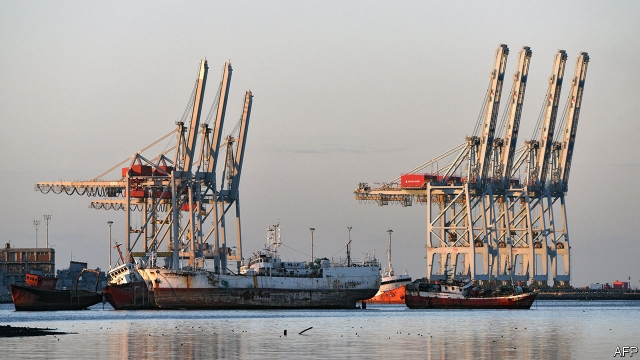
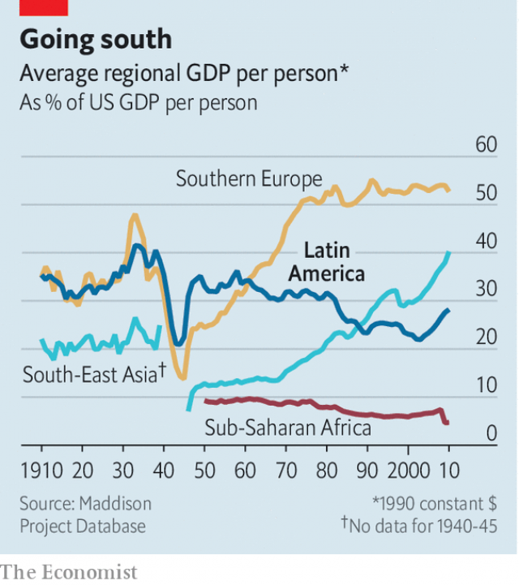

###### Bello

# Why Latin America’s economies are stagnating 

##### Exporting more is the way to buck the trend 

 

> May 30th 2019 

FORECASTERS SLASHING their predictions for economic growth in Latin America has become a depressing annual ritual. This year is no different. The IMF at first expected growth of 2%. By April that had become 1.4%. Even this may be too rosy. In the first three months of the year the three biggest economies—Brazil, Mexico and Argentina—all seem to have contracted and others performed weakly. Since the world economy has expanded relatively strongly in recent years, what this means is that Latin America is falling behind. 

Of course there are some bright spots. Many Latin American economies are at least more resilient and less volatile than they were, thanks to more responsible fiscal policy. Those countries where leaders thought that prudent macroeconomic policy was for dummies—Hugo Chávez in Venezuela, Dilma Rousseff in Brazil and Cristina Fernández in Argentina—have seen slumps. But the really worrying thing is that Latin America’s lagging economic performance has lasted for several decades (see chart). The gap between the region’s average income per person and that of the United States is wider than it was in the 1950s. Two new studies try to explain this relative failure, and how it could be reversed. 

In a paper for the Inter-American Dialogue, a think-tank in Washington, Augusto de la Torre and Alain Ize look at what distinguishes those Latin American countries whose GDP per person has grown significantly faster than that of the United States in this century. That applies to Peru, Chile and Uruguay, which are commodity exporters, and to Costa Rica, the Dominican Republic and Panama, which are service exporters. They conclude that success in international markets—as measured by a rising share of world exports—has been the route to income convergence. That is partly because exporting is a form of learning, as other economists have noted. There is a troubling exception to this rule: Mexico has gained export share but its income has stagnated largely because the rest of its economy is so inefficient. 

 

Counter-cyclical macroeconomic policies are crucial, too, especially in countries that export commodities, the prices of which can fluctuate wildly. But extreme income inequality and widespread poverty make it hard for Latin American governments to resist public pressure to spend during booms. This means that rather than an afterthought, good social policy should be considered a core component of economic management. Clearly, not every country can expand its share of world exports; this is especially hard when protectionism is on the rise. But Latin America has much scope to expand service exports, such as care of the elderly as well as tourism, provided it reduces crime. 

Researchers at the McKinsey Global Institute look at Latin America’s lack of convergence from a different angle. Focusing mainly on Brazil, Mexico and Colombia, they identify two “missing middles”. The first is a shortage of medium-sized firms. Relative to the size of the economy, Latin America has only about half as many companies with sales of $10m to $500m a year as a comparator group of ten emerging economies elsewhere. The Latin American ones tend to make higher profits—a sign that they face less competition. 

The flipside is a lack of well-paid jobs and thus “a missing cohort of middle-class consumers with sufficient income to maintain robust domestic demand”, the report finds. The poorest three-quarters of Latin Americans account for just 40% of total consumption, compared with two-thirds of consumption in the comparator group. Lack of consumer demand deters firms from investing. 

Unless Latin American businesses become more productive, the region’s outlook is dim. According to McKinsey, 72% of the region’s economic growth between 2000 and 2016 was owing to the expansion of the labour force rather than higher productivity. Latin American women now have fewer babies so the labour force will soon stop growing. 

Two political lessons stand out. The left should understand that fiscal discipline and exports are vital to achieve sustained income growth. But the right needs to learn that monopolies hold back economies, that workers should share in productivity gains and that taxes should be adjusted so that they do not fall disproportionately on consumption rather than income. Otherwise Latin America risks being trapped in a vicious circle of economic stagnation and social and political conflict. 

