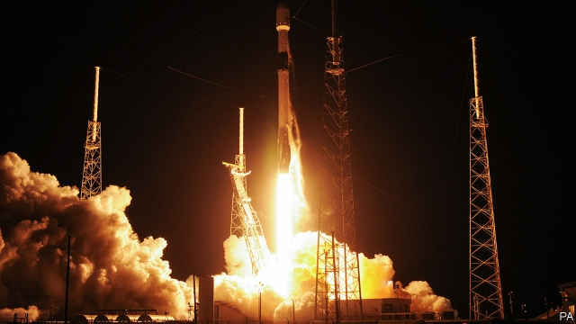

###### The next to blow

# Business this week 

> May 30th 2019 

Fiat Chrysler Automobiles confirmed that it was seeking a merger with Renault, a combination that would create the world’s third-largest car company behind Volkswagen and Toyota. FCA and Renault hope the merger will save cash to bolster investments in electric vehicles and self-driving cars. But Renault is also in a close partnership with Japan’s Nissan and Mitsubishi. That alliance has been strained since the arrest of Carlos Ghosn, its former boss, on charges of financial misconduct at Nissan (which he denies) and its future is now in question. See article. 

Alibaba was reportedly considering a second listing of its shares, but in Hong Kong rather than New York, where its $25bn stockmarket debut in 2014 remains the world’s biggest IPO. This time it is seeking to raise $20bn. Its decision to list in Hong Kong comes amid uncertainties over the future treatment of Chinese companies by the American authorities. Alibaba is using its profits from e-commerce to invest in artificial intelligence, quantum computing and other sensitive tech areas where America and China are competing aggressively. See article. 

The latest skirmish in the trade war saw China threaten to limit supplies to America of rare earths, a group of 17 metals vital to fast-growing businesses such as electric cars but also widely used in the defence industry. China accounts for the vast bulk of rare-earth production; for some of the metals it is the sole producer. In 2010 it cut exports to Japan during a maritime dispute. 

Maersk, the world’s biggest shipping company, gave a downbeat assessment of the effect of global-trade tensions on its industry. It estimates that container trade grew by 1.7% in the first quarter compared with the same period a year earlier. That is less than half the average for 2018. 

Boeing’s 737  MAX aircraft is unlikely to return to service until at least August, according to the International Air Transport Association. A recent meeting of global safety-regulators avoided putting a date on a return for the MAX, which has been grounded following two crashes. IATA stressed that it will be regulators who make the final decision. See article. 

The Food and Drug Administration approved a gene therapy developed by Novartis for treating spinal muscular atrophy in children. Priced at $2.1m, Zolgensma is the world’s most expensive drug, though it costs half the current treatment for SMA over the first ten years of a child’s life. 

The first trial got under way in Oklahoma of a drugmaker facing claims that its marketing of painkillers fuelled the opioid crisis. Johnson & Johnson argues that it followed the law and has decided to fight the case. Its two former co-defendants settled with the state: Purdue Pharma for $270m and Teva, this week, for $85m. See article. 

Germany’s unemployment rate rose to 5% in May, the first increase in five years. Most of the rise is explained by a change to the way the government counts the unemployed, but the labour ministry said that Germany’s slowing economy was also a factor. 

Global Payments, which focuses on processing transactions, agreed to buy Total System Services, which specialises in clearing them, for $21.5bn. It is the third big merger in the payments industry this year. 

 

After delays because of bad weather, SpaceX launched the first batch of satellites that will eventually form its Starlink broadband-internet network. Its boss, Elon Musk, lauded the achievement, SpaceX’s heaviest payload yet. Not everyone was happy. Around 12,000 satellites will be deployed by the mid- 2020s. They operate in low orbit and are brighter than expected, prompting concerns from astronomers about obstructed telescope observations. See article. 

Arun Jaitley stepped down as India’s finance minister because of ill health. Mr Jaitley oversaw many of the financial reforms introduced under the government of Narendra Modi, including a consumption tax. 

Indian authorities stopped the founder of Jet Airways, Naresh Goyal, from flying out of the country. The government has promised to make it harder for the bosses of bankrupt companies to leave India following the case of Vijay Mallya. The boss of Kingfisher Airlines fled to London in 2016 and is fighting extradition. 

In the process of finalising her divorce from Jeff Bezos, MacKenzie Bezos promised to give half of the $36bn she is receiving as part of the settlement to charity. Ms Bezos made the commitment to the Giving Pledge, an initiative started by Warren Buffett and Bill and Melinda Gates through which the super-rich can donate some of their fortune to worthy causes. A contemplative Ms Bezos noted that “we each come by the gifts we have to offer by…lucky breaks we can never fully understand.” 

