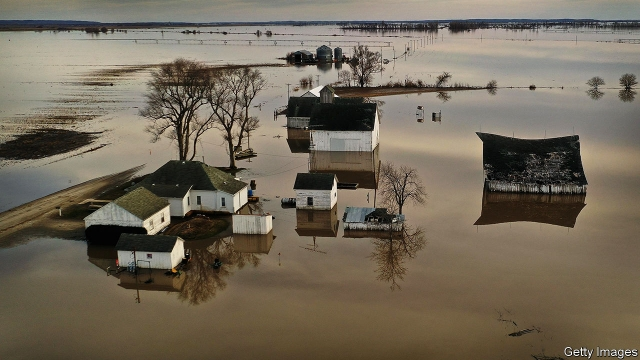

###### Talking about the weather

# Floods and storms are altering American attitudes to climate change 

##### The Midwest is soaked and less sceptical 

 

> May 30th 2019 

FOUR GENERATIONS of one family run Riverdock Restaurant in Hardin, a small town on a spit of wooded land between the swollen Illinois and Mississippi rivers. The matriarch is Sara Heffington, in red T-shirt and jeans. She says the Illinois river usually passes 400 feet (120 metres) from the long, ground-floor room where they serve biscuits and sausage gravy. Today water laps at the front door. She recalls a previous deluge, as they prepared to open in 1993. Back then, a levee broke and neck-high, muddy water submerged them. “That was a one-in-500-year flood,” she says. 

In years when lots of snow melts upstream or increasingly stormy spring rain overfills midwestern rivers, the Heffingtons get gravel from a nearby quarry, fill bags and build a defensive wall. At the moment an oozing white barrier again surrounds their restaurant as diesel-pumps spit defiant jets back towards the river. 

They just about keep nature at bay, even as a fast-moving torrent almost wets the roadway on Hardin’s green metal bridge. When that closed, 26 years ago, the town was all but cut off for five months. The Illinois is likely to crest again next week, at almost the same high level. “It’s starting to scare us,” admits Mrs Heffington. 

Asked why a one-in-500-year flood is back so soon, she first blames a recent lack of dredging and then talks of “extraordinary rains up north”. She sees a long-term “cycle” as the climate changes, but “the Lord has a plan”, and she doubts people affect the weather much. The youngest waitress, Skylar Giberson, disagrees with her older relative. Denial won’t do, she says. Humans and carbon emissions are changing the climate permanently. Her plan? “We should just move.” 

Ms Giberson, just out of high school, may be proved right. America has just notched up its wettest 12 months ever, and floods are worsening across the Midwest. In the past century annual precipitation has risen by 10% across the region, a faster increase than for America as a whole. The Great Lakes region heated up by an average of 0.9 degrees Celsius (1.6 Fahrenheit) in the 115 years to 2016, concluded scientists from the region in a report in March. That was also faster than the national trend. 

Because warmer air holds more moisture (and can suddenly release it), precipitation will keep rising. A 30% increase in the region is possible this century if global carbon emissions go unchecked, according to the federal agencies who produced the National Climate Assessment (NCA) late last year. This warned that more winter and spring downpours will mean more sodden soil, leaching of nutrients and delays to farmers’ planting season. 

Robert Criss, a hydrogeologist at Washington University in St Louis, says rain bursts are most destructive and can “go crazy” in smaller river basins. But even huge rivers like the Mississippi can struggle with higher overall flows. Decades of building levees close to rivers has narrowed them, blocked flood plains and lifted water. No year has yet surpassed a huge flood in 1903, but he says the Mississippi in St Louis has reached historically high water marks in four of the past seven years. 

“Rivers are being constrained like never before,” he says. The Missouri river, for example, is on average half the width of its former natural state. Narrowed channels plus rising rainfall make sudden collapses of levees more likely, such as the one that wrecked the Riverdock Restaurant in 1993, or another that struck part of Davenport, an Iowan city on the Mississippi, early in May this year. Sudden floods can “tear asphalt off roads, strip top soil away, smash grain silos”, making them more destructive than gradual ones. 

As waters rise, politicians across the Midwest are starting to speak more about climate change. In part that is because several Democrats took over governors’ mansions after elections last year. By late April 24 governors, including those of industry-heavy places like Illinois, Michigan, Pennsylvania and Wisconsin, had joined an alliance of states formed in 2017 to combat climate change. Members vow to meet emissions targets set in the Paris climate accord, defying President Donald Trump’s promise to pull America out of it. 

Tony Evers, Wisconsin’s Democratic governor, for example, says he has “brought science back” to his state after eight years of “climate-change deniers” under his Republican predecessor, Scott Walker. He did so because he worries about the “amount of water that’s been dumped on the state, as the crazy weather happenings continue. We’re having hundred-year floods every couple of years.” He has also beefed up the state’s once-neglected environmental agency. Illinois Democratic governor, J.B. Pritzker, declared in January that “climate change is real” and that the state’s emissions would fall by at least 26% (compared with 2005) by 2025. 

Democrats are also responding to voters who tell pollsters they care more about the subject than ever. Several aspiring presidential candidates support some form of a “green new deal”. Jay Inslee, Washington’s governor, is basing his presidential run on the issue. Pete Buttigieg, from Indiana, says “climate change is happening in the Midwest now, it is not theoretical”. He says even Catholic conservatives in Indiana warmed to the topic after a papal encyclical on the environment in 2015. 

Mr Trump remains as hostile as ever. The New York Times reports that his administration has told scientists not to include worst-case scenarios of climate change in the next NCA, due before 2022. Some were told not to make any forecasts for changes beyond 2040, when the biggest disruption is likeliest. Yet ever more voters can see what is happening first-hand. 

Older polling, by Pew, had suggested that coast-dwellers were more alarmed by climate change than those living 300 miles or more inland. But inlanders’ views seem to be shifting, too. A survey published this year by the Energy Policy Institute, part of the University of Chicago, found that 70% of Americans believe climate change is real. Nearly half are also more persuaded by warnings from climate scientists than they were five years earlier. 

Many said that witnessing extreme weather events—like the tornadoes, storms and floods battering the Midwest —did most to form their views. Michael Greenstone, who runs the institute, says the Midwest is already affected by “hotter summers, and it is more challenging for agriculture”. The region’s farmers are already at the sharp end of change. 

Mr Greenstone’s current research, not yet published, points to spikes in summer temperature that could threaten the viability of the region’s two staple crops, corn and soyabeans, possibly even before mid-century. Unless geneticists can develop heat-resistant strains, planting will march steadily northwards. Other researchers, at Indiana University, warned late last year that more frequent summer droughts, plus the spread of pests in warmer winters, also threaten agricultural productivity across the Midwest. One summer drought, in 2012, cost the region an estimated $30bn. 

Down by the river, there are some compensations. At Riverdock Mrs Heffington says a few tourists who come to gawp at the floods stop for a meal. Downriver at Alton, high-flood marks adorn white grain silos opposite the tourist centre. Molly Price, who runs it, says the floods at least provide a lively topic of conversation. “And then everyone talks about climate change.” 

