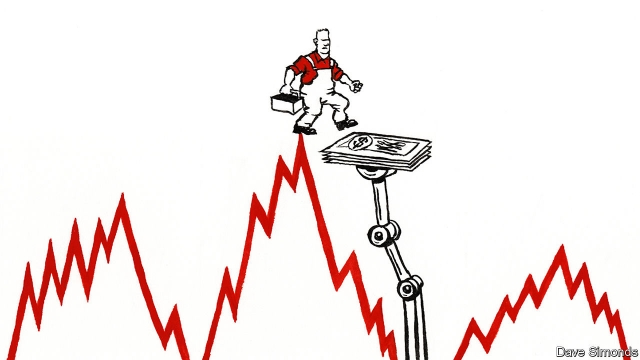

###### Automatic for the people

# How should America fight the next downturn? 

##### The recovery is ten years old. It is time to think about what happens next 

 

> May 30th 2019 

ON JUNE 1ST the expansion will pass its ten-year anniversary to match the longest on record. America’s unemployment rate is just 3.6%. But as the Republican Party basks in its good fortune in occupying the White House at such a time, economists—a doomy bunch—are suffering a sense of dread. They fear that policymakers are missing a wonderful opportunity to prepare the country for the next recession. 

No one knows when that will be. The gaps in America’s economic defences are not so hard to foresee, however. Normally, when recession hits, monetary policymakers slash interest rates in response to a downturn. With interest rates as low as they are today there is little room to do so. Legislation to provide discretionary stimulus, such as temporary tax cuts or spending bumps, can help. This has become a more important component of the response to recession in America. 

Agreeing and implementing tax cuts and spending increases takes time, though, and can be undermined by partisan politicking. In 2011, for example, Republican politicians forced a fiscal policy of severe contraction on an economy that was still reeling from the deepest downturn in living memory, with the result that the recovery was probably slower than it otherwise would have been. 

If politics were no obstacle, what would be the best way to respond to recessions? A group of policy wonks convened by the Brookings Institution and the Washington Centre for Equitable Growth, two think-tanks, recently proposed an array of fixes for Congress to consider. Rather than relying on politicians to do the right thing in the heat of a crisis, they reckon that America needs better automatic stabilisers, which would kick in quickly when a recession occurred and which would gradually be removed when the economy was steady enough to cope without them. 

Claudia Sahm of the Federal Reserve argued in favour of a payment to all Americans, to be triggered by a historically accurate and timely gauge of whether the economy is in recession. The idea is not as odd as it sounds. The payment she proposes would amount to 0.7% of GDP, around half of the typical slowdown in consumer-spending growth in a recession, and about as much as was paid out to American families as part of the Economic Stimulus Act of 2008. Perhaps the biggest innovation would be administrative, which is why the planning would need to start now. 

Recessions tend to involve downward spirals of confidence and consumer spending. Separate research by Christina Patterson of the Massachusetts Institute of Technology has found that the people whose earnings are most likely to crash with the economy—young black men, say—cut their spending most sharply when their income falls. It thus might make sense to fight future recessions by putting cash straight into their wallets. 

Food stamps or Temporary Assistance for Needy Families, two welfare programmes that have an immediate impact, could be made more generous in recessions, for example. Or unemployment benefits could be made more generous, or more widely available. Either step would have a more immediate effect than extending unemployment benefits for longer, which is a perennial debate in Congress. 

States and local governments have historically offset around a quarter of federal-level fiscal stimulus in recessions, because of balanced-budget requirements that force them to tighten their belts, meaning that stimulus from the federal government can often be counteracted at a local level. In theory states, cities and counties could draw on rainy-day funds. But although an analysis published on May 23rd by Moody’s Analytics, a consultancy, found that “more states are within at least striking distance of being prepared for a moderate recession”, it found that many states were not even close. One solution would be an automatic increase in federal government funds for state-level Medicaid and the Children’s Health Insurance Programme, which would then free local budgets for other things. 

Kevin Hassett, the chairman of the Trump administration’s Council of Economic Advisers, sees merit in the idea of strengthening America’s automatic stabilisers, as it can take too long to realise a recession is happening for discretionary stimulus to arrive in time. “It’s a good time to think about it,” he muses, recalling his own past proposals for the government to encourage employers to share out hours rather than make workers redundant. 

But Mr Hassett points out that the Trump administration’s near-term agenda is already packed. He also seems sceptical about the idea that handing out lumps of cash would deliver much long-term help, pointing out that the boost to GDP may just be temporary, and then only the bill would be left. Mr Hassett argues that cuts to tax rates should be kept on the table. 

Some wonks still hold out hope for change in the more distant future. Fixing America’s defences before the next recession looks unlikely. But if congressional staffers get to work on drafting legislation now, then when the next recession strikes it might be possible to introduce better automatic stabilisers—just in time for the recession after that. 

