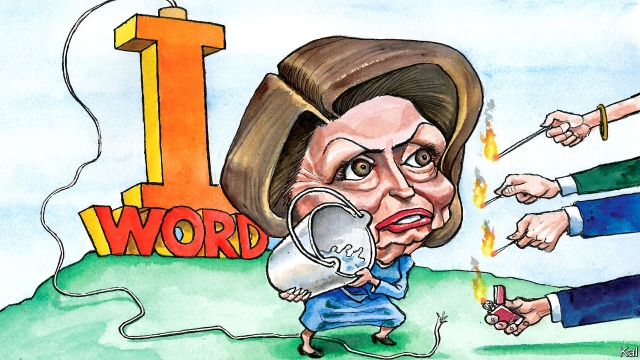

###### Lexington

# Nemesis Pelosi 

##### The House Speaker is the best judge of whether to impeach Donald Trump 

 

> May 30th 2019 

NANCY PELOSI appears to be in a somewhat contradictory position. In her second stint as Speaker of the House of Representatives, the 79-year-old Californian has won plaudits for keeping the enlarged Democratic House caucus united, passing over 100 bills in five months, and intimidating Donald Trump as no other politician has done. Remarkably, given that the Republicans have spent a decade pinning her face to a metaphorical dartboard, the president has largely refrained from badmouthing Mrs Pelosi. He is said in private to express admiration for her grip on her party. Meanwhile, Mrs Pelosi is denying a growing minority of Democratic lawmakers and more Democratic voters what they most want: Mr Trump’s impeachment. This balancing act is likely to get harder after Congress reconvenes next week. 

Ever since six Democratic House members drafted impeachment proceedings against Mr Trump 18 months ago, Mrs Pelosi has claimed to be open-minded on the matter, while manifestly against it. A witness to Newt Gingrich’s effort to oust Bill Clinton, which led to a wave of sympathy for the president, a boost in his ratings and his acquittal by the Senate, she fears impeaching Mr Trump—a politician whose entire modus is based on grievance—could have the same effect. It would almost certainly not lead to his removal, given his own control of his party. 

Hence Mrs Pelosi has offered a series of reasons to avoid pressing the button. After Robert Mueller refrained from accusing Mr Trump of the obstruction of justice that his report describes (simply because Justice Department guidelines forbade him to do so, the enigmatic prosecutor suggested on May 29th) Mrs Pelosi said that further House investigations were required. After the president began defying the Democrats’ subpoenas—and last week promised to end all bipartisan co-operation while they continued their probes—she claimed Mr Trump was so obviously goading Democrats to impeach him that they must not take the bait. Yet some House Democrats have had enough of this. 

Around 40 are committed to launching an impeachment inquiry into Mr Trump, the preliminary step to impeachment. As an indication of which way the party is moving, around half of the Democrats sitting on the House Judiciary Committee, which has borne the brunt of Mr Trump’s obstruction, are among them, including a senior Pelosi lieutenant, David Cicilline. Pro-impeachment groups, such as Stand Up America, which has recruited over 2m members in the past two years, are planning a media blitz in Democratic districts. At a town-hall meeting in Michigan this week Justin Amash, a Republican congressman, gave them additional encouragement by arguing that Mr Trump’s “incredible dishonesty” made impeachment necessary. “I think you have to have proceedings to deter this kind of conduct,” he said, before a crowd of outraged Republicans and grateful Democrats, in a state that Mr Trump won by a narrow margin. 

This is liable to get ugly. Not least because most Democratic proponents of impeachment are on the left, which sees Mrs Pelosi’s reticence on the issue as part of a broader want of conviction. “I think that, at a certain point, this is no longer about politics,” says Alexandria Ocasio-Cortez. But that is not true. Impeachment is almost always about politics. And Mrs Pelosi, as her standing in her party indicates, is a better judge of its interests than her critics. 

The decision to impeach is a political one informed by legal precedent. In other words, even when it is obvious, as in Mr Trump’s case, that an official has met past impeachment standards, the Speaker is under no compulsion to impeach. Indeed, if Mrs Pelosi believes impeaching a malfeasant president would make him stronger, she is entitled to argue that her constitutional duty is not to do so. When Mr Amash accused her of “trying to play it both ways”, in seeking to hold Mr Trump to account while protecting Democratic interests, he was in a sense merely describing her job. Only if Mrs Pelosi had downplayed Mr Trump’s wrongdoing, in order not to impeach him, would she be failing in her duty, and she has not. She says Mr Trump is so obviously committing impeachable offences that he is becoming “self-impeachable”. 

Whether they know it or not, most of her Democratic critics are also making political calculations. Most Democratic voters—representing around 45% of Americans—now say Mr Trump should be impeached. And Ms Ocasio-Cortez represents one of the safest Democratic districts in the country (which, to boot, she has vowed to represent by putting a firecracker up the sort of Washington consensus-building Mrs Pelosi is engaged in). Yet to win a majority in the House, and probably also the presidency, Democrats need over 50% of the electorate, because of the uneven distribution of their votes. And Mrs Pelosi has that margin, of flakier Democrats and independents, who are much less likely to consider impeaching Mr Trump warranted or important, strongly in mind. That is why she has taken more pains to promote and mollify the concerns of the many new Democratic members elected in competitive districts last November than lefties such as Ms Ocasio-Cortez. The torrent of bills House Democrats have passed has been designed to honour promises, on health care, fighting corruption, and so forth, that these majority-making Democrats made on the trail. So far, few of them have said they want to impeach Mr Trump. 

This may well change. The Mueller report has had little impact on public opinion mainly because hardly anyone—even in Congress, according to Mr Amash—has read it. Yet in his frenzied effort to shut down legitimate congressional probes into his affairs, Mr Trump is threatening to re-enact, in plain sight, the obstructive behaviour it describes. If that starts to interest marginal voters in impeaching him, expect Mrs Pelosi to do so. But don’t try second-guessing her. The Democratic Speaker knows her caucus better than her critics do. 

