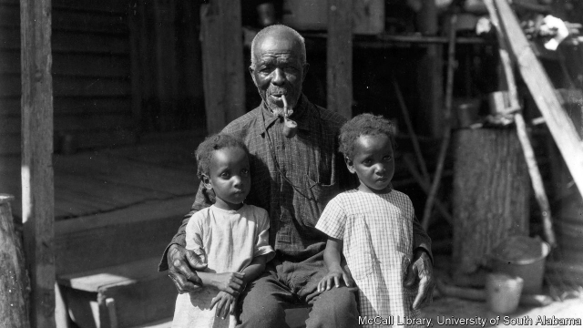

###### Diving into the wreck

# Remains of the Clotilda are discovered in southern Alabama 

##### The remains of the last slave ship to arrive in America are found, near Africatown 

 

> May 30th 2019 

IT BEGAN WITH a bet. Timothy Meaher, a rich plantation owner, thought he could defy a decades-old federal ban on importing Africans as slaves. He was right. On July 9th 1860 the Clotilda, a two-masted schooner whose journey Meaher financed, docked in Mobile Bay. It was the last ship to bring enslaved Africans to America. Less than five years after its arrival, the Union defeated the Confederacy—which seceded from the United States to preserve slavery in the South—in America’s civil war. 

In her hold were about 110 men, women and children who survived a harrowing journey from Ouidah, a notorious slaving port in what is today Benin. They joined the roughly 45% of Alabama’s population that was then enslaved. To escape detection, the captain burned and sank the Clotilda in the bay. Her bones lay undiscovered, amid mud and maritime detritus, until now. 

On May 22nd the Alabama Historical Commission announced that a sunken wreck which divers and archaeologists had been examining for the past several months was the Clotilda. Nothing in the wreck bore the ship’s name. But it matches construction and dimensional details gleaned from insurance documents; the metal and wood match historical practice; and it appears to have been burned. 

What happens next is unclear. After the civil war ended many of those brought to America on the Clotilda wanted to return home, but could not raise enough money. Instead they bought land from Meaher and established a community known as Africatown, which today is a proud but poor neighbourhood in northern Mobile. 

Around 2,000 people live there—including numerous descendants of the original inhabitants. The last survivor died in 1937. The second-to-last, Cudjo Lewis, died two years earlier, not long after sitting for a series of interviews with Zora Neale Hurston that became “Barracoon”, a searing biography. 

Africatown is an ageing neighbourhood, sorely lacking in private businesses. Many hope the discovery will provide a much-needed economic boost. Denizens have suggested raising the wreck and building a museum round it, though that may prove difficult: the ship is mostly buried, and the surrounding waters are alligator-ridden and dangerous. 

Yet the discovery itself has moved Africatown residents, whatever ultimately comes of it. As one of them, Cleon Jones, told AL.com, a local news website, “The saga began with the voyage and the cargo of the Clotilda. Now, there can be an ending to the story.” 

