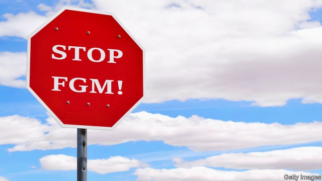

###### The first cut

# Seven American states have criminalised FGM this year 

##### Another 12 are considering it. Good 

 

> May 30th 2019 

MARYUM SAIFEE was in a college anthropology seminar when she realised she had been a victim of female genital mutilation (FGM). As a classmate described the practice, a flood of memories came rushing back. She had been seven and living with family in India for the summer while her parents stayed at home in Texas. Her aunt, a doctor, led her to a downstairs clinic, cut her clitoris without anaesthetic, and gave her a chocolate bar as a reward. “It was by far the most traumatic thing I’ve ever experienced,” says Ms Saifee, but like most survivors she never talked about it. She broke her silence only recently when she grew impatient at how few Americans seemed to know about the issue, or that it affected well-off, educated citizens like herself. “Everyone thinks this is happening somewhere far away, but it touches communities you wouldn’t expect.” 

The Centres for Disease Control and Prevention estimates that 513,000 women and girls in America have either endured or are likely to suffer the procedure, which involves the medically unnecessary removal of some or all of the external genitalia. But this figure was cobbled together from immigration rates and data collected from abroad, and few believe it accurately measures the phenomenon. It is hard to monitor a secret act performed mainly in close-knit immigrant communities. Many women are too ashamed to come forward. Those who do are often shunned or accused of stoking Islamophobia. 

Although Congress banned FGM over 20 years ago, the subterranean nature of the practice has made it hard to crack down on offenders. This seemed to change when prosecutors brought the first federal FGM case to trial. The Justice Department charged Jumana Nagarwala, a doctor, with cutting the genitals of nine girls, all of them members of the Dawoodi Bohra sect of Indian Shia Muslims, in a clinic in Michigan. But in November last year the judge dismissed the case, ruling that the federal ban is unconstitutional because Congress lacks authority over criminal law. Federal lawmakers had prohibited FGM as an interstate commerce under the Commerce Clause, which struck the judge as inapt. Anti-FGM advocates have argued back, pointing out that parents of girls in states where FGM is illegal specifically travelled to Dr Nagarwala for the procedure because Michigan lacked a ban. The government has declined to pursue an appeal. 

Despite its failure, the case has helped to raise awareness of FGM and has pushed states to get laws on the books. Michigan rushed to ban the practice after Dr Nagarwala was arrested in 2017, and other states quickly followed suit. That is despite the fact that this issue, which pits people who are anxious to be friendly to Muslim immigrants against feminists, splits the Democratic coalition down the middle. Of the 33 states that have criminalised FGM, nine either passed, enacted or amended their laws this year and a further nine states are considering legislation. Because the Michigan case showed that people are willing to cross state lines to avoid arrest, lawmakers now see the need for bans in presumed low-risk states, says Ghada Khan of the US End FGM/C Network, an advocacy group. 

