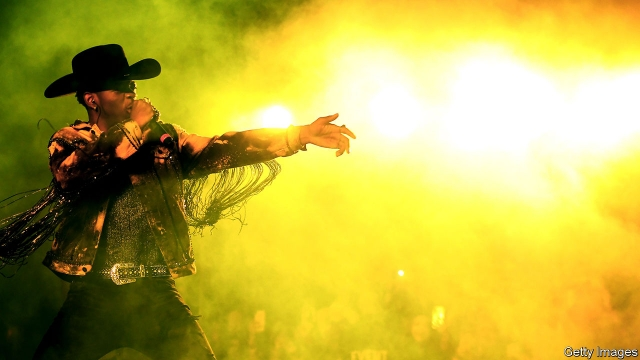

###### Lonesome whistle

# The sociology of country music lyrics 

##### Toil and grit have been replaced by blonde hair and blue eyes 

 

> May 30th 2019 

WITH ITS lilting banjo, cowboy theme and lyrics like “Ridin’ on a tractor” and “Wrangler on my booty”, not to mention an extremely catchy refrain, Lil Nas X’s “Old Town Road” should be a country-music hit. Yet it was kicked off the Billboard country-music chart for not embracing “enough elements of today’s country music”. Billboard later told Rolling Stone magazine that its decision to take the song off the chart “had nothing to do with the race of the artist”. Lil Nas X, the 20-year-old African-American who blended hip-hop, rock and country in his earworm of a song, does not look like the typical country star. Those tend to be white, and most are male. 

One of country music’s greatest strengths is its ability to celebrate working folk in America. But that has also “been its greatest liability”, says Charles Hughes, a historian and author of “Country Soul: Making Music and Making Race in the American South”. A recent paper in Rural Sociology, an academic journal, examined how men talk about themselves in mainstream country music. Its author, Braden Leap of Mississippi State University, analysed the lyrics of the top songs on the weekly Billboard country-music charts from the 1980s until the 2010s and found that the near-routine depiction of men as breadwinners and stand-up guys has changed. 

Over the past decade, more songs objectify women and are about hooking up. Mr Leap’s examination of lyrics also found that masculinity and whiteness had become more closely linked. References to blue eyes and blond hair, for example, were almost completely absent in the 1980s. In the 2000s, they featured in 15% of the chart-topping songs. 

Country radio is the genre’s powerful gatekeeper. Country stations have not played Lil Nas X much until recently. Nor are they playing as many women as before. Jada Watson, of the University of Ottawa, recently found that in 2000 a third of country songs on country radio were sung by women. In 2018 the share was only 11%. Even the top female stars get fewer spins. Carrie Underwood had 3m plays between 2000 and 2018; Kenny Chesney received twice as many. A report from the Annenberg Inclusion Initiative found that 16% of all artists were female across 500 of the top country songs from 2014 to 2018. 

A few black artists, such as Charley Pride, Darius Rucker and Kane Brown, have been successful. Some popular white artists have rapped on country ditties. Yet a young black man using similar imagery and sounds to those that dominate country radio stations gets little play. Lil Nas X’s “Old Town Road” remix, which features Billy Ray Cyrus of “Achy Breaky Heart” fame, has topped Billboard’s Hot 100 for eight weeks. Mr Hughes, the historian, says the fact that Lil Nas X “has had to force his way in is a real commentary on country music’s long-term racial politics, which has always had a very uneasy relationship with blackness.” 

