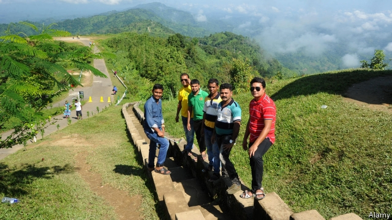

###### Who needs foreigners?

# Domestic travellers have revived Bangladesh’s tourism industry 

 

> print-edition iconPrint edition | Asia | Jun 6th 2019 

WHEN HE SET up Shanti Bari, an ecoresort in the forest near Srimangal, a town in a hilly, tea-growing region of Bangladesh, Tanvir Arefin Lincoln’s guests were mainly foreign tourists. Locals laughed at the idea of staying somewhere with so few modern conveniences. They asked, “Where is the TV? Where is the AC? What are we paying for?” Mr Lincoln replied: “You’re paying for fireflies, for the Moon and the stars. You’re paying for a luxurious environment, not a luxurious room.” 

That was five years ago. Now, most of his guests are Bangladeshi. In 2000 just 300,000 Bangladeshis went on holiday within their country; in 2017, 7m did. The figures for last year and this are likely to be higher still, says Bhubon Biswas, head of the Bangladesh Tourism Board: “Business is booming.” 

Foreign tourism has oscillated wildly in recent years because of political violence and terrorism, including an especially grisly attack in 2016 that targeted expatriates in Dhaka, the capital. But even as foreigners have been scared off, locals have been taking their place. Incomes have increased three- or fourfold during the past ten years, says Syed Rashidul Hasan of Dhaka University. At first, families tend to spend the extra money on appliances and other consumer goods, he explains, but as their incomes continue to grow, they begin to splash out on services, such as holidays. 

Most domestic tourists have a hankering for pampering. Down the road from Shanti Bari are the Grand Sultan and the Palace Luxury Resort, marble-clad complexes with swimming pools and games rooms stocked with Playstations. High-end hotels have sprung up elsewhere, too, especially along the 125km-long beach by the city of Cox’s Bazar, Bangladesh’s most popular tourist destination. But as Shanti Bari shows, there is also growing interest in environmental and adventure tourism. Resorts with assault courses and outdoor sports are springing up outside Dhaka. 

First come the locals, then come the foreigners, or so the government hopes. It is setting up a special zone for foreign tourists in Cox’s Bazar. The intention, Mr Biswas says, is to provide a place where foreigners can safely behave in ways that might cause consternation in other, more conservative parts of the country. “Bangladesh has a lot to offer foreign tourists,” he insists, but Bangladeshis “are perhaps not ready for bikinis”. 

