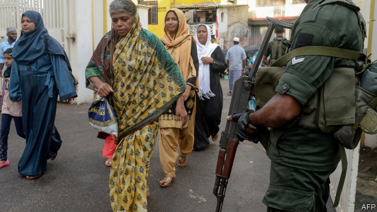

###### Fighting hatred with hatred

# Sri Lanka responds to Islamist terrorism by terrorising Muslims 

 

> print-edition iconPrint edition | Asia | Jun 6th 2019 

THE CHARGEs sound silly but the consequences are not. One Muslim lady’s crime was to wear a shirt printed with a ship’s helm. Her accusers said it looked like the wheel of dharma, so she must be mocking Buddhism, the religion of the majority. A young Muslim man was nabbed for having three SIM cards in his pocket, and a broken memory card. True, he worked in a phone shop, but police insisted he must have snapped the memory card to hide nefarious contents. A rich Muslim doctor was accused of having secretly sterilised 4,000 women by pinching their Fallopian tubes. More than 700 of the supposed victims have complained, enraged by rumours of a fertility “jihad” against non-Muslims. 

Just over a month ago, on Easter morning, jihadist terrorists killed more than 250 people around Sri Lanka in a series of suicide-bombings. It is not surprising that since the attacks, jittery police have arrested more than 2,000 people, nearly all of them Muslim. But with suspicion among the public running high, calls for extra vigilance soon morphed into harsher demands. A Buddhist monk threatened to fast to death unless three prominent Muslim officials, accused of having links to terrorists, resigned. Instead, on June 3rd, all nine Muslim ministers, as well as two Muslim provincial governors, quit in protest. 

Rauff Hakeem, one of the ministers and the head of a largely Muslim political party, describes his constituents as “petrified”. He fears that in Sri Lanka’s fragile and polarised state it is all too likely that cynical politicians will exploit the nasty mood. Some may want to distract attention from the security services, which failed to heed repeated warnings of a looming terror attack. “The vast majority of right-thinking people cannot be held hostage by a radical fringe,” he says. “The problem is when the radical fringe has political patronage.” 

After decades of civil war (which pitted the ethnically Sinhalese, Buddhist majority against largely Hindu Tamils), one might expect Sri Lankans to be wary of demonising minorities. Alas, many are doing just that. Since the bombings in April, police have not just randomly arrested Muslims, who are about 10% of the population, but responded lackadaisically to repeated mob attacks against Muslims and Muslim-owned businesses. Facebook groups have organised boycotts of Muslim-owned shops; fake pictures of huge weapons caches “found in mosques” have circulated. Landlords have evicted Muslims because of their faith. A taxi firm advertises that its drivers are Sinhalese; that is, not Tamils or Muslims. A big poultry company has destroyed its stocks of packaging, so it can roll out a new version, proudly stripped of halal certificates. 

Muslim leaders point out that they had for years warned authorities about the emergence of cult-like radical groups. After the bombings, it was local Muslims who led police to what was believed to be the jihadists’ lair. Co-religionists also took it upon themselves to demolish one of the radicals’ mosques with sledgehammers. 

Some Muslims have called for introspection. The prosperous Muslim elite, they say, has for too long turned a blind eye to creeping extremism. This is partly a product of widespread migration to the Gulf, and partly a reflection of a global trend among Muslims to abandon “diluted” local forms of Islam in favour of a “purer” Arabian kind. At the same time Buddhist groups with similarly narrow-minded inclinations have also gained ground. And just when Sri Lanka needs strong leadership to steer clear of such obvious dangers, its leaders stand disgraced.◼ 

