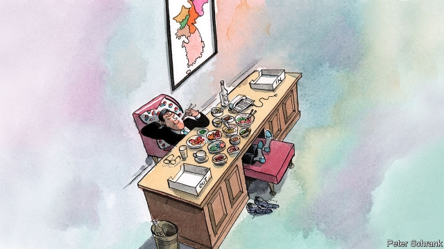

###### Seoul’s silliest sinecure

# The South Korean bureaucrats who pretend to run North Korea 

 

> print-edition iconPrint edition | Asia | Jun 8th 2019 

IN A LEAFY neighbourhood at the foot of Bukhansan mountain in Seoul’s northern suburbs sits a large office building with a stately glass-panelled entrance. Colourful flags flutter in the breeze above the generous but mostly empty car park, which is surrounded by well-tended shrubbery. 

This is the office of the Committee for the Five Northern Provinces, South Korea’s vestigial bureaucracy for North Korea, over which the South claims jurisdiction. Five of the flags outside represent the provinces lost in 1948, when the peninsula was formally sundered (contemporary North Korea has nine provinces). There is a governor for each province, as well as mayors for their towns and cities and village officials for smaller settlements. 

The purpose of the committee’s existence is not obvious. Its officials are unlikely ever to set foot in the places they supposedly run. They are not even in charge of relations with the homicidal dictatorship that actually runs the North: that is the job of the (separate) Unification Ministry. 

Whatever the committee’s officials do, it must be important, since each governor makes a tidy 138m won ($120,000) a year, plus 20m won to cover unspecified expenses. Each has two secretaries as well as a car and driver. The committee as a whole has an annual budget of 10bn won ($8.5m). 

A website lists the committee’s activities as nurturing exchange among North Korean refugees in the South and elsewhere (and, ideally, their families in the North), researching the North’s history and preserving “traditional” (meaning pre-Kim-dynasty) North Korean culture. However, an inquisitive MP recently found no evidence that any research is being conducted. The only obvious sign of exchange with the North is a letter box in the lobby of the committee’s offices with a slit for each of the wayward provinces—although it is not clear whether letters placed in it would ever arrive. 

The preservation of old culture, at least, seems to be going strong. A museum on the ground floor of the building displays several old-looking masks alongside more contemporary North Korean artefacts such as shoes and cosmetics. During a recent ceremony to celebrate the committee’s 70th birthday, the minister for gender equality and family (deputising for the minister of the interior, who was otherwise engaged) stood on a patch of lawn shovelling soil on the roots of a “peace tree” with a gold-effect spade as dignitaries in dark suits looked on. The group soon retired to a banqueting hall on the fifth floor, where they sat at long tables decked with kimchi and makgeolli (rice wine). They watched a performance by women in colourful hanbok (a traditional dress) wielding masks much like those displayed in the museum downstairs. The room filled up noticeably as lunch was served. Pretending to govern North Korea is much nicer than living there. ◼ 

