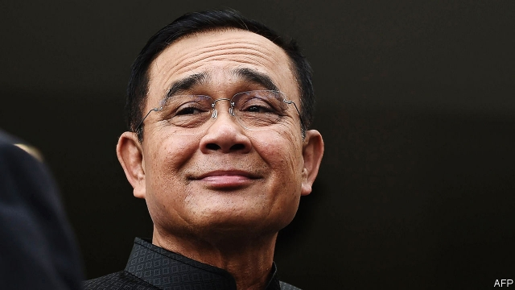

###### An unequal sequel

# The leader of the Thai junta tortures the rules to remain in power 

 

> print-edition iconPrint edition | Asia | Jun 6th 2019 

NO ONE CAN deny his tenacity. More than five years after seizing control of Thailand in a coup and declaring himself prime minister, nearly three years after pushing through a constitution designed to prolong his rule and more than two months after an election his supporters almost managed to lose despite all kinds of unfair advantages, Prayuth Chan-ocha was at last affirmed as prime minister by parliament on June 5th. 

As it happens, Mr Prayuth, without any sense of irony, recently urged his fellow Thais to read “Animal Farm”. The process that led to his affirmation as prime minister was redolent of the coup-leading pigs of the novel, who declare: “All animals are equal, but some are more equal than others.” Take the parliament that selected him at a joint sitting of its two chambers. All 250 members of the upper house were appointed by Mr Prayuth’s government. Roughly a third of them have links with the armed forces or the police. The body contains such impartial figures as Mr Prayuth’s younger brother. 

Or consider the national election in March in which Thais selected the 500 members of the lower house. The country’s election commission decided to change the formula by which it apportioned party-list seats after the vote had taken place, robbing anti-junta parties of a slim majority in favour of tiny, biddable outfits. The commission and the constitutional court have also helped by disqualifying opposition MPs and, in one case, banning an entire opposition party. 

The party founded last year to support the generals’ interests, Palang Pracharat, won 24% of the popular vote in March, just ahead of the Pheu Thai party, linked to Thaksin Shinawatra, an exiled opposition leader, with 22%, and another opposition outfit, Future Forward, which won 18%. To turn its meagre showing into a governing majority, Palang Pracharat has assembled an unwieldy coalition of 19 parties. In addition to the minnows, it will have to keep in line the 53 MPs of the Democrat Party, Thailand’s oldest, and the 51 of the Bhumjaithai Party, an openly transactional operation, to maintain its slim majority of 255 of the 500 seats in the lower house. 

The price of co-operation varies. The Democrats say they want to shape economic policy, change the constitution and curb corruption. They look set to win a deputy prime minister and three cabinet seats (including the coveted ministry of commerce). Already one of their own, Chuan Leekpai, a former prime minister, has secured the job of speaker of the lower house. But not all its members are keen: its leader until the election, Abhisit Vejjajiva, who had vowed to oppose an extension of Mr Prayuth’s tenure, resigned from parliament when the Democrats joined the coalition, along with several democratically minded colleagues. 

Bhumjaithai may earn the ministries of transport, health, and tourism and sport. Its boss, Anutin Charnvirakul, says its conditions for working with Palang Pracharat are simple: that the government enact Bhumjaithai’s policies. This will include liberalising rules around farming marijuana (which was legalised for medical purposes by the military regime in December). “I’m a political engineer,” explains Mr Anutin, “Since we are not ideologues we do things practically.” 

Those at odds with Mr Prayuth can expect anything but rewards. Thanathorn Juangroongruangkit, the leader of Future Forward party, was picked to stand against Mr Prayuth as prime minister by the parties opposed to the former general. He enjoys particular popularity among young Thais. “We must make parliament a place of honour, not a place where people’s faith goes to die,” he thundered ahead of Mr Prayuth’s inevitable acclamation. 

Future Forward and its leadership face at least 16 charges of wrongdoing. Mr Thanathorn has been suspended as an MP by the constitutional court, which is investigating whether he sold all his shares in media companies before registering to stand for parliament, as required by the constitution. Officials have also been asking questions about loans Mr Thanathorn made to Future Forward. In addition, he has been charged with sedition and computer crimes. He denies all wrongdoing and says he is prepared to go to prison. 

Mr Thanathorn’s political purity terrifies the establishment. The band of self-interested survivors clustered around the prime minister are not paragons of consistency or principle. They are likely to jostle constantly for advantage and favour, making the government unstable. 

Mr Prayuth, meanwhile, has not given much inkling of what he plans to do with his mandate. His latest slogan, “Security, Prosperity, Sustainability”, does not shed much light. He did not bother to attend the session at which he was chosen or lay out an agenda to MPs, saying—again, without irony—that his actions over the past five years speak for themselves. 

The constitution may, as intended, save Mr Prayuth’s bacon. It empowers the senate appointed by the junta to intervene to resolve gridlock in the lower house over important legislation, such as the budget, if it stalls for more than 105 days. The junta’s supporters argue that the charter allows minority government more broadly. Mr Prayuth also enjoys the crucial support of the king. “While the government is a farce from a democratic perspective, I suspect they have the resources to keep their thin margin together for some time,” says Karen Brooks of the Council on Foreign Relations, an American think-tank. ◼ 

