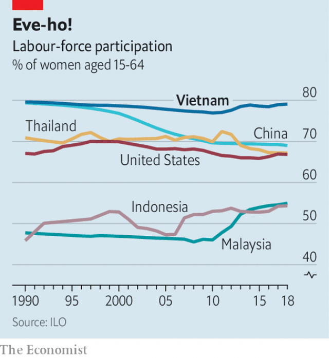

###### More than half the sky

# Vietnam has one of the highest shares of women in work in the world 

 

> print-edition iconPrint edition | Asia | Jun 8th 2019 

DONG THI VINH strides proudly across a patchwork of green fields at her farm just south of Hanoi, Vietnam’s capital. Every now and then she pauses to yank up a weed or prune a pomelo tree. Along with a friend, she started an organic fruit-and-vegetable company seven years ago. Since then, the annual tonnage of produce sold has increased tenfold, partly thanks to contracts the firm has won to supply nearby schools. Women are the financial “pillar of the family”, says Ms Dong. She employs 19 full-time workers, all women. Her daughter has quit a job in the civil service to join the family firm.  

Vietnam has one of the highest female labour-force participation rates (ie, the proportion of women who are in paid work or looking for it) in the world. Some 79% of women aged 15 to 64 are in the labour force, compared with 86% of men. That figure is higher than in all the members of the OECD except Iceland, Sweden and Switzerland, and ten percentage points above China, Vietnam’s northern neighbour (see chart). 

 

Many scholars believe that Vietnam was a largely matriarchal society before a period of Chinese conquest that began in 111 BC. A long history of wars with China, and later France and America, sucked women into the workforce, as more men than women were maimed or killed. In 1960 there were 97 Vietnamese men aged 25 to 54 for every 100 Vietnamese women. By 1975 the war between north and south had reduced that number to 93. Many survivors find it hard to hold down a job. Ms Dong says the war has left her husband with a weak immune system. Even short periods of manual labour trouble him. There are hundreds of others like him in their village. 

Vietnamese-style Confucianism also plays a part. Combined with nationalism fostered by war, it helps to create a feeling that women have a moral duty to make money. Communist ideology reinforces this norm. Government posters exhorting women to work show them wearing hard hats or military uniforms. Supportive government policies help, too. Maternity leave was increased to six months in 2013, high by regional standards. 

The different sexes gravitate towards different types of work. Men tend to take jobs in corporations or organisations that confer status, whereas women tend to be more enterprising. The Global Entrepreneurship Monitor looks at, among other measures, the sex of new business owners across 54 countries. Vietnam had the highest ratio of women to men: 1.14 to 1. This is partly because mothers still do most child care, so they have to work flexible hours. 

Businesses owned by women tend to be informal. Women make up 55% of the self-employed. They typically start a business just to make ends meet. Nguyen Thi Hong chops up and sells chickens for ten hours a day in a sweltering market in Hanoi. Along with her husband, she supports three children, her parents-in-law and her husband’s brother. As she puts it, if she did not work, “How else could we live?” 

Even in the formal sector, work is not always smooth. Misogyny is rife. Many women complain about the glass ceiling, even though young Vietnamese women are now better educated than men. Wives still do the bulk of the housekeeping, too. 

But as the economy shifts from farming to manufacturing, working women are becoming more independent. A recent report from the Mekong Development Research Institute, a think-tank, finds that new roads in the Mekong Delta over the past decade have made it easier for women to work in nearby textile and packaging factories, while their husbands stay at home and tend the family farm. Women in the region now earn more than men, and the balance of power between them and their husbands has shifted. Divorces have become more common and reported rates of domestic violence have fallen. Vietnamese women’s labour may at last be beginning to work for them. ◼ 

