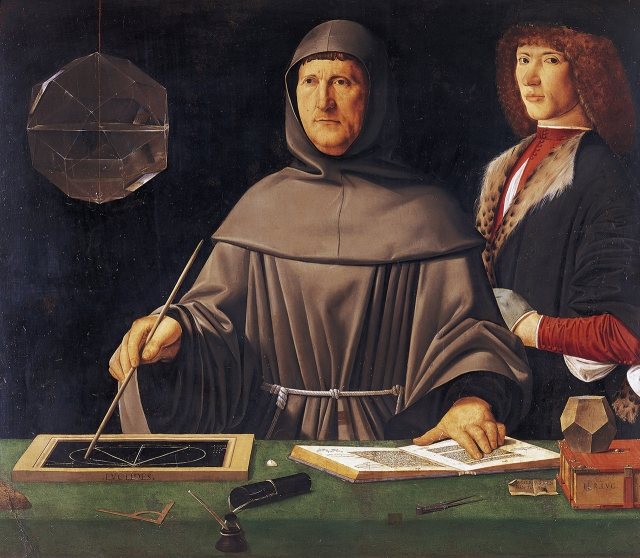

###### The first folio of finance

# A revolutionary treatise goes on the block 

 

> print-edition iconPrint edition | Books and arts | Jun 6th 2019 

MODERN CAPITALISM began among the European merchant families of the early Renaissance—the Fuggers of Augsburg, Medicis of Florence and, in Venice, one Antonio de Rompiasi, who in 1464 hired a tutor in mathematics for his three sons. Like any sensible teacher, young Luca Pacioli aimed to make his lessons memorable and clear. Good humanist that he was, 30 years later he gathered all the world’s knowledge of the subject into a single massive volume. 

His “Summa de Arithmetica, Geometria, Proportioni et Proportionalita” was the 615-page work of a mature professor who had spent decades working across northern Italy. The book was revolutionary on more than one count. It integrated computation using Hindu-Arabic numerals with the logic of classic Greek geometry; it was written in the vernacular of the marketplace rather than Latin (see Johnson); it circulated in large numbers thanks to the new technology of printing. Yet its greatest significance lay in a slim “how to” chapter that described the double-entry accounting system used by Venetian merchants. 

With examples from dealers in butter to lemons to silk, Pacioli set out the method for tracking income and expenditure and the calculation of net profit or loss, which for the first time allowed an immediate snapshot of a firm’s financial position. This brief section would facilitate the birth of the modern corporation. 

“Without order there is chaos,” Pacioli observed in a breezy style that is still in vogue in business books today. His manual is stuffed with quotes from scripture and Dante and pithy advice such as “Don’t learn from ignoramuses who have more leaves than grapes.” He wrote the accounting chapter to help would-be traders in Venice, then the capital of the financial world, “sleep easily at night”. Without double-entry book-keeping, “their minds would keep them awake with worry”. He could not suspect that what might be called “Book-keeping for Dummies” would become the backbone of business for centuries. 

Like many monumental works of 15th-century printing, Pacioli’s treatise has survived in its original form. Some 120 copies still exist, from an initial run of about 1,000. Now today’s moguls have a chance to own this first folio of finance. Christie’s, the auction house, is offering a first edition in the original vellum binding for sale in New York on June 12th. The starting price is $1m for what it unabashedly calls “the most influential work in the history of capitalism”. 

Pacioli’s later life augments the glamour of the first printed use of “plus” and “minus” signs. Impressed by the book, Leonardo da Vinci convinced his patron Lodovico Sforza to hire Pacioli to teach at the court of Milan. Pacioli and Leonardo collaborated on the treatise “Divina Proportione”, which married maths with art through the study of perspective. Not one, but two Renaissance masters were thus responsible for the exquisite harmony of “The Last Supper”. 

