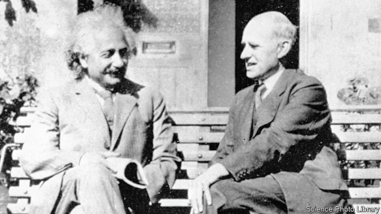

###### Brothers in arms

# How Einstein and Eddington stood against jingoism 

 

> print-edition iconPrint edition | Books and arts | Jun 6th 2019 

Einstein’s War. By Matthew Stanley. Dutton; 400 pages; $28. Viking; £16.99. 

THE EDIFICE of modern physics rests on two pillars, both built during the early 20th century. One is quantum mechanics, which deals with the behaviour of very small things like molecules, atoms and subatomic particles. The other is relativity, which is a theory of gravity and therefore of the universe at the largest scales—planets, stars and galaxies. Quantum mechanics was the work of many minds, but relativity is widely associated with just one person: Albert Einstein, the most famous scientist of the last hundred years. 

Both theories are strikingly counter-intuitive, which makes them good fodder for popular-science books. Matthew Stanley takes an unusual tack. He tells the story of relativity through two entwined lives—Einstein’s and that of Arthur Eddington, a British astronomer whose experiments in 1919 provided the first compelling evidence that Einstein’s strange theories were correct. His tale unfolds against a backdrop of tragic politics, for the development of relativity coincided with the slaughter of the first world war. 

A century before Einstein, Humphry Davy, a pioneering English chemist, accepted an award from Napoleon while Britain and France were fighting. Davy insisted that “if the two countries or governments are at war, the men of science are not.” In Einstein’s day many scientists similarly saw themselves as engaged in an international, humanist enterprise that transcended borders and rose above the ugly banalities of politics. Yet Mr Stanley shows that, with only a few exceptions, such sentiments did not survive the industrialised violence of the Western Front, in which science played an important role. 

Take Fritz Haber, a Prussian chemist who habitually wore his military uniform in the lab (it complemented his duelling scar). He is best known today for devising a way to produce artificial fertiliser that is vital to feeding the world. But a tweak to that same process enabled Germany to carry on making explosives in the face of a British naval blockade. Haber also pioneered the battlefield use of mustard gas. On the Allied side, physicists and mathematicians drew up ballistics tables for artillery. William and Lawrence Bragg, a father and son, switched from X-ray research to using sound waves to locate enemy positions from the boom of their cannons. 

Herbert Turner, a British astronomer, began the war as a cheerleader for scientific internationalism. By 1916 he was arguing in a British journal that Germans were little more than a “pre-Asiatic horde” and should be excluded from scientific endeavours. Even their language, he thought, should be banished from the academy. W.W. Campbell, an American astronomer, opined that Germany, “the most scientific of all nations, has prostituted science to…base ambition”. The scathing sentiments werereciprocated. Wilhelm Wien, a German Nobel prizewinner, urged that German science should be cleansed of “unjustified English influence” and English terms. 

All this is explored through the eyes of Mr Stanley’s two subjects, both of whom resisted the tide of militarism and xenophobia. Einstein despaired at the war fever that overtook his colleagues in Berlin. Eddington was a Quaker and a conscientious objector. An early convert to relativity, he did more than anyone to spread its gospel in the West, as well as trying to keep open what lines of communication he could between the belligerent powers. His efforts culminated in an expedition in 1919 to observe a solar eclipse, with the goal of seeing whether light from distant stars could be deflected by a massive object like the sun, a key prediction of Einstein’s theory. 

Eddington’s finding that light did indeed bend was a dramatic confirmation of Einstein’s ideas. More than that, it was a pointed restatement of ideals that the war had squashed. Einstein’s elevation to global celebrity was boosted by the fact (emphasised by Eddington) that an Englishman had confirmed a German’s hypothesis which rewrote the rules of the cosmos. 

The breadth of Mr Stanley’s narrative inevitably comes at the cost of depth. His book is simultaneously a brisk biography of two great scientists, a brief introduction to relativity, and a potted history of the first world war. But it is punchy and well-written, and full of signposts for readers who might want to delve more deeply into the fascinating subjects it explores. ◼ 

