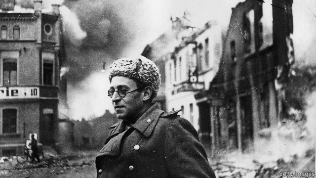

###### Smoke and dust

# Vasily Grossman, the greatest bard of the second world war 

 

> print-edition iconPrint edition | Books and arts | Jun 6th 2019 

Stalingrad: A Novel. By Vasily Grossman. Translated by Robert and Elizabeth Chandler. NYRB Classics; 1,088 pages; $27.95. Harvill Secker; £25. 

Vasily Grossman and the Soviet Century. By Alexandra Popoff. Yale University Press; 424 pages; $32.50 and £25. 

DURING HIS final years, Vasily Grossman kept a few cherished mementoes in his shabby Moscow flat. One was a safety lamp presented by colleagues at the coal mine in the Donbas where, as a young chemist, he had worked to prevent explosions. Another was a child’s alphabet block he found after the liberation of the Treblinka extermination camp. 

Born in 1905 to a Jewish family in Berdichev, now in Ukraine, Grossman (pictured) had entered the camp after gruelling front-line service as a Soviet war correspondent for the Red Army’s newspaper. In November 1944, in the journal Znamya, he published his essay “The Hell of Treblinka”. It ranks not only as one of the first eyewitness reports of the Holocaust, but, as Alexandra Popoff says in her scrupulous but impassioned biography, as a work with “the everlasting quality of genuine art”. 

In an article he wrote in 1946 Grossman affirmed: “There is nothing more precious than human life; its loss is final and irreplaceable.” The miner’s lamp, the child’s alphabet, testify to his core beliefs. Yet as a fine journalist, then a peerless novelist of the horrors of war and tyranny, his destiny was to inhabit times and places that ground up human beings by the million. In his novel “Stalingrad”, which is only now being published in English, the sight of a dying old woman on a bombed boulevard prompts the anguished question: “Human suffering. Will it be remembered in centuries to come?” Or will the tears and despair disappear like “the smoke and dust blown across the steppe by the wind”? Grossman’s oeuvre, which includes what may be the greatest fiction of the second world war in any language, has helped salvage that suffering from oblivion. 

Western readers mostly know Grossman for “Life and Fate”, his epic of the battle of Stalingrad and its aftermath. After its completion in 1960, the KGB confiscated the manuscript. Soviet censors decreed that the novel’s unflinching comparisons between the barbarism of Nazi and Stalinist regimes would make it unpublishable for 250 years. Its Jewish author’s vigilant attention to the anti-Semitism perpetrated by both systems embarrassed Soviet apparatchiks for decades. 

Grossman died, poor and still under suspicion, in 1964. But by 1980 “Life and Fate” had reached the West via microfilm. In 1985 Robert Chandler’s magnificent translation primed the book for fame in the English-speaking world. Radio and stage adaptations have enhanced its reputation as the “War and Peace” of the 20th century. 

The parallel with Tolstoy, which both blessed and plagued Grossman, dates to the early 1940s. Stalin himself, Ms Popoff reports, had “anticipated a Soviet ‘War and Peace’.” Grossman, once a protégé of the Soviet literary guru Maxim Gorky, seemed a prime candidate to write it. Indeed, together with “Life and Fate”, “Stalingrad” forms a consciously Tolstoyan fictional diptych inspired by the epoch-making Russian victory in 1942-43. 

“Stalingrad” came first. Published in censored form as “For a Just Cause” in 1952, it contained sections reluctantly inserted to obey the party line. In 1956, after Stalin died, a new edition allowed Grossman to restore much of his own voice. But no fewer than 11 versions of the manuscript survive. For this translation, as forceful, sensitive and richly coloured as that of “Life and Fate”, Robert and Elizabeth Chandler have woven the strongest unpublished material into the 1956 version. 

The result is another huge, seething fresco of front-line combat, domestic routine under siege, and restless debate. Again, Grossman transforms into art “all the savage grief and homeless happiness of those terrible years”. Again, he resolves the impersonal waves of 20th-century history into brilliant particles of human life. The peril of each hour on the brink of destruction makes “the value of every individual” shine brighter than ever before. 

“Stalingrad” (Grossman’s original title) introduces many characters who return in “Life and Fate”, in particular the extended family of the scientist Alexandra Shaposhnikova. The Jewish physicist Viktor Shtrum, her son-in-law and the ambiguous hero of the later novel, here plays a smaller but still pivotal role. Three generations of the clan labour, love and fight as the Red Army’s chaotic, 1,000km retreat from the German invaders halts at the Volga. Finally, in the late summer of 1942, the Soviet “river of iron and steel” starts “flowing back, from east to west”. 

In the front-line posts, factories and power-plants of Stalingrad itself, with interludes in Moscow, Kazan and even in the German high command, Grossman knits a dozen plot strands into a single narrative. He shows how “a lacerating sense of historical change” cuts deep into the exhausted bodies and brooding minds of his characters. The battle scenes set in Stalingrad’s “vast, rumbling smithy” have all the mesmeric thrill and dread that admirers will recall from “Life and Fate”. The lyricism, tenderness and pathos of the moments of respite touch the same heights. An orphaned boy in a children’s home who “could not tell anyone his pain”, but finds comfort from a kindly cleaner, matters as much to Grossman—or rather, infinitely more—than the generals and leaders who sacrifice millions of pawns on their strategic chessboards. 

There are, though, differences between the two masterworks. Unlike “Life and Fate”, written after Stalin’s death in the hope of greater freedom, Grossman drafted parts of the earlier book under duress. Some chapters of heroic labour in the fields or mines echo Socialist Realist doctrine. A very few pages parrot the sloganeering uplift of party orthodoxy. 

Grossman still finds ways to spotlight the Holocaust—even though, as Ms Popoff notes, he completed the book as “Stalin’s campaign against ‘rootless cosmopolitans’ was picking up steam”. German officers mutter about “a real factory for processing Jews”. Above all, his characters witness, suffer and reflect with a hyper-real intensity. It illuminates nearly every page like the hellish glow that lights up the night sky over Stalingrad. With the German axe “raised high in the air”, the city becomes a second Troy, and Grossman its bard. 

“What on earth’s the ‘Iliad’ got to do with it?” asks one of Alexandra’s daughters after a doomed friend refers to a captive Trojan princess. Simple: few works of literature since Homer can match the piercing, unshakably humane gaze that Grossman turns on the haggard face of war. ◼ 

