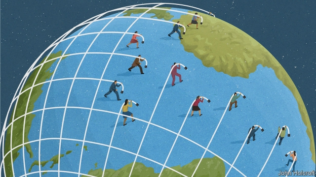
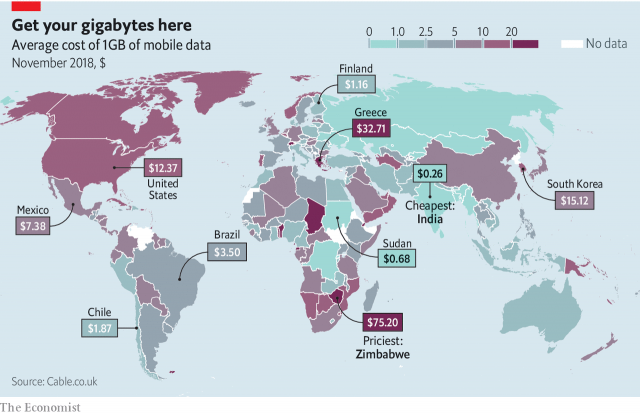
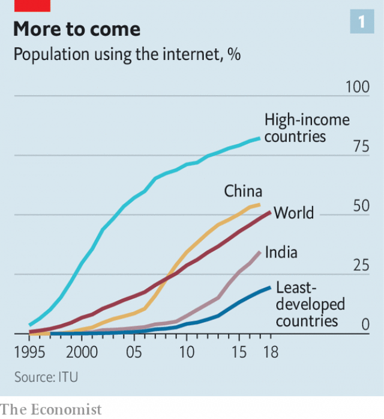
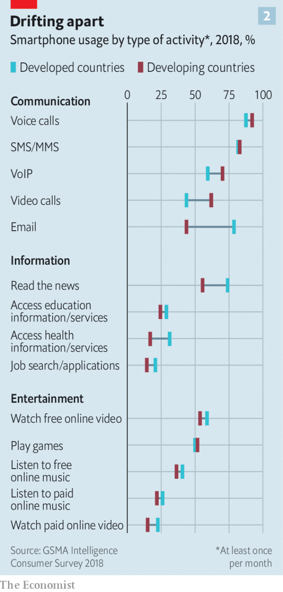
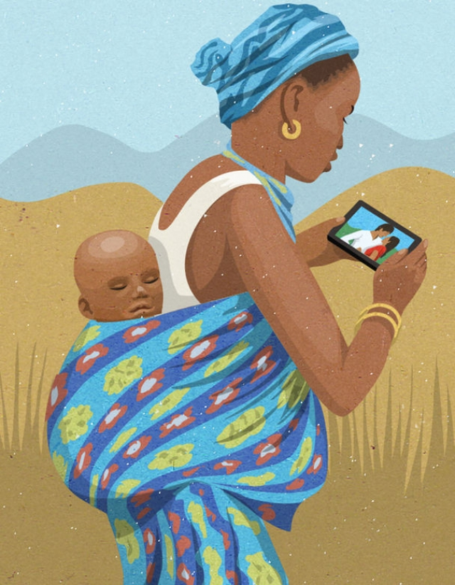
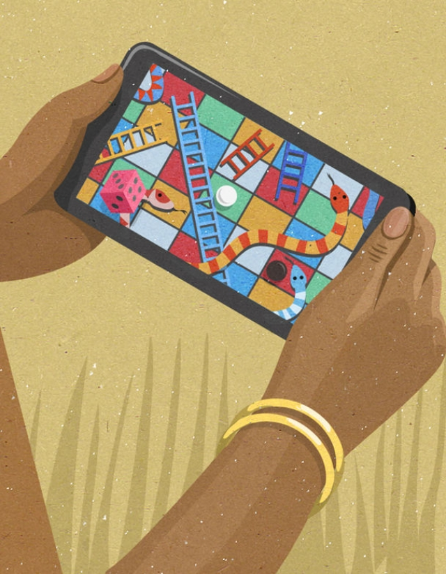

###### The second half of the Internet

# How the world’s poor are discovering leisure online 

 

> print-edition iconPrint edition | Briefing | Jun 6th 2019 

THE CHIEF of Madhogarh, a picturesque village nestled beneath a 17th-century fortified palace in the heart of Rajasthan, came to Indra Sharma three years ago to ask if she would attend a workshop. “Something about the internet,” Ms Sharma, a 40-year-old child-care worker, recalls. She had no particular interest in this internet thing. But she liked the idea of learning something new, so she went along. She and a handful of women from nearby villages were all given a smartphone and some basic lessons in how to use it. 

“First we had to learn how to turn it on and off,” says Santosh Sharma (no relation), a 24-year-old schoolteacher from the neighbouring village. Once they had mastered that, they got down to the essentials: “How to take a selfie, WhatsApp, Facebook, YouTube, how to search.” 

That was in September 2016, when nobody in the villages had a phone. “Now everybody has one,” says Ms Sharma of Madhogarh. “You see old people walking around watching ‘Mahabharat’,” a television series based on a Hindu mythological epic. Down the road from her home three men sit in the shade of a rohida tree, playing a game of ludo on one of their phones. 

According to India’s telecoms regulator, subscriptions for mobile-broadband services more than doubled between the end of 2016 and the end of 2018, from 218m to 500m. At about 3,500 rupees ($50) for a low-end model, smartphones remain dear for an Indian villager’s pocket. But, says Ms Sharma, “everyone has been bitten by the bug; nobody cares how expensive it is.” 

For those who do care, at least a bit, a smartish phone from Reliance Jio—one with app-running cleverness, but no touchscreen—can be had for just 1,500 rupees. Jio, backed by the muscle of the Reliance group, has subsidised not just handsets but also, more importantly, data transmission. Competition between it and the incumbents has seen the price of a mobile-data package slashed by 94%, and consumption has duly exploded ten-fold to 8.8GB per subscriber per month. Indians now gobble up nearly three times as much data on their phones as Americans. They seem on course to become the world’s biggest consumers of mobile-phone data. 

 

The size and speed of India’s growth spurt owes a lot to the price war Reliance Jio set off. But the global trend it embodies does not. At some time in 2018 the proportion of the global population using the internet rose above half, according to the International Telecommunications Union, a UN agency. The second half of the internet will not come online as quickly as the first half was doing in the early 2010s; exponential growth cannot continue in a finite world. But if the 710m new internet users expected to come online in the next seven years is only half the number that arrived in the past seven years, it is still a mighty throng. The chances that a child born today will not have a phone as a teenager are already slim, and quickly growing slimmer. 

 

And almost all this future growth will be in developing countries. The 81% of the developed world—a billion people—online is unlikely to increase its number by much. China, at 58%—800m people—has more room for growth. But internet users elsewhere, who already handily outnumber those in the developed world and China put together, make up only 39% of their countries’ populations. Those are the countries where most of the next billion will come from, and the billion after that, and the billion after that (see chart 1). And as they swell the internet’s numbers, they will change its character. 

The second half of the internet will for the most part speak languages other than English and Mandarin. It will have little to no experience with other digital media. It will also come online almost entirely on mobile devices. Hotstar, launched by Rupert Murdoch’s Star India in 2015, became India’s most popular streaming app because it foresaw that the second screen in Indian households would be a smartphone. Increasingly, the first screen will be, too. The idea of a big screen with a fixed connection will be as alien to the second half as landlines and cathode-ray tubes are to today’s youngsters. 

Better, cheaper hardware explains part of this. An entry-level smartphone today packs more power and features than the first iPhone in 2007, often at a tenth or less of the price. But poor people are not coming online because another core in the processor or megapixel in the camera matters to them. According to Ajit Mohan, Facebook’s new India chief and the former boss of Hotstar, it is the services that drive demand: the consumers want messaging, video and storytelling, all of which the mobile internet is far better at providing than it was a decade ago. 

People want to stay in touch with each other, to be entertained and to express themselves, whatever their income and wherever they call home. This is true in the rich word and in China. It will be true everywhere else, too. And the poorer people are, the more a phone outperforms all the other options they can afford as a way of fulfilling these needs. For many people the phone offers an unsurpassable opportunity for turning otherwise empty time into something enjoyable. According to Payal Arora, a professor at Erasmus University in Rotterdam, the internet is the leisure economy of the world’s poor. 

Until recently, talk of connectivity in the poor world has almost invariably been clothed in the pragmatic and well-meaning language of development. Aid agencies, international bodies and big tech companies told themselves and their funders that poor people needed an internet connection to lift themselves out of misery. They extolled farmers looking up grain prices, women seeking information on maternal health or pupils diligently signing up for online courses. The website for Facebook’s internet.org, an arm of the company focused on bringing unconnected people online, is a classic of the genre: “Imagine the difference an accurate weather report could make for a farmer planting crops, or the power of an encyclopedia for a child without textbooks…The more we connect, the better it gets.” In her book “The Next Billion Users”, Ms Arora finds that Westerners assume that poverty “is a compelling enough reason for the poor to choose work over play when they go online.” 

The poor do not see it that way. Years of fieldwork across the globe have led Ms Arora to conclude that when it comes to getting online, “play dominates work, and leisure overtakes labour.” Where people planning development strategies imagined, metaphorically at least, Blackberries providing new efficiencies and productivity, consumers wanted the chat, apps and games of the iPhone. Worthier uses tend to follow. But they are the cart not the horse. 

The pattern has been repeated in country after country. When Brazil opened thousands of subsidised cybercafés in the late 2000s it brought internet access to 60% of poor neighbourhoods. The cafés were a huge success—because people used them to watch movies and play computer games. They liked to hang out with each other, too. Orkut, Google’s first attempt at social networking, was a huge success in Brazil in the early 2010s; Brazilians are now the world’s third-largest national population on Facebook, after India and the United States. According to Latinobarometro, a pollster, of the Latin Americans who eat only one meal a day, one out of three still contrives to use a smartphone. Juliano Spyer, an anthropologist who studies Brazilians’ internet use, found that the reason poor people in the north-eastern state of Bahia pay for connectivity is that they see it as a form of social mobility—not because they use it to earn more, but because they use it to be more connected. 

In Angola, Wikipedia and Facebook “zero-rate” their services: people using the approved versions of their apps pay no network charges for data from them. They do not get all the internet’s goodies—but they get an internet that is deemed both good and good-enough. This resulted in users finding new ways to piggyback pirated movies on to the free services. A wide-ranging 2015 study of digital lifestyles by Caribou Digital, a consultancy, points to research from Zambia which shows that “entertainment is the first thing that [users] demand, and then other things come around this.” A survey of online activity in sub-Saharan Africa by Pew Research Center, a pollster, saw 85% of respondents saying they used the internet to stay in touch with friends and family. Only 17% said they used it to take classes. 

Global as the trend is, though, India is the best place to observe it—and perhaps profit from it. It has a relatively open market and a newbie population that is large, linguistically diverse and poor, which makes it a proxy for the second half worldwide. The extraordinary speed of its boom is forcing companies to come up with new products and services that fit what the second half wants at a breakneck pace. 

Back in Madhogarh, Ms Sharma uses her phone to video-chat with her son in Jaipur, three or four hours away by bus. The younger Ms Sharma uses her phone mostly for WhatsApp, Instagram and Facebook, and for watching videos on YouTube and TikTok, a Chinese-owned social app that has been downloaded a billion times since its launch in 2017, largely by people outside the world’s big cities. Her smartphone does allow her to look up coursework for the classes she teaches. But mostly, she says, “it is a way to do timepass”, using the Indian-English word for killing time. 

“Timepass” is the essence of the internet. The vast majority of the top 25 apps by revenue in both Google’s and Apple’s app stores are games (and both companies announced new paid gaming services this year). Tencent became one of China’s internet giants because of games. Facebook grew into the world’s sixth-most valuable company by giving people a place to “do timepass”. YouTube is the gateway to several lifetimes’ worth of timepass. The fastest-growing new apps of recent years have all been aimed at timepass: Fortnite, WhatsApp, Instagram, Snapchat. TikTok, which consists of 15-second videos, is timepass in its essence, made by bored kids in mofussil towns who have found vast audiences by doing silly things. 

 

Timepass is a pleasure to both rich and poor (see chart 2). But the business model it can support depends on which of those markets you are looking at. If the timepassers have sufficient money, you can sell their attention on to advertisers who want them to consume other goods, too. If the timepassers are poor, you need to get them to pay for what they are doing. 

The most striking thing they are doing is watching videos—which they are also making, in great abundance. In 2016 there were only 20 Indian YouTube channels with more than 1m subscribers. Today there are 600. This year T-Series, a Bollywood studio and record label, became the most subscribed channel on YouTube, dethroning PewDiePie, a Swedish entertainer who had topped the charts for several years. Perhaps even more surprising, one of YouTube’s top 50 channels worldwide is largely in Bhojpuri, a language spoken only in some of India’s least-developed states. Google reckons that three-quarters of all mobile traffic in India is video. 

Video offers its users whatever their lives need. Ms Sharma of Madhogarh uses YouTube to look up recipes, among other things. Recipes were a selling point for the menfolk of the village. They were reluctant to allow their wives to have smartphones until they were told that it would help the women cook new dishes. The kitchen is not the only site of consumption. A lot of Indians use phones to look at pornography with a level of privacy not previously easy to come by. PornHub, a large website, says 90% of its traffic from India is on mobile, compared with 75% from America. 

Though not all countries have data plans as cheap as India’s, the trend to video is universal, says David Shapiro, the business head of Google’s “Next billion users” unit. Where mobile broadband is pricey, people download videos on Wi-Fi connections to view offline later on. 

It is not just that video is easily available on the internet. To many in the second half video more or less is the internet. Anecdotally, it seems that YouTube is a more common Indian home page than Google. It is used to search not just for entertainment but for everything else. Snigdha Poonam, a journalist, says that when she mentions a book she wrote a few years ago to people she is interviewing in rural India, it is on YouTube that they search for it. 

The preference for video is partially explained by the fact that the next half of the internet speaks a very wide range of languages—but may not read any. Video in another language works better than text; video is easier to post to your peers than writing is. And speech beats typing—as can be seen from the use of WhatsApp to send voice messages rather than texts. Though usually associated with pricey first-world gadgets such as the Amazon Echo, voice-input systems have found enthusiasts in the poor world, too. New internet users in India routinely use voice commands to operate their phones, including for such tasks as making calls. When Gaana, a big Indian music-streaming app, underwent a recent redesign, its product managers made voice the primary way to search. “I was very weirded out that they made voice search more prominent than text search,” says Satyan Gajwani, the Silicon Valley-based boss of Times Internet, the part of the Times of India media conglomerate which owns Gaana. But “voice search is now almost as big as non-voice search.” 

 

What works for leisure can also work for work. Mukesh, an illiterate cab driver in Mumbai, uses Uber’s ride-hailing app through a combination of voice input and audio direction. When he has to send messages, he speaks into a voice-to-text app, copies what turns up on the screen onto a messaging app and sends it to his waiting passenger-to-be, hoping it makes sense. Mostly, it does. Low-income internet-users are not uninterested in its work-related possibilities. But these tend to be a later consideration, and one that is a bonus. 

Ways of making money out of other people’s internet use have not yet come to grips with the timepass of the almost entirely unwealthy. In the most recent full year, 46% of Google’s revenues came from the United States and 6% from the rest of the Americas. Asia contributed 15%. A Facebook user in North America generates 12 times more in revenue than one in Asia, and most of today’s Facebook users in Asia are better off than most of those who are on the way. But nearly 90% of Facebook’s growth in the next four years is expected to come from South-East Asia, Latin America, the Middle East and Africa. It is not just that these people will have less money with which to buy the things advertisers want to sell them. There are fewer things to advertise to them in the first place. Mr Shapiro at Google describes the question of how to be important to the second half as “existential” for his company. 

Google, which owns the Android operating system used by 86% of the world’s smartphones, is trying to shift its thinking to build products for Mumbai, not Mountain View. The workshops in Rajasthan were part of a Google initiative called “internet saathi”, or “internet buddy”, aimed at women. Mr Shapiro’s unit sends teams to developing countries to better understand how people there use the internet, and what they might want from it next. 

Learning that a third of Indian phone users wake up every day to an alert warning that their phones are running out of storage space, Google created an app, Files, that helps them clear out the junk. It proved a hit worldwide. A for-profit tie-up with Indian Railways to install Wi-Fi at stations has spread to six other countries.A Google paper on new product design notes that in poor countries “engagement with the immediate environment through multiple senses (visual, aural, olfactory, and tactile) may be more pronounced.” It advises product designers that “Western aesthetics, such as minimal use of colour, sound, and text, and stylised visual elements often fade out in these environments.” 

Yet even a company with the financial and technological resources of Google may not always see all the angles that the new internet offers. Unlike iPhones, many Android devices have ports for external storage, such as memory cards. When it learned that many users were carrying lots of data on such cards, Google’s solution was to produce Files to free up storage. That made people happier with their phones. 

But Indians do not just use memory cards because their phones have run out of room. They get them loaded with pirated movies and music for a small fee at a local corner shop, often packaged with an app called MX Player. The app is installed on 1.2m Android phones every day, and two-thirds of those installs are sideloaded from memory cards, rather than downloaded from Google’s Play store, which is the way most Western Android users get their apps. 

To Times Internet, this looked like an opportunity to reach a new market. Last year it bought MX Player for $140m and built a movie- and music-streaming service into it with which it can now reach a great many people who it knows like cheap video. It was an opportunity others might not have seen. As Mr Gajwani says, the strategies for growth in non-metropolitan India are going to be very different from those applied in the cities, and they will be hard for firms based in Beijing or San Francisco—or even the nicer bits of Mumbai—to pull off. Price-sensitivity is only one element of it. Understanding the culture matters too. 

Or consider Jio. Chris Lane of Sanford C. Bernstein, a research firm, estimates that Reliance, a conglomerate with fingers in everything from power generation to retailing, invested $37bn to get its network up and running. In so doing, it has built a user base which it hopes eventually to tap for more than just its current very low data charges. The mobile network has set up movie, music, television and sports streaming services; news and content aggregators; chat, cloud storage and payment services; its own app store; and an annual subscription service called Jio Prime. It aims to be the tollgate for all timepass. 

It is not a unique strategy. As a report by the GSMA, a trade organisation for mobile network operators, recently argued, content is the “natural next move for telecoms operators” with pay-TV “a clear opportunity”. What distinguishes Jio is that it has been able to spend tens of billions to build a network towards that end from scratch. Few enjoy that luxury. But some aspects of Jio’s strategy—a focus on network speed, an enticing introductory offer of free data, a level of infrastructure ownership—can be drawn on by those with shallower pockets, says Mr Lane. 

The other, crucial aspect of understanding the second half is that seemingly unlikely things can have value. When you call an Indian mobile phone, it is not uncommon to hear a song instead of the traditional ringing tone. That song, a “caller ring back tone” in the jargon, is chosen by the user you are calling, who pays for the privilege. Until the rise of smartphones and social networks, caller tunes were a big money-spinner for Indian mobile operators, contributing 82bn rupees in revenue in the three years to March 2012. All this for music only others would hear. 

 

The urge driving people to pay a monthly fee for something they do not themselves consume is self-expression, which may be a key to coming up with new sustainable business models for the low-income internet. Times Internet is experimenting with “themes”, where users pay a small fee to personalise the appearance of an app on their phone. Another idea is paying one rupee or so to include a personal message with a song before sharing it with a friend or loved one. Such business models will have to be based around tiny amounts of money on a massive scale. 

Entertainment, communication and self-expression go hand in hand. Households in India and countries like it tend to have a single television shared by large families. The ability to consume media of your own choice is a step change from having to watch whatever granny had chosen. Daniel, a Ugandan who took part in Caribou’s big survey, said: “At home I have a lot of siblings, there is a TV set and a radio which is kept by an auntie. Whenever she is leaving she says, ‘this radio is for Bujingo’ [pastor]… so I wouldn’t get time to listen to music because of the fights at home but now whenever I feel like listening to music, I control it.” 

Smartphones and social media are, for many in the second half, arenas with a semblance of privacy. While Western internet users fret about the privacy implications of big tech companies hoarding their data, young internet users in the towns and villages of the developing world are delighted to have, for the first time, a way to communicate and express themselves away from the prying eyes of family, neighbours and other busybodies. In Asia and the Middle East smartphones open up a world of romance, enabling people to flirt and date despite social constraints. All over, they allow people who may never travel abroad to make new friends around the world—and people who are travelling, often as migrant workers, to stay in touch. 

Providing access to entertainment, opportunities for a richer social life and the ability to speak and be heard to hundreds of millions will mark a profound improvement in humankind’s aggregate quality of life. It will have risks, as the politicisation of social media and the social mediation of politics in rich countries have shown. But just as they will be facing some of the same risks, the world’s rich and poor will be sharing experiences. They will be spending their time doing the same things: chatting on WhatsApp, liking pictures on Instagram, watching videos on YouTube, doing timepass on TikTok. The world’s ability to have a little bit of chill time is becoming more equal.◼ 

