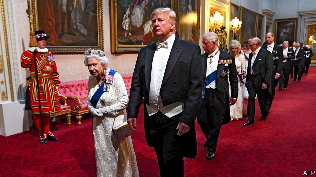

###### The president in the palace

# Donald Trump’s visit to Britain goes well—at least for him 

 

> print-edition iconPrint edition | Britain | Jun 6th 2019 

DONALD TRUMP saw only people cheering, not protests, reports of which the president branded “fake news”. They did not seem so fake on Whitehall. Placards said “Dump Trump”, “Trump: Climate Disaster” and “Keep Trump away from our NHS”. One optimistic poster proposed “Stop Brexit, stop Trump”. Most bizarre was a banner saying “Man Utd fans against apartheid”. The mood was cheerful, even carnival-like—at least until it rained. 

As ever, Labour’s Jeremy Corbyn came out to back the protests. But his disdain was diluted after Mr Trump revealed that he had rejected a meeting request from Mr Corbyn, whom he dubbed a “negative force”. He said the same of Sadiq Khan, London’s mayor, calling him a “stone-cold loser”. This contrasted with his enthusiasm for Brexiteers, singling out Boris Johnson as a great potential successor to Theresa May as prime minister. He also met Nigel Farage, whose new Brexit Party is eating into Tory support, and suggested that he should be one of the Brexit negotiators. 

The president clearly valued hobnobbing with royalty and feasting in Buckingham Palace with the queen (whom he called a “fantastic woman”) more than bilateral discussions with Mrs May. But although he said he would have negotiated Brexit differently, by suing the European Union, he also praised Mrs May’s deal. And he glossed over differences on Huawei, a Chinese telecoms giant mistrusted by America but cautiously accepted in Britain, by saying that the two countries would soon reach an agreement. 

Trade was trickier. Mr Trump promised a “phenomenal” post-Brexit deal that would double or even triple bilateral trade. But he also echoed his ambassador by saying that everything should be on the table. That includes not just farm products but access to the NHS. When most Tory leadership candidates instantly said the health service was not for sale, Mr Trump backtracked. But his own trade negotiating documents make clear that America will look for more NHS contracts and higher drug prices. What’s more, Congress has said it will not ratify any trade deal if Brexit is seen to threaten peace in Northern Ireland. A bilateral deal looks both hard and far off. 

The British managed to get in a few subtle digs of their own, with the queen and Mrs May going out of their way to praise the role of international institutions, which Mr Trump has criticised or in some cases abandoned. The prime minister openly admitted to differences on climate change and Iran, and she used this week’s D-Day commemoration to remind the president of the value of NATO in upholding the global order. Mr Trump’s response was to repeat his demand that NATO allies spend more on defence. 

Besides praising Mr Johnson, with whom he spoke by phone, Mr Trump sought meetings with Jeremy Hunt, the foreign secretary, who he said would make a good prime minister, and with Michael Gove, the environment secretary, whom he claimed not to know. The White House has clearly decided these are the three strongest candidates to succeed Mrs May. It is not obvious that Mr Trump’s support will prove helpful, any more than did Barack Obama’s backing for the Remain campaign in 2016. Yet it could weigh with some Tory party members. Certainly Mr Hunt and Mr Gove seemed pleased. ◼ 

