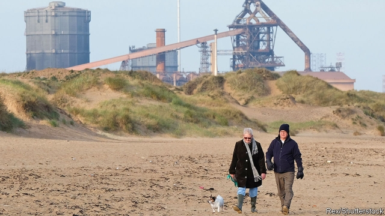

###### Mettle after metal

# Four years after its steelworks shut, Redcar is recovering 

 

> print-edition iconPrint edition | Britain | Jun 6th 2019 

AT A HOUSE in Redcar in 1876, Samuel Plimsoll was inspired to invent his famous line. Painted on a ship, it indicated the limit to which the vessel could be loaded to maintain buoyancy—thus making it hard for fraudsters to overload it with the intention of collecting an insurance payout. Lately the residents of Redcar, a town of 40,000 on Teesside, have worried more about a sinking economy than sinking ships. In 2015 the gigantic SSI steelworks closed for good, putting 2,000 people out of work and whacking the local economy. Today the site of Plimsoll’s house is a vacant branch of Marks & Spencer. 

The progress of Redcar since SSI’s collapse is being watched nervously by other industrial towns that have found themselves in trouble. On May 22nd Scunthorpe, 100 miles south, received the news that British Steel, the country’s second-largest producer of the metal, had entered liquidation, imperilling the jobs of 3,000 employees in the town. The government does not want to bail it out; the firm is desperately looking for a buyer. If the worst happens, what can Scunthorpe expect? 

Redcar was hit hard by SSI’s closure. The output of local manufacturing industries, including but not limited to metals, fell by 10% in a year. Between September 2014 and March 2016 the share of working-age men with jobs slumped by five percentage points, a greater decline than the fall across Britain during the crisis of 2008-09. 

Scars are still visible. British Steel Redcar, a railway station three minutes’ ride from the town centre, once served the site but no longer has a purpose. On a single day your correspondent boosted its annual passenger numbers by 2.5%—just 40 people used it in 2017-18, making it Britain’s loneliest stop. Even today real wages in Redcar remain a tenth lower than they were in 2015, the worst performance of any of the 200-odd regional authorities in England and Wales. 

It is harder to quantify the emotional impact of losing a plant where generations of the same families had worked for a century. From the beach, the idle works hulk over the skyline. Research by Sascha Becker, Thiemo Fetzer and Dennis Novy of Warwick University suggests that an area with Redcar’s characteristics “should” have voted 62-38 for Brexit in the referendum, which took place just months after the steelworks closed. In fact Redcar voted Leave by 66-34. 

Yet the town could surely have found itself in worse shape than it is now. Whereas in the early 1990s unemployment in some post-industrial areas topped 15%, in Redcar it has fallen from 9% to 6% since the closure of the SSI works. Working-age employment rates have risen to well above their long-run average, with full-time jobs taking up a greater share than before. These numbers have not been achieved by jobseekers deserting town: indeed, in recent years more 20- to 64-year-olds have moved to the area than have left. Higher employment means household incomes have held up better than average wages. The town is far from posh, with twice as many charity shops as the average across Britain, according to the Local Data Company, a research firm. But it remains lively, with banks, butchers and an oddly large number of tanning salons. 

The town’s valiant economic performance is partly a result of a strong jobs market across Britain. With the country’s unemployment rate at a four-decade low of 3.8%, firms are looking for workers wherever they can find them. Meanwhile, unlike the former coal-mining areas, which were hopelessly reliant on a single industry, Redcar has long had a more diversified economy, making it easier for ex-steelers to find work than it was for jobless miners a generation ago. A report last year suggested that many ex-SSI workers had moved into construction and vehicle repairs. 

The government’s response may have played a role, too. Some £50m ($64m) of state support, equivalent to £25,000 per worker formerly employed directly at the plant, has been made available to a “task-force”. About £4m was put towards offering advice and grants to help people form startups, and £14m was dedicated to training those directly affected by the closure. 

Not everyone who needed help has got it. But other SSI alumni have had good experiences. James McDermott, who once conducted structural inspections at the plant, says he received help from the task-force to improve his skills with drones. After being awarded a £10,000 grant he now runs Overview Drone Services, providing aerial photography, inspection and land surveys to businesses. “I can’t fault the help I’ve been given,” he says. 

Detailed research on the fortunes of Redcar’s ex-steelers—long promised by the government, not yet delivered—is needed to work out which programmes worked. The research cannot come soon enough: with British Steel on the brink in Scunthorpe, the government may soon be called into action again. ◼ 

