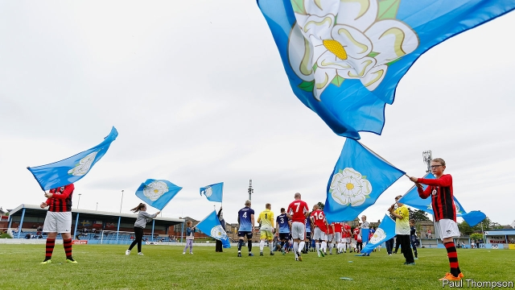

###### All kicking off

# How football can reveal the lighter side of identity movements 

 

> print-edition iconPrint edition | Britain | Jun 6th 2019 

IT WAS SATURDAY, June 1st. The anticipation had been building for days. Spectators had arrived long before kick-off to make themselves comfortable, and were busying themselves with souvenir programmes, drinking Spanish beer and eating freshly grilled meat. Or chip butties. This was, after all, Yorkshire. 

While the attention of most football fans was on Madrid, where Liverpool were about to play Tottenham in the Champions League final, fans streamed into the grounds of Ossett United to watch Yorkshire IFA play Parishes of Jersey FC. Yorkshire won, scoring the only goal of the game in the 93rd minute. 

It was the first match of the Heritage Cup, featuring unrecognised nations of the United Kingdom. Kernow FA, the Cornish team, had to drop out because of a lack of funds to travel. Ellan Vannin, representing the Isle of Man, couldn’t put a team together. The boys from the Chagos islands, many of whom live in Crawley, stepped in, only to receive a 9-2 thrashing at the hands of Jersey. 

The creation of “national” football teams for such places is a relatively new phenomenon. The Yorkshire team was set up in July 2017 and has played just seven matches. Parishes of Jersey was created last summer. Nor is it restricted to areas with a historical, readily recognised identity; Surrey has a team, too. 

“For me, a lot of this was about saying to people in devolution politics, ‘Stop going to London cap in hand.’ Let’s promote Yorkshire as it is, not as part of England,” says Phil Hegarty, the team’s founder and chairman.“Not that there’s anything wrong with England.” Yorkshire has long had a strong regional identity, and has its own political outfit, the Yorkshire Party, which in the last general election won more votes than the Liberal Democrats in Wakefield. 

There are no politics on the pitch. The crowd is good-natured. “This is the only chance these lads have to play international football,” says one supporter. Another pair of Yorkshire fans debate whether the Jersey team are “southern softies” or, worse, from “northern France”. The Yorkshire mascot, a man in a Viking outfit, applied for the gig on the basis of once playing Spiderman at a children’s party. He comes from Newcastle and lives in County Durham. 

Many teams have sought to register with FIFA, world football’s governing body, and been rejected. Instead they have joined the Confederation of Independent Football Associations (CONIFA), which organises a biennial World Cup. The last one, held in London, was won by Karpatalja, a Hungarian team. 

“We want CONIFA to be a viable alternative to FIFA,” says Mr Hegarty, who hopes that in ten years 10,000 people might watch Yorkshire on television. It is an ambitious goal, but not an impossible one: 521 people turned up to the field in Ossett, even on the day of that other big match in Madrid. 

