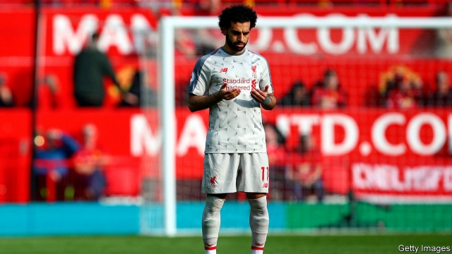

###### The Salah effect

# Mo Salah’s goals help to tackle Islamophobia in Liverpool 

 

> print-edition iconPrint edition | Britain | Jun 6th 2019 

“IF HE SCORES another few then I’ll be Muslim too,” chant Liverpool fans whenever Mohamed Salah, an Egyptian striker, finds the net. Since arriving in June 2017, he has done so with record-breaking frequency. On June 1st he scored his 71st goal in 104 appearances, to inspire the Reds to victory in the Champions League, Europe’s most prestigious competition. As usual, he celebrated by kneeling in prayer. 

It is unlikely that Mr Salah—whom another chant describes as a “gift from Allah”—has converted many fans to Islam. But a working paper by political scientists at Stanford University has found signs that his popularity might have helped to tackle anti-Muslim sentiment on Merseyside. 

The cleanest evidence came from a Facebook experiment on 8,000 British Liverpool fans. The academics gave each respondent a survey containing footballing facts and questions; a third of surveys also included a slide describing Mr Salah’s commitment to praying. Then all users were asked about their attitudes to Muslims. Of those who saw the slide about Mr Salah’s faith, 23% thought Islam was compatible with British values, compared with 18% of the other fans. Although most Liverpool supporters may know about Mr Salah’s faith anyway, the experiment showed that a reminder could alter their opinions. 

The academics also hunted for signs of broader changes in Islamophobic sentiment in Liverpool since Mr Salah was signed. First they looked at hate crimes, in which the perpetrator is motivated by race, religion or another type of identity. Of 23 English regions analysed, almost all saw a rise in the number of such crimes in the ten months after Mr Salah’s arrival, part of a long-term trend that the Home Office puts down to better recording by the police. Merseyside, by contrast, reported a slight fall. The researchers built statistical models to predict monthly rates of various types of offences in Liverpool, and found that hate crimes had been 19% less common than expected, a gap that did not exist for any other illegal activity, suggesting that any “Salah effect” was limited to religious tolerance. 

Then the researchers turned to Twitter. They identified British followers of Manchester United, Manchester City, Chelsea, Arsenal, Liverpool and Everton (a Merseyside rival), and analysed 44,000 tweets that mentioned Muslims, Arabs or mosques. In the 14 months after Mr Salah’s transfer, 7.6% of Islam-related tweets by Liverpool fans had negative sentiments, about the same as the 7.3% during the previous three years. But the figure for Everton jumped from 18.6% to 21.3%; for the other teams it rose from 7.1% to 10.9%. Online Islamophobia in Liverpool seems to have been kept in check at a time when it was rising elsewhere. (The researchers found no sign that the broader increase was caused by jealous fans abusing Mr Salah.) 

Most parts of the country, including Merseyside, saw a spike in anti-Muslim sentiment in the summer of 2017, after terrorist attacks in London and Manchester. If Mr Salah has played even a small part in reining in Liverpool fans’ prejudice since then, that is an achievement as remarkable as leading the club to European glory. ◼ 

