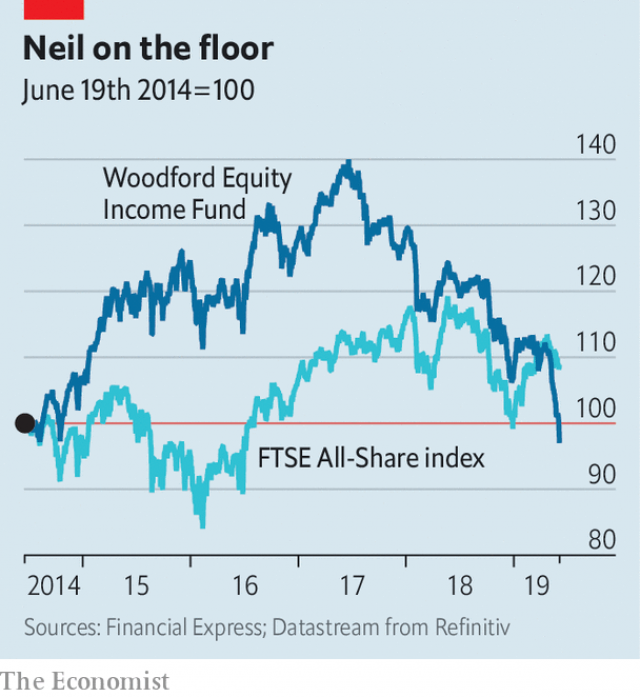

###### Woodford, felled

# Neil Woodford, star fund-manager, comes a cropper 

 

> print-edition iconPrint edition | Britain | Jun 6th 2019 

MAIDSTONE, KENT’S county town, was a bastion of resistance during the Peasants’ Revolt of 1381. Six centuries later it is at the centre of another rebellion, which threatens to engulf one of Britain’s best-known investment groups. The Kent County Council pension fund, which holds the savings of government employees, had for months been frustrated by the poor performance of the £3.7bn ($4.7bn) Woodford Equity Income Fund (WEIF). On June 3rd it tried to withdraw its £263m investment in the vehicle, prompting WEIF’s custodians to suspend redemptions. Insiders expect a stampede once trading resumes. 

Neil Woodford, WEIF’s star manager (pictured), built his fame over 26 years at Invesco. In 2014 he left to start his own business. His approach, based on bespoke research, gut feeling and a taste for going against the grain, divided opinion. Among his first picks were four tobacco firms, a provocative bet amid a backlash against cigarette makers. But investors followed him: WEIF oversaw £10bn at its peak. 

Like the vehicles Mr Woodford ran at Invesco, WEIF at its launch mostly held shares in large, listed companies. It was “open-ended”: investors could come in and out whenever they wanted. And it vowed to distribute stable, recurrent income, in addition to growth in value. For the first two years returns were strong, reassuring shareholders. In 2016 Kent topped up its initial £200m stake with another £60m. 

But the fund morphed into something barely recognisable. Convinced that his peers were too pessimistic about Brexit, Mr Woodford swapped blue-chips for smaller, younger companies focused on the domestic market. From 40% in 2016, these accounted for 95% of WEIF’s listed stocks in March 2019. But some of his riskier investments, such as stakes in firms developing new drugs, soured. And protracted political uncertainty has thwarted his hoped-for recovery in the price of unloved stocks, such as retailers and housebuilders. 

 

Even before the latest woes, losses since 2017 had wiped out nearly all of WEIF’s early gains (see chart). Investors started running for the exit, causing the fund’s value to shrink by £560m in May alone. But finding a buyer for large stakes in small businesses is hard, so WEIF struggled to raise the cash needed to meet redemptions. And the selldown kept pushing the fund against a regulatory limit of 10% in unlisted stocks, forcing it to take “extreme” steps like listing some on the Guernsey exchange, says Peter Brunt of Morningstar, a research firm. On June 5th the Financial Conduct Authority hinted that it might open an investigation. 

Mr Woodford’s firm says closing the gate will give it the breathing space it needs to “reposition” the fund towards more liquid stocks, so as to meet redemption requests once it reopens. Observers are not optimistic. “Investors who have stayed are now trapped and we don’t know for how long,” notes Patrick Connolly of Chase de Vere, a financial adviser. 

Investors may fume at Mr Woodford for his racy choice of stocks. But they cannot blame him for hiding the truth: WEIF’s holdings were disclosed on its website all along. Instead they might ask why firms like Hargreaves Lansdown, Britain’s largest financial adviser, continued to recommend WEIF until very late. Pension trustees will also force investment committees to keep closer tabs on how liquid their portfolio is, expects Ryan Hughes of AJ Bell, an investment platform. The legacy of Maidstone’s revolt of 2019 may be reform. ◼ 

