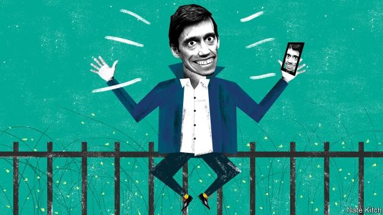

###### Bagehot

# Rory Stewart, odd man out 

 

> print-edition iconPrint edition | Britain | Jun 8th 2019 

LET’S HOPE things get better smartish: so far the Conservative leadership race has been a cross between a farce and a pander-fest. Candidates have fixated on the unrealistic Brexit deadline of October 31st, claimed magical negotiating powers for themselves and flirted with a kamikaze policy of leaving the EU without a deal. For these modern-day Metternichs, the only thing easier than renegotiating Brexit is growing a magic money tree in their back yards. The air is thick with promises to cut taxes, increase public spending and otherwise let the good times roll. 

The exception to this dismal picture is Rory Stewart, the secretary of state for international development and the MP for one of England’s most northerly constituencies, Penrith and the Border. According to the normal rules of politics, Mr Stewart should be nothing but an afterthought in the race. He is a leading supporter of Theresa May’s unpopular deal on Brexit, and he has been in the cabinet only since May 1st. He combines a suspiciously privileged background (Eton, Oxford and the Foreign Office, cloak-and-dagger branch) with an even more suspicious taste for ideas (he has taught at Harvard and published four books). Nerdish and soft-spoken, he loves to dwell on the case for prudence, caution and “facts on the ground”—hardly a rallying cry for populist times. 

Yet Mr Stewart’s campaign has caused a surprising stir with the public, thanks to a combination of Heath Robinson improvisation when it comes to campaign techniques and high seriousness when it comes to policy. Mr Stewart wanders around the country with a small film-crew, introducing himself to strangers, chatting to them about whatever is on their minds (he has been delighted to discover that people are much keener on talking about serious subjects such as Brexit and, above all, social care, than about the sort of trivia that obsesses Westminster), and then posting the resulting videos on the web. His video on the social-care system has been watched 700,000 times and another on the case against a no-deal Brexit more than 2m times. 

Mr Stewart’s campaign is well adapted to a selfie-obsessed age, in which the world is full of people making videos of themselves and posting them to their followers. It is equally well adapted to Mr Stewart’s exotic biography. He made his name by walking 6,000 miles across Iran, Afghanistan, Pakistan, India and Nepal, depending for bed and board on his ability to chat to the locals, and writing a bestselling book about his adventures. He has decided to apply much the same technique to becoming prime minister, walking hither and thither and engaging people in conversation. Mr Stewart’s knowledge of Muslim culture and Afghan languages has proved surprisingly useful on his current travels. During a recent visit to Woking he not only visited the usual campaigning venues, such as the British headquarters of the World Wildlife Fund, but also the Shah Jahan mosque, the oldest in the country, which attracts 3,000 worshippers every Friday. 

 

What are the chances that Mr Stewart will be able to persuade his fellow MPs to put him on the shortlist of two candidates that goes to the party’s 120,000 members in the country? The stark answer is that they are very small. The parliamentary party’s large pro-Brexit wing is solidifying behind Boris Johnson, who already has about 40 backers to Mr Stewart’s five, while the party’s moderates look as if they are getting behind Michael Gove, a Brexiteer in good standing, but a responsible one. Mr Stewart may even fall foul of the party’s new rule, designed to thin out a field that at one point reached 13, which demands that candidates must have at least eight MPs backing them by 5pm on June 10th. All in all his campaign brings to mind Adlai Stevenson’s famous reply to a supporter who told the governor that “all the thinking people” were on his side: “That’s not enough. I need a majority.” 

So why does an exotic candidate who is unlikely to get onto the shortlist matter? Because the Conservatives shouldn’t just be using this election to decide who replaces Theresa May. They should be using it to decide what direction the party takes after the twin traumas of the financial crisis and the Brexit vote. Mr Stewart is providing the party with a map and a compass. He argues that the Tories need to rediscover their historical role as the party of realism. His first career, in foreign policy, was defined by discovering the gap between the neoconservative dream of bringing democracy and human rights to the Middle East and the messy reality on the ground. Recently his career as a politician has been defined by defending Mrs May’s messy compromise against hardliners who think that all you need to do is intone the magic phrase “Leave means Leave” and practical problems will evaporate. 

He argues that the best way to deal with populism is to steal some of its clothes. Politicians should do more to tackle the “small injustices in daily life”, such as the fact that disgraced businessmen can keep their knighthoods. He thinks the best way to resolve the tension between parliamentary and direct democracy, inherent in the attempts to implement the referendum result, is to create an intermediate body—a “citizens’ assembly”, equipped with the power to call expert witnesses but freed from the discipline of parties—to produce a blueprint which it then submits to Parliament. He recognises that the Conservatives need to learn more about the country they aspire to govern, which means getting out and talking to people who aren’t their natural constituents. His campaign team is particularly proud that their polling shows he is the most popular Tory candidate among young voters. 

Smart Conservatives have taken to joking that Mr Stewart is the sort of Tory who is embraced by people who don’t vote Tory. But isn’t that exactly the sort of person an imploding party needs, if not to lead it then at least to help re-engineer its policies? Banging on about “clean Brexits” to fellow fanatics might be emotionally satisfying. But it is also a sure way of ending up in the boneyard. ◼ 

