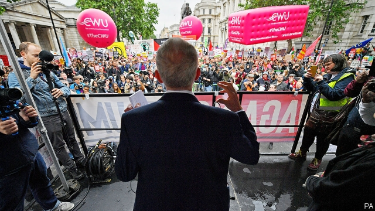

###### From demonstrations to Downing Street

# The Corbyn doctrine on foreign policy 

 

> print-edition iconPrint edition | Britain | Jun 6th 2019 

BENEATH A GAZEBO on Whitehall, Jeremy Corbyn gazed towards his past. Banners from different stages of the Labour leader’s life floated above the crowd that had gathered on June 4th to protest against a state visit by Donald Trump. A flag for Stop the War, an organisation once chaired by Mr Corbyn, loomed large. So did a placard for the Palestine Solidarity Campaign, another group he has supported. A few logos of the Campaign for Nuclear Disarmament, which Mr Corbyn helped run, were visible. Behind his left shoulder, meanwhile, lay Mr Corbyn’s possible future: the entrance to Downing Street. He has spent his life protesting against British foreign policy. Soon he may run it. 

Just as Labour has plans to overhaul Britain’s economy, so too does it promise to upend the country’s relationship with the world. It says that under Mr Corbyn Britain would lead the fight on climate change, force big companies to behave themselves in developing countries and, through some diplomatic ju-jitsu, bring about an end to unilateral military action. 

Yet beneath the lofty aims, Labour would preserve many of the fundamentals of Britain’s foreign policy. It would stay in NATO and continue to spend 2% of GDP on defence. The party has committed to renewing Trident, Britain’s nuclear deterrent, even though Mr Corbyn has in the past said he would not use it. When it comes to Israel and Palestine, Britain would continue to back a two-state solution. Aid spending would stay at 0.7% of national income. And Labour still wants to leave the EU, even though most of its supporters do not. A shift in rhetoric would not always be matched by a shift in reality. 

Start with what would be different. Labour’s foreign policy is enthusiastically provocative. During Mr Trump’s visit Emily Thornberry, the shadow foreign secretary, said of the president: “He is a sexual predator, he is a racist, and it’s right to say that.” There is little desire to join the cross-party consensus that has historically dominated British foreign policy, which the Labour leadership sees as out-of-kilter with public opinion. Long, expensive wars in Iraq and Afghanistan, and more recent strikes in Libya and Syria, have made Britain less safe, Labour believes. Many Britons agree. In 2017 about half told pollsters that foreign wars were in part responsible for terrorist attacks. Less than a quarter disagreed. Labour would recognise Palestine and give Chagos islanders the right to return to the disputed British territory. 

The biggest change would be a reluctance to use the forces Labour has pledged to fund so lavishly. Britain’s “bomb first, talk later” approach, as Mr Corbyn has described it, would be replaced by a policy of using military action only as “a genuine last resort”. Outside UN-sanctioned peacekeeping missions, it is difficult to see circumstances in which British troops would be deployed. And Britain’s attitude towards NATO would change. Although Ms Thornberry supported the decision to send soldiers to Estonia as a “tripwire” force to deter its neighbour Russia, she has pointedly refused to say whether the Baltic states should have joined the transatlantic alliance. Mr Corbyn and his advisers have repeatedly labelled NATO a tool of Western imperialism and a threat to peace, arguing that its expansion into eastern Europe was a provocation of Russia. 

The effects of such radical views will be tempered by two factors: the party’s mandate and the country’s means. Internal party politics will be a check on Mr Corbyn’s hard-left advisers. Labour is not a one-man band, and its position on Britain’s nuclear arsenal reflects this. Unite, a trade union which is also the Labour Party’s biggest funder, is opposed “in principle” to nuclear weapons but says its priority is to preserve members’ jobs, including those of defence workers. For the same reason it is cool on the idea of suspending the sale of arms to dodgy regimes in the Middle East. 

More broadly, Mr Corbyn represents only one strand of foreign-policy thinking within the party, which is not filled exclusively by peaceniks. Labour has always had a militaristic streak. It was Clement Attlee, feted by the left on all other matters, who took Britain into NATO and demanded that it develop the nuclear bomb. While residual supporters of the Iraq war are few, previous interventions in, for example, Kosovo—opposed by Mr Corbyn—are regarded with pride within the party. The bulk of its MPs are attached to Britain’s nuclear capability and its role in the Western alliance. 

External factors could still alter this. If Labour ended up in coalition with the Scottish National Party, this might temper some of the government’s domestic policies—but it could radicalise its foreign policy. The SNP opposes renewing Trident. And Labour’s policy is set at its annual conference. Thus Britain’s future as a nuclear power or NATO member would be settled by a closed-door meeting of union delegates and party members. 

What will not change, whether Labour or the Conservatives are in Downing Street, is the government’s overestimation of Britain’s clout in the world. Both parties are fond of the tagline “Global Britain”. Yet whoever enters Downing Street will find that life as a medium-sized country in a world of continent-sized rivals is hard. Britain cannot act like a Scandinavian country, using its large aid budget to play an outsized role in the world, points out one former foreign secretary. “Nordics are trusted by people in the international community in a way Brits are not,” he says. 

Playing an active role in the Middle East requires winning over not just the Palestinians but Israel and America too, a task for which Mr Corbyn, who has spent his life railing against American imperialism and who failed to root out anti-Semitism within Labour, is uniquely ill-suited. The close intelligence relationship between Britain and America may be jeopardised, given Mr Corbyn’s views and allies. Even British agencies may feel uncomfortable sharing reports with a Downing Street that includes a senior adviser who was a member of the British Communist Party until 2016. 

It may be that, rather than charting a radical new course, Britain finds itself bleating from the sidelines, the Foreign Office reduced to little more than an NGO, says Thomas Raines of Chatham House, a think-tank. Back on Whitehall, Mr Corbyn told the crowd: “Never forget: protest and activism eventually leads to change.” He may find that is not always the case, even in Downing Street. ◼ 

