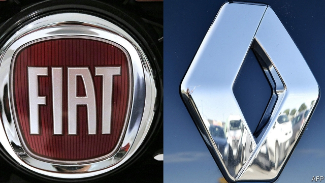

###### Braking bad

# A merger of Fiat Chrysler Automobiles and Renault is no more 

 

> print-edition iconPrint edition | Business | Jun 6th 2019 

SUDDEN, SURPRISING and “transformative”. The description could apply both to the proposed merger between Fiat Chrysler Automobiles (FCA) and Renault announced on May 27th and its demise only ten days later. Late in the evening of June 5th the Italian-American firm, which had approached its French counterpart with the offer, announced that it was withdrawing the proposal. The share prices of both companies fell on the news. The rapid implosion of a deal that was intended to secure the futures of both carmakers as the industry undergoes fundamental change is a huge blow for its architects. It shows that the much-needed consolidation of the car industry will be fiendishly hard to pull off. 

The deal looked like a winner for both parties. Their complementary strengths in regions and products, plus a chance to share investment in electrification and self-driving cars, had convinced John Elkann, the chairman of FCA (who sits on the board of The Economist’s parent company), and Jean-Dominique Senard, his counterpart at Renault, of the wisdom of combining the two firms. This would create the world’s third-biggest carmaker. If Renault’s Japanese partners, Nissan and Mitsubishi, got on board, the firm would become a colossus making 15m cars a year—almost half as much again as their closest competitors. 

So what went so wrong, so quickly, to compel FCA to pull out? The deal, born out of reportedly convivial talks between Mr Elkann and Mr Senard, was greeted with approval by investors. The French government, which has a 15% stake in Renault, seemed amenable. Nissan, Renault’s main alliance partner in which the French firm has a 43% stake, made reassuring noises. 

But, it then emerged, Nissan had been kept in the dark about the deal until the last minute. It worried that the deal’s structure as a 50-50 partnership between shareholders of Renault and FCA did not properly acknowledge Renault’s stake in Nissan, worth some $13bn. And the Japanese firm felt rushed into making a huge strategic decision, not long after it had rejected Renault’s plan for a full merger under Carlos Ghosn, the firm’s former boss who is now fighting charges of financial wrongdoing at Nissan (which he denies). Under the terms of the agreement governing the alliance, a change of control would have allowed Nissan to renegotiate the partnership. It had apparently called for a strategic review. The cost savings of €5bn ($6bn) that FCA claimed for the deal were partly predicated on the continuation of Renault’s alliance with Nissan and Mitsubishi. 

Despite its misgivings, Nissan could have been brought on board, FCA believed. For FCA the main stumbling-block was the French government, which has a habit of being a tricky counterparty in deals involving national champions. Without French support, and acceptance of a 7.5% stake in the merged firm, the deal would not have got this far. But the French wanted control. Sources close to FCA say that the government was constantly second-guessing and renegotiating every aspect of the deal. For FCA this portended future interference. When France pointed the finger at Nissan as a roadblock, FCA lost patience. 

The question is what happens now? Yet another car-industry mega-merger has collapsed—this time before it even got off the ground. It seems unlikely that the deal can be revived. FCA’s disillusionment with the French government seems too great. The rocky relationship between Renault and Nissan is unlikely to be improved by the French government’s finger-wagging. FCA will lick its wounds and may seek another deal. One often mooted partner is PSA Group, the maker of Peugeots and Citroëns. But it was the damning verdict on the now-dead merger issued last week by PSA’s boss, Carlos Tavares, who called it a “virtual takeover” of Renault, that may have thrown a spanner in the works. Engineering the consolidation of the car industry is looking harder than ever.◼ 

