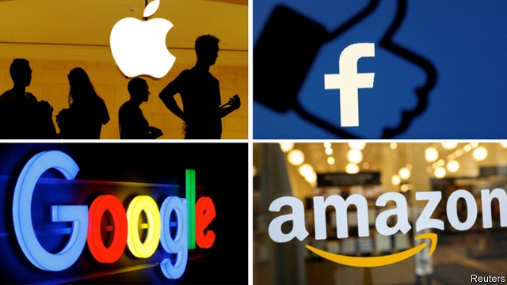
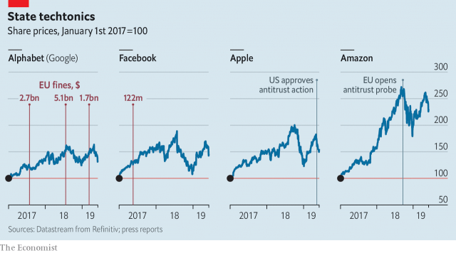

###### Fine by US

# American trustbusters are rattling Google, Amazon, Facebook and Apple 

 

> print-edition iconPrint edition | Business | Jun 6th 2019 

SHARES IN THE biggest internet firms took a nasty tumble on June 3rd, after weekend reports suggested American authorities were limbering up to scrutinise their business models. Just four —Amazon, Facebook, Apple and Alphabet—lost $134bn in market capitalisation in a day, not far off the entire worth of Netflix (which also fell). 

Dealing with competition quibbles is hardly new for Big Tech. European trustbusters have been on their case for two decades. Even whopping fines there have barely registered with investors (see chart). Alphabet, which owns Google, has coughed up $9.5bn across three cases over the past two years (it is appealing). Its valuation rose each time. News of a preliminary probe into Amazon in September dented its share price much less than poor earnings unveiled soon after. 

 

This time is different. The 4.5% drop in the four giants’ market value suggests investors are more worried. Possibly meatier American fines are not the reason: the billions Google has been forced to pay represent less than a tenth of the $134bn in profits it has generated since the first case was opened in November 2010. Even higher penalties can be written off as a cost of doing business. 

More likely, shareholders fret that American authorities could force the firms to change their money-spinning business models. In his confirmation hearing William Barr, America’s attorney-general, said he wanted to “find out more” about how Apple and others had grown so big. Elizabeth Warren, a senator and Democratic presidential hopeful, has said that Facebook should be broken up. If America is picking up where Europe left off, investors are right to be concerned. 

