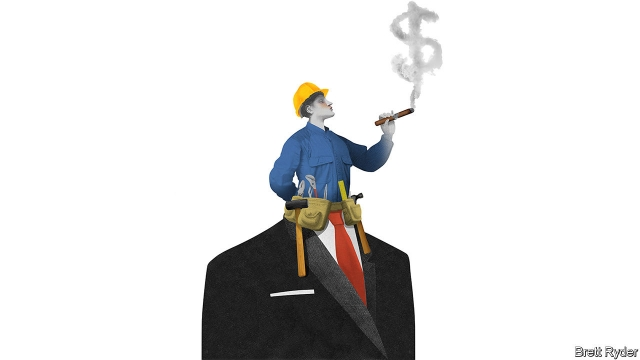

###### Schumpeter

# Blue-collar capitalists 

 

> print-edition iconPrint edition | Business | Jun 6th 2019 

IDA TARBELL, the great muckraker of the early 20th century, not only wielded her pen against Standard Oil. She also used it to advocate for better versions of capitalism. In “New Ideals in Business”, a book from 1916, she explained how William Cooper Procter, a pioneering Episcopalian, introduced profit sharing in 1887 and eventually share ownership for workers of Procter & Gamble (P&G), a consumer-goods firm. Lauding the impact on the company’s performance, she recounted the words of one employee: “Do you suppose I’m going to let a new man come in and loaf on his job…? It’s my profits that I’m looking out for now.” 

Over a century on, P&G still grants about a tenth of its shares to its employees and retirees. Other well-known firms, such as Southwest Airlines, Starbucks and even Huawei of China, are part or wholly worker-owned. But today left-wing politicians are pushing capitalism for the masses perilously close to socialism. On June 5th Bernie Sanders, a senator and candidate for the Democratic presidential nomination in 2020, gatecrashed Walmart’s annual general meeting in Arkansas, demanding that the retail giant put a worker on its board. He has also unveiled a policy that would force big firms to give a portion of their stocks to a fund controlled by employees, which would pay them a regular dividend. This shares features of a proposal by Jeremy Corbyn’s Labour Party in Britain. 

Other presidential hopefuls, most notably Elizabeth Warren, another firebrand senator, also decry the lowly position of workers in America, and tie it to wealth inequality, the pre-eminent economic gripe this campaign season. They are right. If employees held more company stock—as top executives do thanks to share allocations—America’s wealth gap, in which the top 10% of households own 80% of America’s financial assets, may become a bit less gaping. But compelling rather than coaxing firms to give away shares to workers jeopardises a delicate compromise between progressives and conservatives that has historically helped advance the cause of employee ownership in the West. 

Employee ownership has many virtues. Its radicalism appeals to the left: it boosts workers’ wealth. Its conservatism pleases the right; workers gain a stake in capitalism’s future, which may improve their performance, and so that of the business. Not all schemes work, but studies show that on average employee-owned firms benefit from higher output per worker, a more stable workforce and higher returns on assets. According to a study in 2017 by Nancy Wiefek of the National Centre for Employee Ownership, an industry body, employee-owners enjoy significantly higher median income and job tenure than workers without ownership (though there may be other explanations for this). 

America leads the way in the number of blue-collar capitalists. But even it still has a long way to go. Almost 40% of adult American workers are engaged in some sort of profit-sharing. The number of Americans enrolled in employee stock-ownership plans (ESOPs), in which firms grant shares to workers, has risen steadily to 14.3m in 2016, from 13.5m in 2010. ESOP assets total $1.4trn. Britain’s comparatively modest employee share ownership is viewed almost reverentially. When Julian Richer, 60-year-old owner of a British hi-fi chain, announced last month that he would put 60% of his shares into a trust for employees (he has no children), he was showered with praise. At last, the country found a capitalist it could like. 

Not everyone applauds the idea. As Joseph Blasi of Rutgers University observes, for decades critics warned that employee ownership is a risky substitute for pay, because it encourages workers to put too many eggs into one basket. If their firm goes bust they can lose everything—as happened with United Airlines in 2002. Policymakers have promoted diversified 401(k) pension plans instead. Other opponents say it encourages free-riding; if you expect others to do the heavy lifting to ensure their asset maintains value, you may be tempted to slack off. 

Mr Blasi says such claims are mostly disproved. Employee ownership typically comes on top of pay, rather than substituting some of it (not at United, which explains that fiasco). Workers seldom hold more than 15% of their financial wealth in their own company, which is manageable. As for free-riding, Tarbell’s account illustrates that other workers will not tolerate loafers. 

Expansion of employee ownership could use a tailwind. At last count 158,000 private firms in America were in the hands of baby-boomer founders on the verge of retirement, according to Ms Wiefek. These companies could be sold partially or wholly to their employees via an ESOP scheme. But take-up is much lower than the potential suggests. To accelerate it, the government could provide more information, modest tax inducements or procurement policies that favour employee-owned firms. Richard Freeman of Harvard University sees scope for using employee ownership to offset possible job losses to artificial intelligence (AI). His answer to the question ‘Whatcha gonna do, workers, when AI Robomania runs over you?’ as he wrote in a recent paper, is to spread ownership of capital more widely. 

The best bet may be to rekindle a spirit of self-interest among businessmen. They enjoy a disproportionate share of capitalism’s rewards—and worry about its fate. Based on public-company filings, Mr Blasi estimates that big firms have shelled out at least 0.5% of their shares a year to their five most senior executives. Boards could do more to broaden ownership to the rank and file. The reckless remedies proposed by Mr Sanders, Mrs Warren and Mr Corbyn should not put firms off. Bringing capitalism to the masses has a rich history, dating back to Procter and bolstered in the Thatcher and Reagan years of the 1980s. It deserves a rich future. As Tarbell said, all it takes is “brains, freedom from isms, humanity and a large firm sense of responsibility”. ◼ 

