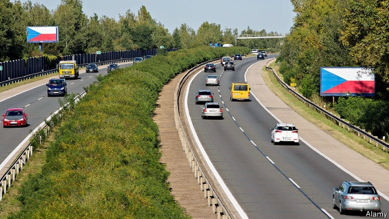
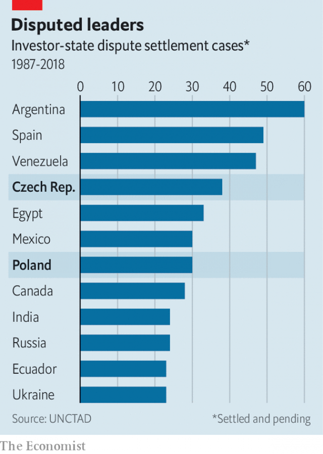

###### Kafkaesque

# Disgruntled investors are losing patience with central Europe 

 

> print-edition iconPrint edition | Business | Jun 8th 2019 

SEBASTIAN PAWLOWSKI used to gush about the economic potential of the Czech Republic and the wealth of Czech culture. The Swiss investor with Polish roots arrived in Prague in the early 1990s and became one of the top property developers in the Czech capital, then full of promise and excitement. He founded a popular private museum dedicated to Alphonse Mucha, a local art-nouveau master, and one to Franz Kafka, a Prague-born writer. 

These days Mr Pawlowski is still a supporter of Czech arts, but would not invest another koruna in the country. He blames a kerfuffle over an investment in Benice, a Prague district where he bought land for residential development in 2007. This, Mr Pawlowski claims, was scuppered by local authorities, which in 2012 reversed zoning rules by court order. 

Even now Mr Pawlowski still lacks permission to build the planned 800 flats. In 2017 he sued the Czech state at the World Bank’s International Centre for Settlement of Investment Disputes (ICSID) for $218m over a violation of the bilateral investment treaty (BIT) between Switzerland and the Czech and Slovak Federative Republic concluded in 1990, and still in force despite the country’s subsequent break-up. 

Mr Pawlowski is not the only investor who says he was stiffed by local or national governments in central and eastern Europe. Some of these legal tussles are part of the transition to a modern market economy. A lack of co-ordination between local and national authorities that make different promises is partly to blame. Increasingly, however, the region’s governments seem wilfully to ignore international rules. 

Investors’ biggest concern is the subjugation of local courts by populist rulers. Andrej Babis, the Czech prime minister who is facing criminal charges over the misuse of EU funds, recently replaced his justice minister with a loyalist. Last week his Hungarian counterpart, Victor Orban, shelved a plan to create a parallel court system that would handle cases involving the state. But his earlier overhaul of the justice system has fuelled concerns about judicial independence. So have similar moves by Poland’s ruling Law and Justice party. 

 

Investors rely on BITs to get a fair shake—those in central Europe more so than most. Of 942 investor-state disputes worldwide since 1987, a disproportionally high number involved post-communist countries that joined the EU 15 years ago (see chart). The Czech Republic (38 cases) and Poland (30) are the worst offenders. By comparison, Germany and France, much bigger economies with more inward investments, have four cases between them. 

Tales similar to Mr Pawlowski’s abound in the region. Invenergy, an American firm which invested 2.2bn zloty ($583m) in 11 wind farms in Poland in 2005, last year sued the Polish government for $700m in a UN court over cancelled power-purchase agreements. Poland’s courts sided with Invenergy but were ignored by state-controlled bodies. Another American investor, George Nussbaum, set up a billboard business in the 1990s that boomed until the Czech government banned billboards on highways because of traffic-safety concerns in 2012. This put an end to licensed roadside billboards but not those without legal permits, which are put up by some Czech firms. Mr Nussbaum is about to file a suit at the ICSID alleging a breach of the Czech-American BIT. The British liquidator of New World Resources (NRW), an energy group, is threatening to lodge a complaint about the Czech government at the ICSID under the Energy Charter Treaty, an international compact governing cross-border investments, over the insolvency and expropriation in 2017 of OKD, a Czech miner which NRW used to own. 

In a case last year involving Achmea, a Dutch health-care company, and Slovakia the European Court of Justice (ECJ) ruled that EU law takes precedence over the Dutch-Slovak BIT. This led the EU’s executive arm to step up efforts to end intra-EU investment treaties by the end of the year. This assumes that national courts can be trusted to issue impartial verdicts—and governments, to respect them. Opponents of the proposal argue that, in central Europe at least, they do not. ◼ 

