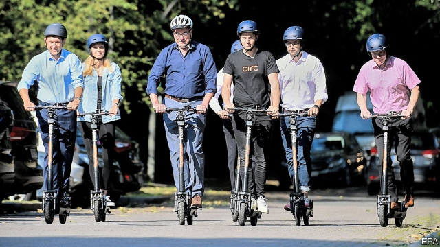

###### Growing up

# Electric-scooter startups are becoming more cautious 

 

> print-edition iconPrint edition | Business | Jun 8th 2019 

ON MAY 29TH electric scooters began legally to glide down cycle lanes in the Swedish city of Helsingborg. The next day a rider collided with a car and died. The Swedish Transport Authority immediately called for a ban on the devices. The incident highlights the riskiness of the vehicles—and of the fast-growing micromobility business around the world. 

Motorised versions of children’s kick scooters are notoriously unsafe. Their silent motors catch pedestrians and other road users unawares. A study by the Portland Bureau of Transportation concluded that e-scooters get into accidents 22 times as often as cars do, and 44 times as often as motorbikes. Another, by the city of Austin, found that one in three users is hurt on their first go. They are also increasingly unwelcome. Abandoned dockless devices obstruct pavements and doorways. In 2018 San Francisco temporarily banned them. The mayor of Nashville recently tweeted that the city’s experiment with them “is not working out”. 

In keeping with the startup credo of asking forgiveness rather than permission, firms often launched large e-scooter fleets without consulting local authorities, sometimes literally overnight. The backlash is making them rethink their approach. Bird, a two-year-old industry pioneer, has introduced a “GovTech platform” to let local authorities designate no-ride and no-park zones, set speed limits and display safety messages on scooter dashboards. VOI of Sweden, whose scooter was involved in last week’s accident, accompanies launches with educational pop-ups. It is planning a “virtual traffic school” for novices. 

A big remaining obstacle is insurance. In Sweden scooters limited to 20 kilometres per hour (12 miles per hour) are classified as bicycles and do not need motor-liability coverage. In some places, like Germany, authorities demand that micromobility startups take out such policies. Elsewhere, insurance is the responsibility of the renter. Like their customers, then, companies face a balancing act. Thom Rickert of Argo Group, an insurer, talks of a “complicated liability economy”. It could get more complicated soon. The latest craze is for even more dangerous-looking electric-powered skateboards. 

