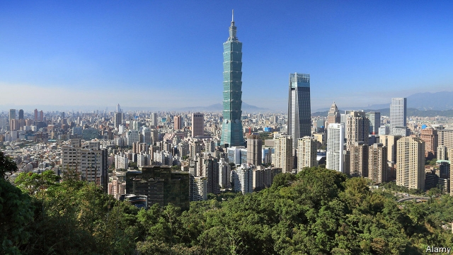

###### The silicon tightrope

# Taiwan’s computing titans are caught up in the US-China tech war 

 

> print-edition iconPrint edition | Business | Jun 6th 2019 

IN THE SHADOW of Taipei 101, the Taiwanese capital’s tallest skyscraper, 42,000 people attended Computex, one of the world’s biggest electronics trade expos, which concluded on June 1st. They bought, sold and ogled every electronic component imaginable. Neon-pulsating fans. Computer casings in every imaginable shade of beige. Infinite varieties of fibre-optic cables. And, of course, chips. If silicon had a smell, Computex would be oozing it. 

The massive exhibition space is in fact a sideshow. The real action takes place high above, in the hotel suites of central Taipei. The world’s technology firms book them, then fly in for meetings with the Taiwanese companies that are the beating heart of the global electronics supply chain. Taiwan is, in effect, Computex writ large. 

The largest Taiwanese tech companies are contract manufacturers, which make products for other firms rather than sell them directly to consumers. The combined sales of the 19 biggest last year totalled $394bn. They co-ordinate the fiendish logistics of getting hundreds of parts sourced from Asia and beyond to arrive in the right place at the right time, in order to keep their assembly plants, many located in China, humming. Largan, Pegatron, Quanta and TSMC are not household names. Their customers—Huawei, Apple, Amazon—are. But the global tech value chains atop which these illustrious firms sit would break without their Taiwanese links. 

All iPhones and many Huawei devices run on cutting-edge microprocessors made by TSMC. Largan grinds the minuscule lenses and other optical equipment that goes into high-end smartphone cameras. Many lower-end phones sold by companies under various brands are basically generics produced by Pegatron or Quanta. Hon Hai, better known as Foxconn, is the only company with the capacity to marshal the armies of workers needed to ramp up iPhone production. The vast majority of its stadium-sized factories are in China, but Taiwan is the centre of operations. The label on most Apple devices, “Designed in California. Assembled in China”, is missing a central component: “Made possible by Taiwan”. 

By the same token, Taiwan’s silent giants find themselves in the middle of the technology cold war between China and America. TSMC is perhaps Huawei’s most important supplier. For now it says that America’s decision last month, on national security grounds, to prohibit its companies from exporting technology to the Chinese firm does not affect it; TSMC’s meticulous supply-chain management systems show that its exports to Huawei do not contain enough American intellectual property to fall under the ban. Nonetheless it is under pressure, as are its Taiwanese peers. Rumours are swirling that Foxconn has stopped some of its manufacturing for Huawei. (Huawei denies this. Foxconn declined to comment.) Last week China said it was compiling its own list of “unreliable” foreign firms. 

Even before these latest salvoes, Taiwanese companies were already looking beyond China to locate new assembly plants, prompted by rising Chinese labour costs and President Donald Trump’s earlier tariffs on Chinese imports. But relocating links of the complex supply chain from clusters such as Shenzhen in southern China (800km from Taipei as the crow flies) will increase the costs of shipping and logistics, eating into the Taiwanese firms’ comparatively thin margins. And a wholesale move out of China looks unfeasible, not least because few other places possess the expertise that agglomerations like Shenzhen have built up over the years. 

Some Taiwanese firms are quietly seeking a toehold in other countries. Pegatron is planning to invest $1bn in a new manufacturing facility on the Indonesian island of Batam, just an hour by ferry from Singapore. Foxconn and Wistron, another Taiwanese firm, each now has an iPhone factory in India. 

Keeping a low profile is getting harder for the Taiwanese companies. If you include Hong Kong, China consumes 40% of Taiwanese exports, most of it courtesy of the contract manufacturers. Around 1m Taiwanese, roughly one-tenth of its labour force, work in China. Taiwan’s relations with China, which considers the island part of its territory, are ever uneasy—especially when, as now, the Democratic Progressive Party, which insists that Taiwan is an independent country, wields power. Last month John Bolton, Mr Trump’s national security adviser, enraged China by breaking with decades of precedent to meet his Taiwanese opposite number. Terry Gou, Foxconn’s founder and Taiwan’s richest man, is meanwhile seeking the presidential nomination of the biggest opposition party on a China-friendly ticket. 

Most of Mr Gou’s fellow tech bosses prefer to keep their heads down. Small wonder, for shadows have served them well. From now on they may have to get used to the spotlight.◼ 

