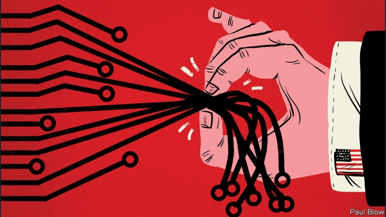
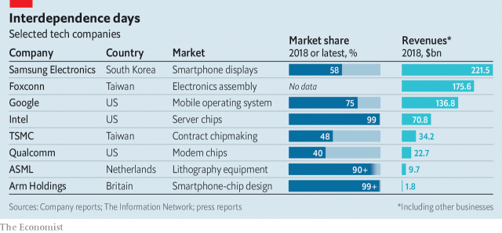

###### Pinch points

# The technology industry is rife with bottlenecks 

 

> print-edition iconPrint edition | Business | Jun 6th 2019 

JAPAN HAD long since lost its lead in electronics. Or so many thought. When an earthquake and tsunami hit the country in 2011, its continued centrality to the industry quickly became apparent. Copper foils for printed circuit boards, silicon wafers to make chips, resin to package them—for many components Japan was the home of the biggest, sometimes only, supplier. As production ground to a halt, customers scrambled to find alternatives. Many had to limit their output, like carmakers reliant on Renesas Electronics, a leading maker of engine-controlling chips whose wafer-fabrication plant sustained heavy damage. 

Natural disasters—whether cataclysmic like the Japanese earthquake or merely destructive like floods or wildfires—regularly test the electronics supply chain. Now a geopolitical shock from President Donald Trump’s efforts to isolate China has thrown the industry’s structure into sharp relief—and exposed its choke points (see table). 

 

This structure is best thought of as a transcontinental relay race with hidden hurdles, says Willy Shih of Harvard Business School. Modern electronic devices are the most complex things humans produce. Firms at every stage of the process are highly specialised and wield advanced technology. Components are passed from one firm to another, each of which adds a bit of value; some parts cross the ocean several times. Sometimes, where only one or two providers of a particular subsystem exist, the lanes converge. Downstream firms, which may only know their direct suppliers, often have no idea what happens upstream, explains Mr Shih. Until, that is, something goes awry. 

The earthquake in Japan revealed that the country produces the bulk of chemicals and other materials to make microchips. The Trump tremor immediately highlighted China’s dominant role in electronics assembly. It is home to half the world’s capacity, estimates Henry Yeung of the National University of Singapore, which can be ramped up at short notice. When Apple launches a new iPhone, for example, tens of thousands of workers have to be hired within weeks. 

In May America’s Commerce Department blacklisted Huawei, a Chinese technology titan, and 70 of its affiliates, barring American firms from selling them certain technologies without government approval. This shed light on another bottleneck: chips. Like ZTE, a smaller Chinese firm which in 2017 briefly found itself in a similar situation, Huawei could not survive without chips designed in America. 

Although Huawei has its own semiconductor subsidiary, HiSilicon, it still imports most of its chips and spent $11bn last year on components from America. Qualcomm, a company based in San Diego, makes around half the world’s baseband processors, modem chips which manage wireless connections. Intel makes virtually all “server-class” chips used in the world’s data centres. Chips based on designs licensed from Arm, a British firm, can be found in almost every advanced smartphone out there. All said they would limit sales to Huawei, lest they fall foul of the American ban. 

For their part, Qualcomm, Arm and other chip designers depend on foundries to turn silicon into microprocessors. The largest of these is Taiwan Semiconductor Manufacturing Company (TSMC). It is one of only three firms capable of producing cutting-edge microprocessors. The other two are Intel, which focuses on making chips it designs itself, and Samsung of South Korea. According to insiders, processors which go into an iPhone are all made in a single TSMC facility. And Taiwan, like Japan, is prone to earthquakes. (TSMC says its chip factories are designed to resist major earthquakes.) 

Intel, Samsung and TSMC, in turn, rely on a bevy of specialised equipment suppliers to kit out their factories. One is ASML, a Dutch firm. It is the world’s only maker of lithography equipment that uses “extreme ultraviolet” light, which enables the production of transistors small enough for the next generation of advanced chips. ASML has spent decades, and billions of dollars, getting that finicky technology to work. Its 180-tonne machines sell for €120m ($135m) a pop. Intel, TSMC and Samsung have each bought a handful. SMIC, a Chinese chipmaker, has ordered one. If SMIC or other Chinese firms were barred from buying more, China’s ambition to become self-sufficient in advanced chips would come a cropper, says Robert Castellano, an industry analyst. 

Then there is software. Three-quarters of the world’s smartphones, including many made by Huawei, use Google’s Android mobile operating system. The American ban means that, although Huawei retains access to the open-source version of Android, Google has said that it will no longer provide the Chinese firm with proprietary bits, such as the app store and security updates. That will not hurt Huawei in China, where these services are already blocked. But it will in the West, where consumers rely on them every day. 

Open-source does not guarantee invulnerability. Some think Mr Trump may want to ban exports of such software to China, as has long been the case for certain encryption programs. Without programs like the Linux operating system or Kubernetes, a tool to manage computing loads, Alibaba could not have become the world’s fastest-growing cloud-computing giant. 

All these bottlenecks, and America’s direct or indirect sway over many of them, makes it tempting for hardliners in Washington to “weaponise interdependence”, as Henry Farrell of George Washington University and Abraham Newman of Georgetown University put it in a recent influential paper. America has threatened to cut off foreign financial institutions from the SWIFT banking network and the dollar clearing system for doing business with countries or entities it does not like. The Huawei ban applies to foreign firms if at least one-quarter of their technology originates in America (hence Arm’s decision to stop licensing the Chinese firm). 

After the Japanese earthquake, many firms moved to identify risks in their supply chain and sought alternatives, says Bindiya Vakil, boss of Resilinc, which maintains a database of links between suppliers and monitors disruptions. But it is hard to will new high-tech companies into existence. And doing so would be costly. So the system remains largely unchanged. 

Will the Huawei ban alter it? Many firms will speed up efforts to bypass China—for instance by building factories in places like India or Mexico. (Mr Trump’s threat last week to slap tariffs on Mexican imports may give them pause.) Samsung has already moved most of its smartphone production to Vietnam. Retaliation by China may hasten the process. When in 2010 it cut export quotas for rare earths, a set of obscure minerals used in magnets and other electronic components, of which 70% is produced in China, this quickly led to a search for alternative sources and substitute materials. Days after the Huawei ban Xi Jinping, China’s president, paid a much-publicised visit to a rare-earths facility. 

Whether or not it responds in kind, China will redouble efforts to become technologically independent. Huawei has said it will soon release its own mobile operating system to supplant Android. The government is likely to pump even more money into the country’s chip industry. 

Optimists argue that interdependence will be disarmed once it has served its purpose in the latest Sino-American trade tussle. But the damage has been done. As Mr Shih says, many companies feel they can no longer rely on Chinese suppliers. And the Chinese realise that America can use the supply chain to wage economic war. Hawks in Washington and Beijing may dream of two “techno-spheres” of influence. To globalised technology firms, it feels like a nightmare.◼ 

