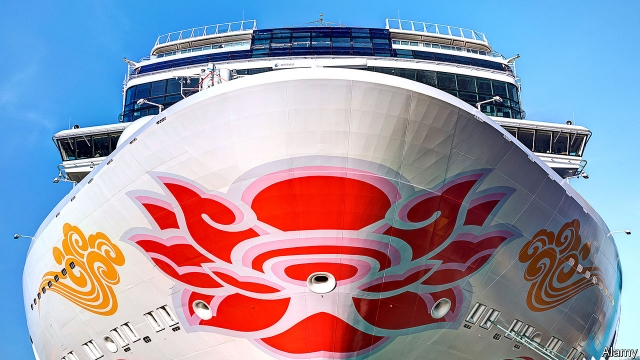

###### Not what it was

# What slumping demand for cruises says about Chinese tourists 

 

> print-edition iconPrint edition | Business | Jun 6th 2019 

WESTERNERS IMAGINE Chinese travellers to be different from them. The rise in the number of large tour groups in European cities has stoked fears of “overtourism” among locals. Chinese tourists’ supposed preference for only visiting popular landmarks, their taste for Chinese food and their addiction to luxury shopping are widely mocked. But the tastes of Chinese travellers are, in fact, rapidly converging with international norms—nowhere more so than on cruise ships. 

America dominates the cruise industry. Carnival, Royal Carribean and Norwegian Cruise Line, which control nearly 80% of the global market between them, are based there. Just over half of the 26m people who went on a cruise in 2018 were American, reckons Cruise Market Watch, a data-provider. But China is catching up. Between 2013 and 2016 number of Chinese cruise-goers grew at a compound annual rate of 70%. In 2016 they overtook Germans to become the second-biggest cruise-going nation. Last year 2.4m Chinese holidayed on the high seas, spending around $3bn out of a global total of $46bn. 

Now the industry is entering choppy waters in China, even as cruise passenger numbers increase almost everywhere else. Chinese passenger numbers dipped by 1-2% in 2018 and are estimated to fall by a further 5-15% this year. What happened? 

Cruise lines owed their early success to offering Chinese tourists what they wanted: “floating shopping malls with casinos” in the words of David Beckel of Bernstein, a research firm. At sea they could bypass the country’s strict gambling laws (just as the original American “booze cruises” in the 1920s were a way of getting around Prohibition) and snap up duty-free Western brands. Shops on Royal Carribean and Carnival voyages were regularly stripped bare of everything from Bulgari necklaces to South Korean rice cookers. 

No longer, it seems. Chinese tastes are fast becoming more sophisticated, observes Alex Dichter of McKinsey, a consultancy. Surveys suggest that visiting landmarks and shopping have been dethroned as top reasons for travelling. Nowadays taking a break from work to recharge and to experience local cultures tend to be the top of the list. The emphasis is on experiences, not things—like travellers in the West, in other words. Oliver Wyman, a consultancy, found that the share of Chinese holiday spending on shopping fell from 41% in 2016 to 32% by 2018. 

As a result, cruise lines that have gone too native, or that rely too much on shopping for profits, have suffered. Norwegian launched its first ship built especially for China in 2017, armed with shops, gambling machines, Asian restaurants and a karaoke bar. Two years later, amid disappointing ticket sales, Norwegian spent $50m ripping out all the Chinese fripperies and moved the ship to Alaskan fjords. In 2018 Royal Caribbean scuttled SkySea Cruises, a joint venture with Ctrip, a Chinese online travel agency, when it discovered it could make more money running its own vessels with fewer nods to local taste. Carnival maintains its joint venture with CSSC, a state-owned Chinese firm. One reason might be to appease regulators keen to boost Chinese shipyards’ order books. 

Royal Caribbean has found it more lucrative to offer a Western experience at sea at a premium price than to compete against cheap Chinese resorts. It is among the few lines in China that makes money, claims Richard Fain, its executive chairman. It is still adding more ships. On June 6th, after The Economist went to press, Spectrum of the Seas, its newest vessel, was due to embark on its maiden voyage from Shanghai carrying nearly 5,000 passengers. 

Mr Fain thinks that the Chinese market will eventually rebound. Analysts at Goldman Sachs, a bank, reckon that just 0.5% of potential passengers in China took a cruise in 2017, compared with over 4% in America. Pierfrancesco Vago, executive chairman of MSC Cruises, the world’s fourth-largest line, blames regulation. Western lines cannot sail between two Chinese ports. China is thinking about relaxing some of these rules, but only for domestic firms, which are few in number and tiny in size. To grow, they—and their regulators—may need to turn international.◼ 

