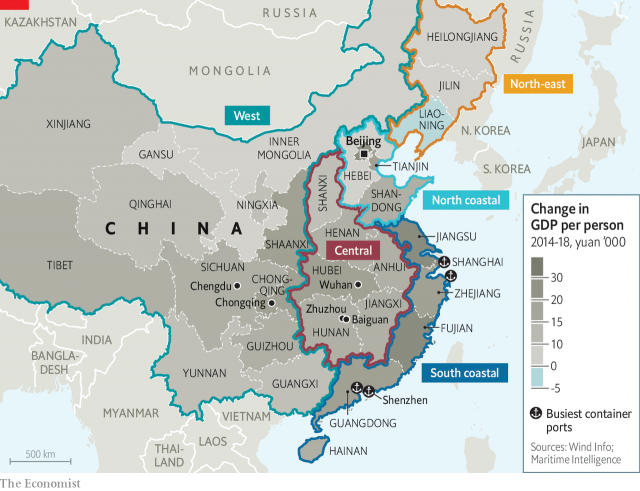
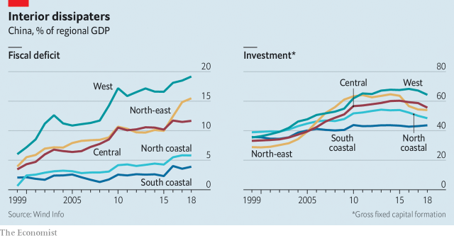

###### Flyover country v coastal elite

# Once again, China’s richest region is pulling ahead of the others 

 

> print-edition iconPrint edition | China | Jun 6th 2019 

MOTIVATIONAL SLOGANS do not get much blunter than the one hanging over the sewing machines in Li Zhiguo’s factory: “Work hard here to make money, don’t be disliked by your family”. He proudly holds up one of his products, a red chiffon dress with ruffled sleeves. Dozens more are wrapped up, awaiting shipment. 

It is a scene that, on the surface, should please Chinese leaders. Mr Li’s factory is in Baiguan, a poor town in the central province of Hunan. The government has long wanted to spur growth deep inside the country, in part by getting low-end industries to leave the prosperous coast and move to places like Baiguan. The money, managers and machines in Mr Li’s factory are almost all transplants from the coast. “There’s advantages to being here. It’s easier to find workers,” he says. 

But scratch a little deeper, and problems appear. Mr Li aims to have enough orders to keep a hundred workers busy. But business is so slack that he has only hired half that many. When Baiguan launched its industrial park three years ago, the government billed it as a new home for China’s textile industry. Today, the zone is pockmarked with vacant buildings. Workers may be paid less than on the coast, but they are more expensive than their counterparts in Cambodia and Bangladesh. The roof over the park’s sales office has partly collapsed. Managers complain of power cuts. 

The difficulties of building a textile industry in Hunan are part of a much bigger challenge: closing the gap between inland China and its coast. When China opened its economy in the 1980s, its seaboard reaped the biggest gains. Other regions grew more slowly. Eventually the government began focusing on the poorer areas. Two decades ago this month, it launched a “develop the west” plan, followed in 2004 by a similar scheme for its central provinces. These projects involved large investments in roads, railways, schools and hospitals, plus incentives for businesses and workers to move to the interior. 

In the official telling, these efforts have been a triumph. That is partly true. Since the early 2000s growth in the interior has soared. But a shift is now under way. Growth is still strong in the interior. Yet the coastal region, particularly its southern half, is now outpacing much of the rest of China. It is a phenomenon familiar in other countries: the richest areas are pulling further ahead of the poorer ones. It is one that makes the Communist Party, having prided itself so much on its efforts to reduce inequality, deeply anxious. 

China’s south coastal region comprises Shanghai and five provinces from Jiangsu to Hainan (see map). It is home to the mainland’s four busiest ports, including Shanghai and the tech hub of Shenzhen. The region is China’s wealthiest, with a GDP per person of nearly 100,000 yuan ($15,000). When the government began pouring money into the interior, the south coast initially lost ground. From 2003 to 2013 its share of national GDP fell from 36% to 33%. But since then its relative fortunes have revived. Its share rebounded to nearly 35% in 2018, the highest in more than a decade. 

 

The region that has fared the worst is the north-east, burdened by a legacy of state ownership. The north coast, centred around Beijing, has also stumbled, in part because of policies to limit pollution. The western and central regions have done better. Several cities there, such as Chengdu and Wuhan, are thriving. But on the whole the west and centre have stopped gaining on the south coast. In nominal terms, China’s economic slowdown of the past decade has been twice as sharp inland as it has been along the coastal strip. 

The underlying picture is even more worrying. Fiscal deficits (the gap between government revenues and expenditures) have remained low on the south coast, rising from 2% in 2000 to 3.9% today. In western and central China, deficits have expanded rapidly, from an average of 5.5% to 15.5% (see chart). Land sales and transfers from the central government have kept local governments afloat, but will diminish as growth slows. 

 

The change in regional fortunes is partly the result of investment flows. In 2000 the construction of things such as roads, railways and factories accounted for roughly a third of GDP in all regions. By 2015, as a result of the government’s drive to boost the interior, the ratio had risen to 43% in the south coast, but to 68% in the west and to 60% in the centre (see chart). With investment now tailing off inland, their growth is also beginning to falter. 

The slowdown in investment will be easier to stomach for places that have spent money well. The central city of Wuhan should benefit. It has been a focal point of China’s efforts to cultivate its semiconductor industry. But cities that have got it wrong will suffer. Chongqing, in the west, worked to attract car and computer manufacturers. As sales of both have weakened, so has Chongqing’s economy. It went from being one of China’s zippiest cities, growing by 17% in 2010, to one of its slowest, growing by 6% last year. “Everyone says we got hit by a financial crisis,” says Liao Li, a saleswoman in a small home-decoration shop there. It is not that bad, but Chongqing’s decline has been sudden. 

Plenty of industries on the south coast have also run into trouble, from shipbuilding in Jiangsu to garment-making in Guangdong. But the region’s economy is more diversified, and so more resilient. It is strong in modern services, from software design to wealth management. And it is still an industrial powerhouse. Many of its manufacturers have spent heavily on automation. Its smaller firms have also adapted. Scholars estimate that 77% of China’s “Taobao villages”—ones deriving much of their sales from e-commerce platforms such as the eponymous one—are based on the south coast. 

As China’s economy matures, the south coast’s advantages are likely to grow. The region is well-suited to knowledge-based industries. It generates half of all patent applications nationwide. Since 2015 worker productivity has increased by 7.4% annually on the south coast, more than any other part of China, according to Moody’s Analytics, a consultancy. It is also a magnet for foreign firms: 87.5% of foreign direct investment flowed to coastal China in 2017, official figures show. Many foreign managers say the business climate in the south is better. “Guangdong is like a spa,” says a European executive who recently launched a big project there, having previously endured frustrations in the interior. 

One incentive that is often touted for producing goods in China’s interior is lower wages. But the region’s workers usually earn more than those in South-East Asian countries: twice as much as in poorer ones such as Vietnam and a tenth more than in wealthier ones such as Thailand. The trade war with America strengthens the headwinds. Firms that might have moved inland from the coast are instead looking abroad. Industrial activity has been declining more rapidly as a share of the interior’s economy than of the south coast’s. In western China, for example, it has fallen from 51% of GDP in 2011 to 41% last year. 

China’s leaders will not give up. In recent speeches President Xi Jinping has declared that reducing the economic gap between regions remains a crucial goal. Local officials are still trying to pursue it. Nearly an hour’s drive from Baiguan’s would-be textile centre, the city of Zhuzhou has created “Power Valley”, which local officials hope will become a manufacturing base for the railway, car and plane industries. It is a well-manicured zone with crisp factory buildings, a slogan (“beautiful intelligence town”) and a big government office dedicated to making it work. 

But nearly four years on from its opening, Power Valley is clearly low on fuel. A clerk at the reception says it has 80% occupancy. Yet just outside her door, there is half a block of abandoned offices. Down the road, one of the bigger occupied buildings belongs to a car-design company. Its manager sheepishly admits that he obtained a five-year lease rent-free. Ten employees are spread across four floors. “We are racing to catch up with the coast,” he says. The race already seems lost. ◼ 

