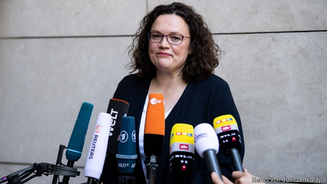
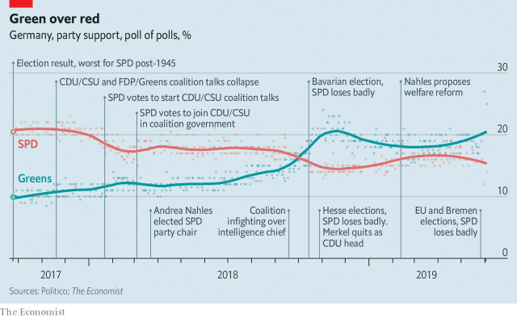

###### Picking up the rubble

# Andrea Nahles’s resignation leaves Germany’s government teetering 

 

> print-edition iconPrint edition | Europe | Jun 6th 2019 

THE DOUGHTY heroines who cleared the debris from Germany’s ravaged streets after the war were known as Trümmerfrauen, or “rubble women”. At some point the nickname attached to Andrea Nahles, who resigned as leader of the Social Democrats (SPD) on June 2nd. In January 2018 she showed why she deserved it. The SPD’s morale was in ruins after an election loss a few months earlier. Angela Merkel’s conservative Christian Democratic Union (CDU) wanted it to rejoin the “grand coalition” that had run the country since 2013, but many SPD members thought the party needed to lick its wounds in opposition. Ms Nahles took them on. In a barnstorming speech at a party meeting in Bonn, she said voters would find shunning government “crazy”, and vowed to make the CDU “squeal” in coalition talks. The party voted to stay in government, and in April it elected Ms Nahles its first woman leader. 

Little over a year later it is Ms Nahles’s strategy that lies in tatters. True to her word, she negotiated an SPD-friendly coalition treaty. The party secured the finance and foreign ministries. In government it has chalked up wins on migration, energy and defence. And yet voters have turned away in droves. The last straw came on May 26th, when the SPD slumped to 16% of the vote at the European elections, 11 percentage points below its previous score, and failed to win an election in the city-state of Bremen for the first time in seven decades. One recent poll put the party at a once-unthinkable 12%, less than half the surging Greens. Ms Nahles, a veteran of party intrigue, tried to soldier on in the face of internecine plots. But in the end, the support was not there. 

 

Her decision reignites questions over the future of the coalition with the CDU (and its sister party, the Bavarian Christian Social Union). Mrs Merkel, the chancellor, and Annegret Kramp-Karrenbauer, the CDU leader, want the “GroKo” to serve out its term until 2021. But that looks difficult. Some 57% of voters say the parties should call time on their alliance. 

Whether the SPD heeds their call will depend on how the contest to replace Ms Nahles plays out. A triumvirate of state politicians has been appointed to run the party temporarily and organise the race for the leadership. Novel ideas such as open primaries or a dual leadership (which has worked well for the Greens) are doing the rounds. A second task is to decide how to carry out a vague mid-term “review” called for in the coalition agreement. The party meeting to discuss it, originally planned for December, could be brought forward to autumn. Some insiders think party members will have to vote again on whether to stay in government. The SPD’S board will meet on June 24th to lay out the road map; a new leader is not expected for months. 

Whoever takes over will face huge challenges: boosting morale in a party riven by distrust; responding to the rise of the Greens, who are gobbling up SPD votes in Germany’s cities and in its south and west; and handling the fallout from state elections in the east this autumn, where the party expects to do badly. But the biggest question will inevitably be over the fate of the coalition. Any candidate for the leadership will have to answer the many GroKo doubters who consider their scepticism vindicated. Some may call for the party to quit the government immediately. 

There are strong arguments against doing so. A walkout would probably trigger an election, and polls suggest the SPD could lose a third of its seats. “Giving up because we are weak would be to admit publicly that we are not capable of governing, and who should vote for a party like that?” says Ralf Stegner, a deputy SPD leader. Many would prefer to demand policy changes from the CDU/CSU on pensions, taxes on the rich and climate protection—issues on which the SPD believes voters share its views—and to leave only if the party is unable to obtain concessions. 

Yet the CDU is in no good position for early elections either, notes Gero Neugebauer, a political scientist in Berlin. Ms Kramp-Karrenbauer is also struggling. If an election looms, party rivals might challenge her to become the CDU’s chancellor-candidate (Mrs Merkel has promised to step down). The CDU too stands to lose seats. Optimists in the SPD hope such worries would force the CDU to back down on policy. That could strengthen the new SPD leader and let the coalition stagger on. 

Perhaps. But optimism has rarely proven a winning bet for the SPD. “They have a leadership problem, a policy problem and a coalition problem—they have to solve all of them, and they don’t know how,” says Lothar Probst, a political scientist in Bremen. No wonder senior SPD figures have hurried to rule themselves out as candidates to replace Ms Nahles. Having dumped its Trümmerfrau, the SPD is desperately scrambling for someone else to clean up the mess she leaves behind. ◼ 

