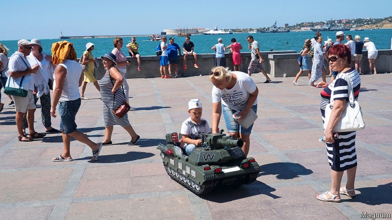
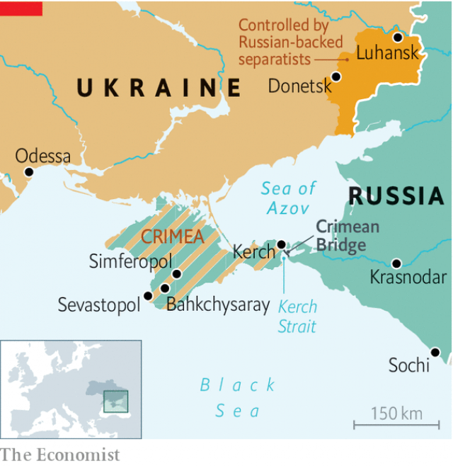

###### After the annexation

# Crimea is still in limbo five years after Russia seized it 

 

> print-edition iconPrint edition | Europe | Jun 8th 2019 

THE METALLIC likeness of Catherine the Great towers over a park in Simferopol, the capital of Crimea. First erected in 1890 to commemorate the centenary of Catherine’s capture of the peninsula, it was torn down after the Russian revolution. After the Soviet Union collapsed, leaving Crimea part of newly-independent Ukraine, attempts to rebuild the statue stalled. Only after Russia annexed Crimea in 2014 did the empress’s countenance rise again. “She’s the Putin of the 18th century,” says Andrei Malgin, the director of a local history museum. A defiant message adorns the pedestal: “This monument has been rebuilt in honour of the reunification of Crimea with Russia in 2014 and FOR ALL TIME.” 

Russia’s seizure of Crimea ruptured its relations with Ukraine and the West. Other crises followed: wars in eastern Ukraine and Syria, election interference in America. Ukraine still wants its territory back. Volodymyr Zelensky, the country’s new president, called it “Ukrainian land” in his inauguration speech. But Russia has the peninsula firmly under its control. Western officials pay lip service to territorial integrity, while resigning themselves to the new status quo. 

 

Russian officials crow that they have spruced up the peninsula after Kiev let it deteriorate. Indeed, the federal government has been generous: two-thirds of the regional budgets for Crimea and Sevastopol come from federal transfers. Sergey Aleksashenko, a former deputy head of the Russian central bank, reckons Moscow has spent 1.5trn rubles ($23bn) on Crimea over the past five years—equal to three years of national health-care spending. Mega-projects have transformed the landscape. A 19km bridge stretches across the Kerch strait, linking Crimea to the Russian mainland (see map). A smooth highway runs from the bridge to Sevastopol, and the city has a sleek new airport. North of the bridge, Moscow now claims the Sea of Azov as its own. Last autumn, Russia seized three Ukrainian ships trying to enter it; their 24 sailors are still in Russian custody. 

Yet the patriotic fervour of the annexation has faded. “The euphoria has completely gone,” says Oleg Nikolaev, a prominent businessman. The region suffers the same problems as the rest of Russia: corruption and mismanagement, inflation and falling salaries, repression and restrictions. “We build a road, then tear it up to lay pipes. Then we build the road again but forget the streetlights, so we tear it all down and start again,” Mr Nikolaev gripes. In Sevastopol an outsider governor appointed by Mr Putin has riled locals. 

Support for the annexation remains high. Yet a recent study by Vladimir Mukomel of the Russian Academy of Sciences turned up dissatisfaction with “the Russian bureaucratic machine, staff turmoil [and] corruption”. Demands for stability have given way to a desire for change. 

Crimea’s disputed legal status compounds the challenges. Western sanctions crimp business. Significant private investments are few, and tend to the quixotic. A group of investors from St Petersburg hopes to turn a dusty Soviet-era design bureau on the outskirts of Sevastopol into a Russian Silicon Valley. “What does a techie need? Himself, a laptop and inspiration,” says Oleg Korolev, the park’s managing director. “Why not on the shores of the sea!” This glosses over the things a budding entrepreneur might not find in post-annexation Crimea: connections to the outside world, access to capital and the rule of law. 

The new airport offers flights only to Russian destinations. Crimean residents have trouble getting visas to other countries, few of which recognise the annexation. Crossing the land border to Ukraine, as an estimated 200,000 do each month, means braving long lines and inquisitive border guards. Most banks, even Russia’s state-run giants, see the region as toxic; only a few small ones service it directly. To order from online merchants, Crimeans use VPNs that conceal their location. Companies partner with firms on the mainland to avoid problems with suppliers. A cottage industry has cropped up offering deliveries from IKEA and other superstores in Krasnodar, just across the strait. 

According to Mr Mukomel, the only material beneficiaries have been civil servants and pensioners. “There are new rules of the game, and perhaps not everyone has adjusted to these new realities,” says Mr Malgin. As director of a public museum, he is among the winners. 

“We got up early for prayers, and then we heard the knocks,” says Zera Suleimanova. On March 27th Russian security services detained her son and nearly two dozen other Crimean Tatars. It was the largest mass arrest yet in a growing campaign of repression. The Tatars, a Turkic Muslim group who controlled the peninsula before the Russian empire arrived (and who were deported for decades by Stalin), mainly opposed Russia’s annexation. Their ruling council, the Mejlis, and its leaders have been banned from Crimea. 

Arrests, harassment and disappearances have become common. A Tatar activist says police threaten them: “If you misbehave, you’ll become a poteryashkoi”—a “lost one”. Activists have formed a group called “Crimean Solidarity” to support political prisoners. 

Ethnic Ukrainians, a shrinking minority, face similar pressure. “Everything left from Ukraine has been erased,” laments Archbishop Kliment, head of the Ukrainian Orthodox church in Crimea. Before the annexation, the church had 49 locations, including 25 active parishes, and nearly 20 priests across the peninsula. Today it is down to just nine locations and four priests. “The language is dying,” one Ukrainian activist whispers. “There are five- and six-year-old kids for whom Ukrainian is as alien as English.” 

The new authorities’ official histories efface the peninsula’s non-Russian past. Asked what came before Catherine, a tour guide at one Sevastopol history museum responds with a wave of the hand: “Just some Turks.” As Mr Kliment points out, this is nothing new: the Russification of Crimea began long before Mr Putin gobbled it up. “But whether they can make it last,” he muses, “only God knows.” ◼ 

