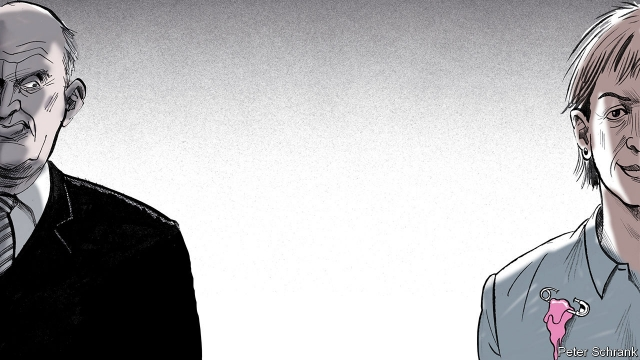

###### Slime of the times

# Estonians are protesting populism by wearing “pink slime” 

 

> print-edition iconPrint edition | Europe | Jun 6th 2019 

ALL OVER Tallinn, people are sporting the same strange accessory: a pink blob the consistency of used chewing gum. It dangles from lapels in libraries, at foreign-policy conferences and in bars in Telliskivi, Bohemian quarter of the Estonian capital. 

Estonians call it “pink slime”. This is not to be confused with the meat slurry used in cheap sausages. In Estonia, “pink slime” started as an insult aimed at liberalism. The Estonian Conservative People’s Party (EKRE), a nationalist outfit, opposes multiculturalism, immigration and gay marriage. Its leader, Mart Helme, says he does not believe in liberal democracy and thinks globalists in Brussels want to erase the identities of Estonia and other countries, turning them all into a uniform post-national mush. The party’s epithet for the ideology it detests is roosa ila, or “pink slime”—a reference to feminism and gay rights, and by extension the rest of the liberal worldview. 

EKRE cannot be ignored. It has been a junior partner in government since April, following an election in which it won 18% of the vote. “Rahva Oma Kaitse”, a satirical radio show, joked that roosa ila would soon be outlawed. On hearing this, Liina Lelov, a jewellery designer, decided to create something for those who identify with it. The pins, which she makes by hand and sells for €5 ($5.50) each, have sold out multiple times. 

In April Kersti Kaljulaid, the president, made a sartorial statement of her own, attending the government’s swearing-in ceremony in a top bearing the words “speech is free”. Days earlier Martin Helme, the incoming finance minister (and son of Mart), had called for “biased” presenters to be removed from the state broadcaster. In the same week Vilja Kiisler, a journalist, quit the country’s largest newspaper, saying she had been asked to tone down her criticism of EKRE by the editor-in-chief—the nephew of the elder Mr Helme. 

Before the swearing-in ceremony was over, there was a new reason to take offence. Mart and Martin Helme posed for photographers making an “OK” hand gesture, which has become associated with white supremacism. (The younger Mr Helme has stated that he wants to “keep Estonia white”.) EKRE seems to be furnishing liberals with fodder for outrage faster than their fashion designers can keep up. 

